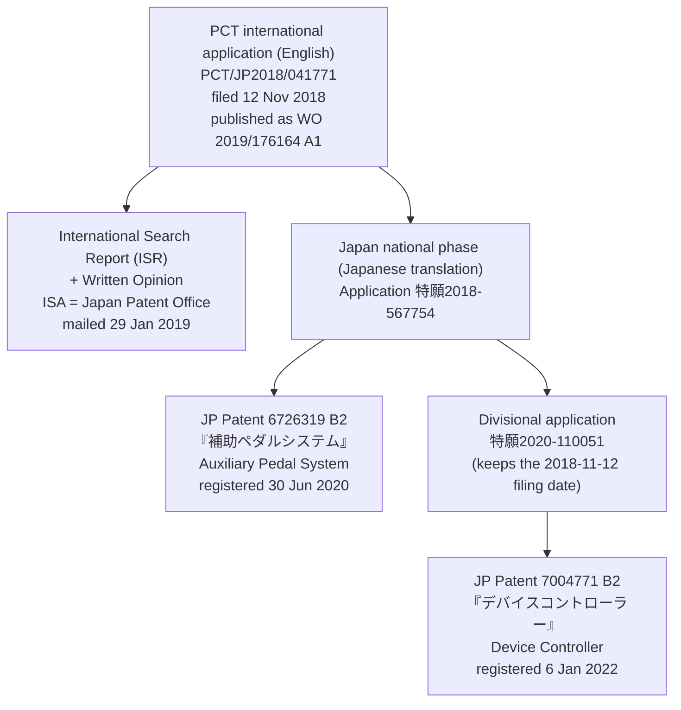
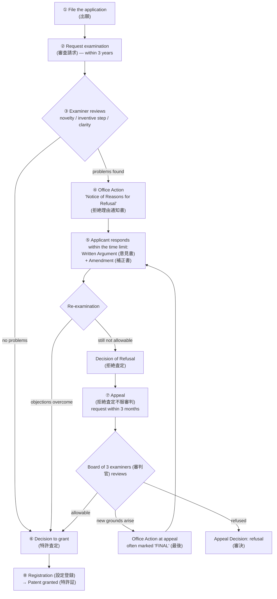
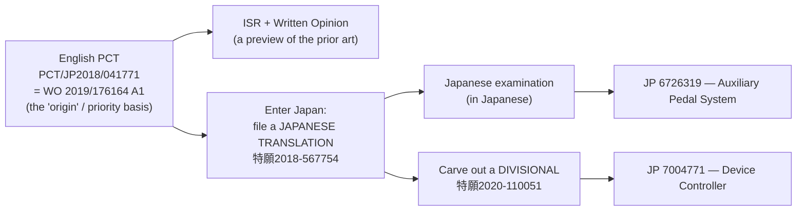

# bFaaaP Patents — A Plain-Language Guide

*English-first explainer of the bFaaaP patent family, written so that readers with
**no patent background** can follow it. Japanese (日本語) and German (Deutsch)
versions are planned later in sibling folders.*

This document explains:

1. The bFaaaP **patent family** at a glance.
2. A **5-minute primer** on the Japanese patent system (with a flow diagram), so
   you can read the rest.
3. How an **English‑language PCT** application becomes Japanese patents.
4. **Patent 1 — JP 6726319 B2 "Auxiliary Pedal System"** (the *Pro* / acoustic
   device): dated prosecution history, cited prior art, the underlined amendments,
   and the examiner‑vs‑applicant key points.
5. **Patent 2 — JP 7004771 B2 "Device Controller"** (the iOS‑side controller):
   the same, including the **appeal** stage.
6. The **PCT international search (ISR)** and a full **citation list**.
7. **Academic take‑aways** — what the prosecution teaches about the *real* novelty
   of bFaaaP, used to re‑frame the arXiv / ACM TACCESS papers.

> ⚠️ **Not legal advice.** This is an engineering/See‑also summary written from the
> file‑wrapper documents in [`..`](..). For authoritative text, read the granted
> gazettes (公報) and the original prosecution PDFs. Where this guide and the
> official documents differ, the official documents control.

---

## 1. The bFaaaP patent family at a glance

The whole family starts from **one English‑language PCT international application**
and branches into **two granted Japanese patents**:



| Item | Patent 1 | Patent 2 |
|------|----------|----------|
| **Number** | JP **6726319** B2 | JP **7004771** B2 |
| **Title** | 補助ペダルシステム (Auxiliary Pedal System) | デバイスコントローラー (Device Controller) |
| **Maps to** | *bFaaaP Pro* — the robotic pedal actuator for **acoustic** pianos | The **head‑angle control method / controller** (the iOS side; generalizes to electronic devices) |
| **Application No.** | 特願2018-567754 (PCT national phase) | 特願2020-110051 (divisional of the above) |
| **Filing date** | 12 Nov 2018 | 12 Nov 2018 (divisional inherits the parent date) |
| **Registered (granted)** | 30 Jun 2020 | 6 Jan 2022 |
| **Patentees** | Tomoyuki Shishido; Otaki Architectural Office, Ltd. (有限会社大滝建築事務所) | same |
| **Inventors** | Hiroyuki Narusawa, Masahiro Ootaki, Tomoyuki Shishido, Kyoko Yamaguchi, Daisuke Tokushige | same five |
| **Origin (priority)** | English PCT WO 2019/176164 | English PCT WO 2019/176164 (via the parent) |

Both patents are **in force in Japan**. `bFaaaP®` is a registered trademark and the
glasses‑mounted motion sensor is a registered design (not covered here).

**Public links:** Google Patents
[JP6726319B2](https://patents.google.com/patent/JP6726319B2/en) ·
[JP7004771B2](https://patents.google.com/patent/JP7004771B2/en) ·
WIPO PATENTSCOPE [WO2019176164](https://patentscope.wipo.int/search/en/detail.jsf?docId=WO2019176164) ·
J‑PlatPat (search by number) <https://www.j-platpat.inpit.go.jp/>.

---

## 2. A 5‑minute primer on the Japanese patent system

If you already know how patents work, skip to §3.

### The normal road from application to grant



### The five words you need

| Japanese | Reading | What it is |
|----------|---------|------------|
| 拒絶理由通知書 | *kyozetsu‑riyū‑tsūchisho* | **Office Action** — the examiner's written list of objections (e.g. "not new", "obvious", "unclear"). It is *not* a final rejection; it is an invitation to respond. |
| 意見書 | *iken‑sho* | **Written Argument / Opinion** — the applicant's reply explaining why the invention should be granted. |
| 補正書 | *hosei‑sho* | **Amendment** — edits the claims/specification to overcome the objections. |
| 拒絶査定 | *kyozetsu‑satei* | **Decision of Refusal** — issued if the response did not overcome the objections. |
| 拒絶査定不服審判 | *…fufuku‑shinpan* | **Appeal** against a refusal, heard by a 3‑member board of senior examiners (審判官). |

### Three things that confuse newcomers

- **"Claims" are the legal boundary.** The *specification* describes the invention;
  the **claims** (特許請求の範囲) define exactly what is protected. Examination is a
  negotiation over the **wording of the claims**.
- **Why text is underlined.** When you file an amendment, the JPO rules require you
  to **underline every changed word** so the examiner can see what moved. So in the
  amendment PDFs, **the underlined parts ARE the changes** — they are the heart of
  the story, because they show *exactly which limitation* won the patent.
- **The three classic objections.**
  - **Novelty (新規性, §29(1))** — "this exact thing already exists in one document."
  - **Inventive step (進歩性, §29(2))** — "a skilled person could obviously combine
    known documents to reach this." This is the hardest hurdle.
  - **Clarity / support (明確性・サポート要件, §36)** — "the wording is ambiguous"
    or "the claim is broader than what the specification actually supports."

---

## 3. How an *English* PCT becomes Japanese patents

bFaaaP's first filing was an **English‑language PCT international application**.
PCT ("Patent Cooperation Treaty") lets you file **one** application that reserves
your rights in ~150 countries, and gives you a single **International Search
Report (ISR)** before you spend money entering each country.



Two consequences that matter for reading the file:

- The Japanese claims are a **translation** of the English original. Some of the
  prosecution is therefore about *Japanese wording* (e.g. an ambiguous particle
  「が」), which would not exist in the English text.
- A **divisional** (分割出願) is a child application split out of a parent so a
  *different* invention in the same disclosure can be pursued separately. The
  divisional keeps the parent's filing date. Here, **JP 7004771 (the controller)**
  was divided out of **JP 6726319 (the pedal system)** — so the family protects
  *both* the physical pedal robot **and** the control method, from the same 2018
  disclosure.

---

## 4. Patent 1 — JP 6726319 B2 "Auxiliary Pedal System"

This is the **bFaaaP Pro** invention: detect the user's head motion → process it →
drive an actuator that presses an **acoustic** piano pedal.

### 4.1 Bibliographic data

| Field | Value |
|-------|-------|
| Patent No. | **特許第6726319号** (JP 6726319 B2) |
| Title | 補助ペダルシステム — *Auxiliary Pedal System* |
| Application | 特願2018-567754 (Japan national phase of PCT/JP2018/041771) |
| Filed | 12 Nov 2018 |
| Registered | **30 Jun 2020** |
| Examiner | SAEKI Kentarō (佐伯 憲太郎), Examination Division 4 |

### 4.2 Prosecution timeline (dated)

| Date | Event |
|------|-------|
| **2018‑11‑12** | International filing (English PCT) — also the effective JP date |
| **2019‑01‑29** | ISR + Written Opinion mailed by ISA/JP (see §6) |
| *(national phase entry + request for examination)* | |
| **2020‑04‑06 / 04‑21** | **Office Action** drafted / dispatched — grounds: novelty §29(1), inventive step §29(2), clarity §36(6)(ii) |
| **2020‑06‑13** | **Amendment + Written Argument** filed (39 claims → 15 claims) |
| **2020‑06‑30** | **Registered (granted)** |

A grant **17 days** after the response shows the examiner accepted the amendment
essentially as filed.

### 4.3 The Office Action (2020‑04‑21): grounds + cited prior art

**Cited references (引用文献):**

| # | Document | What it shows |
|---|----------|---------------|
| **1** | **JP 2017‑21461 A** (特開2017‑21461) — a head‑mounted display (HMD) | A posture sensor (64) detects head‑angle change; a "sensitivity adjuster" (720) **ignores** angle change until it exceeds a set value; the user can **customize the operation threshold**. |
| **2** | **NPL: "Head‑Activated Piano Pedal," CanAssist, University of Victoria** — [online], 2018‑04‑02 ([Internet Archive capture](https://web.archive.org/web/20180402202115/https://www.canassist.ca/EN/main/programs/technologies-and-devices/test-1/piano-arts.html)), 5th paragraph | A head‑tilt‑activated mechanical device that pushes/releases an acoustic **piano pedal**, controlled by a sensor in a **headband** (for a wheelchair pianist, "Emily"). |
| **3** | **JP 2006‑154504 A** (特開2006‑154504, YAMAHA) | A pedal‑performance assist device fixed relative to the floor/piano; offsets pedal **free‑play** so the pedal moves without delay. |

*(Background search refs that were **not** grounds for rejection: US 4736664, JP 2015‑87824, JP 2017‑37567, JP 2014‑95953, US 2018/0064371.)*

**Grounds, claim‑by‑claim:**

- **Novelty (§29(1)(iii))** — claim 35 vs ref 1 (the HMD already shows head‑angle +
  customizable threshold).
- **Inventive step (§29(2))** — claims 1–19, 28–34 vs refs 1+2; claims 20–27 vs
  refs 1+2+3; claims 36–39 vs ref 1. The examiner's core argument: the piano‑pedal
  device (ref 2) and the head‑angle HMD (ref 1) are in the **same field** (detecting
  a user's head motion), so adding ref 1's *offset range* and *user‑changeable
  signal* to ref 2 would be obvious.
- **Clarity (§36(6)(ii))** — claims 28, 29–34, 35–39: terms like "**the** actuator"
  / "**the** device" were used without first introducing "an actuator" / "a device"
  (a missing‑antecedent problem).

### 4.4 The amendment — the *underlined* changes (what won the patent)

The applicant cut 39 claims down to 15 and added a **quantitative control law** to
independent claim 1 (the underlined additions in the file):

> …the **head motion involves a head tilt angle**; the actuator‑control signal is
> changeable **by multiplying, by a _multiplier_, the value obtained by subtracting
> the upper limit of the offset range from the head‑tilt angle**; and **the
> multiplier is selected by the user to a value between 10 and 50**, so that a head
> tilt of **2–10°** beyond the offset upper limit fully depresses the pedal.

In short, the surviving invention is not "head sensor → pedal" but a **specific,
numerically‑bounded mapping**:

```
actuator command  =  ( head_tilt_angle − offset_upper_limit )  ×  multiplier
                      with  multiplier ∈ [10, 50]  (user-chosen)
                      and  full pedal press reached within +2–10°
```

These numbers come straight from the specification's **human‑subject study**
(Example 6, the *Auxiliary Pedal Effect Evaluation*, "APEE"): 15 participants —
**7 Class I adults, 5 Class II children, 3 Class III "challenged" (disabled)** —
from whose data the 10–50 multiplier and 2–10° ranges were drawn.

The clarity defects were fixed by editing "actuator‑control signal" → "the
actuator's control signal" etc., and by **deleting** the unclear claims 35–39.

### 4.5 The applicant's arguments (Written Argument, 2020‑06‑13)

1. **Teaching‑away (阻害要因) against combining ref 1 + ref 2.** Ref 1 (HMD)
   *requires an on‑screen **indicator*** so the user can see whether the threshold
   is crossed (its claim 1 and [0039]–[0085]); ref 2 (CanAssist pedal) has **no
   display at all**, and a **pianist cannot perform while wearing a vision‑blocking
   HMD**. Pulling one feature out of an indicator‑dependent device and bolting it
   onto a display‑less device is not something a skilled person would naturally do.
   *(This is, in HCI terms, exactly bFaaaP's contribution: head control that needs
   no worn display or on‑screen target during performance.)*
2. **The "multiplier" numbers are nowhere in the art.** Neither ref 1 nor ref 2
   discloses the **10–50 multiplier** (nor the 2–10° span). They were obtained
   empirically from the APEE human trial, so they cannot be an obvious design choice.

### 4.6 Granted claim 1 (the surviving invention)

> **An auxiliary pedal system** comprising a **detector** (detects the user's
> motion → detection signal), a **processor** (→ actuator‑control signal), and an
> **actuator** (presses a pedal); wherein the motion is **head motion** with a
> **head‑tilt angle**; there is an **offset range** in which the actuator is not
> driven; the actuator‑control signal is **user‑changeable**; it equals
> **(head‑tilt − offset upper limit) × multiplier**, with the **multiplier chosen
> by the user in 10–50**, so that **2–10°** past the offset fully depresses the
> pedal.

### 4.7 Examiner ↔ applicant: the key points

| Examiner said | Applicant answered | Outcome |
|---------------|--------------------|---------|
| Head‑angle + customizable threshold is already in the HMD (ref 1). | Kept it, but narrowed to a **specific multiplier law (10–50; +2–10°)**. | Accepted |
| Obvious to combine HMD (ref 1) with the piano‑pedal device (ref 2). | **Teaching‑away**: HMD needs an indicator/visible display; a pianist can't wear one. The numbers aren't in the art. | Accepted |
| Claims 28/29–34/35–39 are unclear (missing antecedents). | Fixed wording; **deleted** claims 35–39. | Resolved |

---

## 5. Patent 2 — JP 7004771 B2 "Device Controller"

This is the **control method / controller** itself (the iOS side), carved out as a
**divisional** so it can protect head‑angle control of devices in general — not
only an acoustic pedal. It had a harder ride: it was finally refused in ordinary
examination, and **granted only after appeal**.

### 5.1 Bibliographic data

| Field | Value |
|-------|-------|
| Patent No. | **特許第7004771号** (JP 7004771 B2) |
| Title | デバイスコントローラー — *Device Controller* |
| Application | 特願2020-110051 (**divisional** of 特願2018-567754) |
| Filed | 12 Nov 2018 (divisional; inherits parent date) |
| Registered | **6 Jan 2022** |
| Appeal No. | 不服2021‑11503 |
| Appeal board | Chief examiner INABA Kazuo (稲葉 和生); examiner HAYASHI Tsuyoshi (林 毅), Board 27 |

### 5.2 Prosecution timeline (dated)

| Date | Event |
|------|-------|
| **2018‑11‑12** | Effective filing date (via the parent) |
| *(filed as a divisional in 2020; ordinary examination)* | |
| *(2021)* | Ordinary examination ends in a **Decision of Refusal** → applicant files an **Appeal** (不服2021‑11503) |
| **2021‑10‑19 / 10‑20** | **Office Action at appeal** drafted / dispatched, marked **"FINAL" (最後)** — grounds: clarity §36(6)(ii), support §36(6)(i), inventive step §29(2) |
| **2021‑11‑25** | **Amendment + Written Argument** filed (8 claims → 5 claims) |
| **2022‑01‑06** | **Registered (granted)** |

### 5.3 The appeal Office Action (2021‑10‑20): grounds + cited prior art

**Cited references:**

| # | Document | What it shows |
|---|----------|---------------|
| **1** | **JP (Tokuhyō) 2012‑514392 A** (特表2012‑514392) — a head‑gesture **earphone/headset** control system | Acceleration sensors on a headset detect head motion; a computation unit controls devices (4a–4e); **volume** is set by the **absolute head‑tilt angle**; a **neutral ±5° dead range** where nothing changes; angle evaluated in **3.5° steps**, each tied to a **3 dB** volume step; "sensitivity" is adjustable via a USB‑connected PC. |
| **2** | **JP 2017‑21461 A** (特開2017‑21461) — HMD with posture sensor | Same HMD as the parent's ref 1; a posture sensor on **glasses** can detect head motion (used against the "glasses‑mounted" claim 8). |

**Grounds:**

- **Clarity §36(6)(ii)** — claim 1's phrase "a device controller **usable by a
  person who has a leg and/or neck disability**" was ambiguous because the Japanese
  particle 「が」 could mean *only such people* **or** *also such people*.
- **Support §36(6)(i)** — the claim was not limited to controlling the *barrier‑free
  auxiliary pedal*, and the **parameters** that make it usable by disabled people
  were not specified, so it was broader than the specification supports.
- **Inventive step §29(2)** — claims 1–8 vs ref 1 (the board argued ref 1's "3.5°
  angle step" and "3 dB volume step" *are* a "sensitivity," which a skilled person
  could set to the claimed values); claim 8 also vs ref 2 (glasses mounting).

### 5.4 The amendment — the *underlined* changes (what won the patent)

The applicant collapsed 8 claims into 5 and rewrote independent claim 1. The
underlined additions made claim 1 **concrete in two new ways**:

1. **A user‑pre‑adjustable _response speed_** (応答速度), not just a generic
   "control signal":

   > …the **offset range** *and* the **response speed when the head moves beyond the
   > offset range** are **changeable in advance according to the user's preference**…

2. **The same quantitative window as the parent, tied to two concrete severe‑
   disability populations**:

   > …the offset **upper limit is 3–10°**, and a head tilt of **2–10°** beyond it
   > generates the device control‑command signal, **so that the controller is usable
   > both by a person with a leg disability and by a person with a tracheostomy
   > (気管切開)**.

The "tracheostomy" limitation is supported by the specification's Table 2,
**subject #14** — a participant with a partial leg disability *and* a tracheostomy,
whose head motion was restricted by the tracheostomy, and who therefore chose a
**small offset (3–5)** and a **large multiplier (40–50)** to play successfully.

### 5.5 The applicant's arguments (Written Argument, 2021‑11‑25)

- **Support / "a patentable part of a patentable system is itself patentable."**
  The controller is disclosed as usable for *any* electronic device (electronic
  piano, game controller…), so it is **not** limited to the pedal. Analogy: a
  patentable EV **battery** is protected as a battery even when used in a ship or
  generator, not only in the car.
- **Human‑subject evidence ⇒ inventive step.** Making a device usable by people for
  whom operation is normally *impossible*, and **proving it in a human trial**, is
  strong evidence of a non‑obvious effect. The applicant explicitly analogized to
  **medicine**, where *in‑vitro* results don't predict human‑clinical results — so a
  good human‑trial result supports non‑obviousness. The **tracheostomy** population
  is concrete and large (~**7,395** Japanese patients on tracheostomy positive‑
  pressure ventilation per a 2018 national survey, plus many more with a
  tracheostomy generally).
- **"Response speed" is not in ref 1; the examiner's reading is hindsight.** Ref 1
  lists the terms "3.5°", "3 dB", "angle step", "volume step", but **never says they
  are changed** ("make smaller / larger"), and never says a **response speed** is
  **pre‑adjustable per user**. Reading those changes into ref 1 is **後知恵
  (hindsight)**, only possible after seeing bFaaaP.

### 5.6 Granted claim 1 (the surviving invention)

> **A device controller** comprising a **detector** (head motion → detection signal)
> and a **controller** (→ device control‑command signal); wherein there is an
> **offset range** in which the device does not respond; the **offset range** *and*
> the **response speed beyond it** are **pre‑adjustable to the user's preference**;
> the **offset upper limit is 3–10°** and a tilt of **2–10°** beyond it produces the
> command — **so that it is usable both by a person with a leg disability and by a
> person with a tracheostomy.**

### 5.7 Examiner ↔ applicant: the key points

| Appeal board said | Applicant answered | Outcome |
|-------------------|--------------------|---------|
| "usable by disabled people" is ambiguous (「が」). | Moved the phrase to the end and made it concrete: **"usable by people with a leg disability *and* with a tracheostomy."** | Resolved |
| Claim not limited to the pedal; disabled‑usability parameters unspecified (support). | A patentable **part** of a system is independently patentable; added the **3–10° / 2–10°** parameters; cited Table 2 subject #14. | Resolved |
| ref 1's angle/volume steps already are a "sensitivity" → obvious. | Reframed to a **pre‑adjustable _response speed_** (not in ref 1); the step‑changing reading is **hindsight**; **human‑trial** proof of disabled usability shows a non‑obvious effect. | Accepted |

---

## 6. The PCT International Search (ISR) and its citations

The **ISR** (Form PCT/ISA/210) and the **Written Opinion** (Form PCT/ISA/237) for
**PCT/JP2018/041771** were prepared by the **Japan Patent Office** as International
Searching Authority.

- **Search completed:** 16 Jan 2019 · **Mailed:** 29 Jan 2019 ·
  **Authorized officer:** SAKURAI Shigeyuki.
- **IPC classes searched:** G06F 3/01, A63F 13/24, G10H 1/00.
- **Opinion summary (Box V):** for **all claims 1–39** — **Novelty = YES**,
  **Industrial applicability = YES**, but **Inventive step = NO**. In other words,
  at the international stage the examiner thought the invention was *new* but
  *obvious* over combinations of the documents below. (This is exactly why the
  Japanese national phase narrowed the claims to the **quantitative control law** —
  see §4–§5.)

**ISR citation list (引用文献):**

| Ref | Category* | Document | Relevant claims |
|-----|-----------|----------|-----------------|
| **D1** | Y | **NPL: "Head‑Activated Piano Pedal," CanAssist, University of Victoria**, [online] 2018‑04‑02, 4th paragraph — [Internet Archive](https://web.archive.org/web/20180402202115/https://www.canassist.ca/EN/main/programs/technologies-and-devices/test-1/piano-arts.html) | 1–39 |
| **D2** | Y | **JP 2017‑37567 A** (COLOPL, INC.), 2017‑02‑16, [0012], [0018], [0021]–[0023] | 1–39 |
| **D3** | Y | **JP 2014‑95953 A** (Tokyo Institute of Technology), 2014‑05‑22, [0029], [0043] · family WO 2014/073121 A1 | 1–39 |
| **D4** | Y | **US 2018/0064371 A1** (ALPS Electric), 2018‑03‑08, [0030], [0034]–[0035], FIG. 1 · family WO 2016/194581 A1, EP 3305193 A1, CN 107708552 A | 2–3, 8–11, 14–15, 18–19, 22–23, 26–27, 30–33, 36–39 |
| **D5** | Y | **JP 2006‑154504 A** (Yamaha), 2006‑06‑15, [0015], [0018], [0027], [0047]–[0049], [0063], FIG. 9(a) · family US 2006/0112809 A1 | 20–27 |
| — | A | **US 4736664 A** (Hinsley & Norwood), 1988‑04‑12, whole document (general background) | 1–39 |

\* **Y** = relevant to inventive step **in combination** with another Y document;
**A** = general background (not prejudicial on its own).

The ISA's reasoning: **D1** (head‑activated piano pedal) is the closest art; **D2**
and **D3** add the **offset range** and **user‑preference‑changeable** signal; **D4**
adds the **glasses‑mounted** sensor; **D5** adds **free‑play offset** and a
**detachable weight / sound‑proof chamber**. The numeric *multiplier* and *offset*
ranges were treated as "mere design matters" internationally — which is precisely
the point the Japanese grants later **disagreed with**, once those ranges were tied
to the human‑subject data.

> **Note on the closest prior art (D1, CanAssist).** D1 describes a head‑tilt piano
> pedal built by University of Victoria's CanAssist for a wheelchair pianist
> ("Emily"): a floor device attached to the pedal + a **headband** wireless sensor;
> tilt the head down → pedal pressed; tilt up → released. bFaaaP differs by the
> **glasses‑mounted** sensor, the **quantitative, user‑tunable control law**
> (offset + multiplier + response speed), the **airback reaction‑anchoring**, and
> human‑subject validation across disabled and non‑disabled users.

---

## 7. Academic take‑aways (for the bFaaaP papers)

The prosecution history is a gift to the **arXiv / ACM TACCESS papers**, because the
patent offices have effectively *peer‑reviewed where the novelty really lies*. Use
these points to re‑frame the manuscripts:

1. **The contribution is the control *law*, not the architecture.** "Head sensor →
   processor → actuator → pedal" was found anticipated/obvious (CanAssist + HMD).
   What is new is the **quantitative, user‑tunable mapping**: a small **offset/dead‑
   zone (upper limit 3–10°)**, a **user‑selected multiplier (10–50)**, **full action
   within +2–10°**, and (for the controller) a **pre‑adjustable response speed**.
   → Foreground these parameters and their derivation, not the block diagram.

2. **Human‑subject (clinical‑style) evidence is the backbone.** The APEE study (15
   participants across Class I adults, Class II children, Class III disabled) is what
   converted "obvious design choice" into a granted claim. The applicant's own
   medicine analogy — *in‑vitro ≠ human trial* — is a strong framing for the
   evaluation section. → Lead with the human‑subject data and the parameter
   distributions it produced.

3. **Concrete inclusive impact, named populations.** The granted controller claim is
   tied to **people with leg disability *and* tracheostomy** (Table 2, subject #14:
   small offset + large multiplier because tracheostomy limits head motion), with a
   quantified population (~7,395 TPPV patients in Japan). → This is the
   accessibility/assistive‑technology thesis the TACCESS paper should center.

4. **An HCI insight hides in the "teaching‑away" argument.** The patent was won
   partly by arguing that an HMD needs a **visual indicator**, which a performing
   pianist cannot use — so bFaaaP's value is **head control that needs no worn display
   or on‑screen target during live performance**. → State this as an explicit interaction‑design
   contribution.

5. **Generality beyond the pedal.** The "a patentable part is independently
   patentable" argument (the controller works for electronic pianos, game
   controllers, any device) supports the papers' **generalization** discussion
   (other instruments / assistive device control).

6. **Engineering numbers to cite consistently.** The patent ranges (offset upper
   limit **3–10°**, action span **+2–10°**, multiplier **10–50**, and the
   **response‑speed** tunability) should match the figures and the firmware/iOS
   description in this repository, so the paper, the patents, and the code all agree.

---

## 8. Files in this folder & sources

This guide summarizes the documents in the parent folder
[`..`](..):

```
bfaaap_patent_info/
├── WO2019176164A1/
│   ├── bFaaaP_PCT_WO2019176164A1.pdf   … the PCT pamphlet (PUBLIC gazette)
│   └── ISR_20190131.pdf                … ISR + Written Opinion (home address redacted)
├── JP6726319B_auxiliarypedalsystem/
│   ├── bFaaaP_JPB 006726319.pdf        … granted patent gazette (PUBLIC)
│   ├── First_OfficeAction_*.pdf        … 2020-04-21 Office Action
│   ├── WrittenAmendment_*.pdf          … 2020-06-13 amendment (underlined = changes)
│   ├── WrittenOpinion_*.pdf            … 2020-06-13 argument
│   └── Certificate_JP6726319B_*.pdf    … certificate (personal address redacted)
├── JP7004771B_devicecontroller/
│   ├── DeviceController_JP7004771B.pdf … granted patent gazette (PUBLIC)
│   ├── AppealLevel_OfficeAction_*.pdf  … 2021-10-20 appeal Office Action (FINAL)
│   ├── WrittenAmendment_*.pdf          … 2021-11-25 amendment (underlined = changes)
│   ├── WrittenOpinion_*.pdf            … 2021-11-25 argument
│   └── Certificate_JP7004771B_*.pdf    … certificate (personal address redacted)
└── general_description/
    └── README.md                       … this guide
```

**Privacy note.** The **certificates** and the **ISR transmittal pages** contained
the inventors' **residential/office addresses**; those address regions have been
**redacted (blacked out)** in the PDFs before publication. The **public gazettes**
(PCT pamphlet, granted‑patent 公報) are left unchanged because they are already
public records. Names of patentees/inventors are kept, as they appear in the public
gazettes.

**Licensing.** For bFaaaP's patent‑licensing policy (free for genuinely public/open
uses, and — as a matter of policy — free for products/services that enable inclusive
participation by people with disabilities, even commercial ones), see the
[top‑level README](../../README.md#patent-licensing). For any licence question,
contact **Tomoyuki Shishido** via <https://bfaaap.com> or ORCID
<https://orcid.org/0000-0002-8944-2088>.
