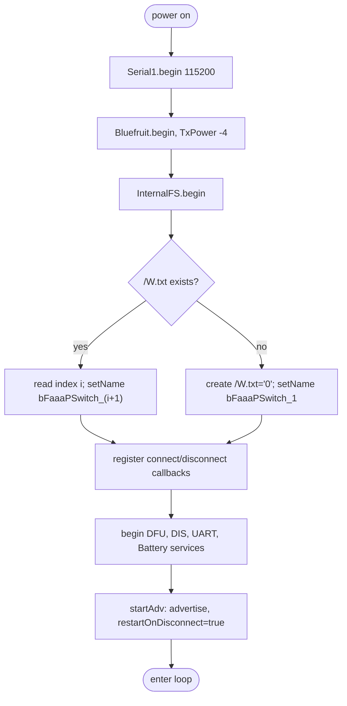
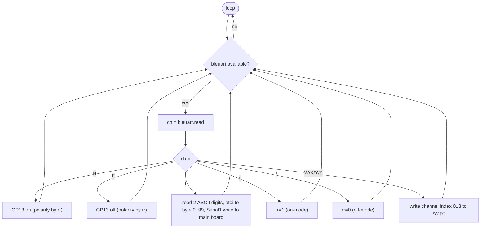
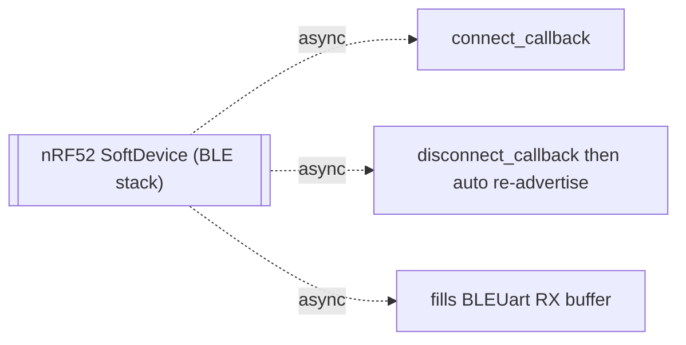
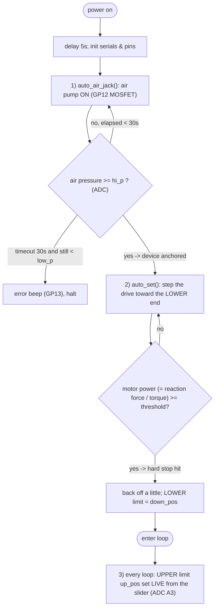
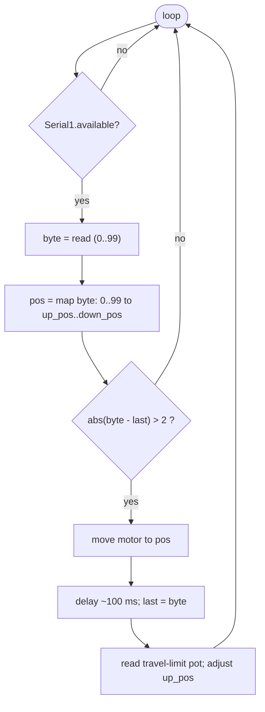

# Firmware — design highlights & flowcharts

> English first; 日本語・ドイツ語版は後日 `i18n/` 配下に追加予定。
> Firmware by **Hiroyuki Narusawa**.

Control firmware reads better as **flowcharts** than as prose, so the behaviour
of each board is drawn below. Diagrams use Mermaid (rendered by GitHub).

---

## Is there asynchronous processing? — Yes, on the BLE board only

This is the key architectural fact.

| Board | Model | Why |
|-------|-------|-----|
| **BLE board** (nRF52 / Bluefruit) | **Asynchronous / event‑driven** | The Nordic **SoftDevice** runs the radio in the background (interrupt context). `connect_callback` / `disconnect_callback` fire **asynchronously** on connection changes; incoming bytes are buffered asynchronously; `restartOnDisconnect(true)` re‑advertises by itself. `loop()` merely **polls** that buffer. |
| **Main board** (RP2040 / Pico) | **Synchronous / blocking** | A single‑threaded polling `loop()`. `move()` busy‑waits with `delayMicroseconds()`, calibration uses blocking `while` loops, and `setup()` blocks on the air‑jack and limit search. No interrupts, callbacks, or RTOS. |

**Why the split is deliberate.** BLE timing is hard real‑time, so it is offloaded
to the SoftDevice (async). Motor motion wants deterministic, ordered, blocking
steps, so the main board stays simple and synchronous. The **wired UART
decouples the two timing domains** (async radio ↔ sync motion) — the same idea
the iOS app uses to decouple the AR frame rate from the BLE send rate.

---

## BLE board (nRF52)

### Boot

### Main loop — command dispatch (polls the async RX buffer)

### Asynchronous events (run outside `loop`)

---

## Main board (Pico)

### Boot sequence (three mechanisms, in order)

### Main loop — position the pedal

---

## Self‑calibration & anchoring (boot mechanisms in detail)

At power‑up the device makes itself **anchored and self‑referenced** before it
will respond to the app. Three mechanisms run, in this order:

**1) Air‑jack anchoring — `auto_air_jack()`.**
Before any pedal force is applied, the firmware runs the **air pump**
(GP12 → MOSFET) to inflate the **airback** bag under a neighbouring pedal. It
keeps pumping until the measured air pressure reaches `hi_p` (read on the ADC),
with a **30‑second timeout**. If pressure still cannot reach `low_p`, it sounds a
continuous **error beep** (GP13) and halts — i.e. it refuses to operate unless
the unit is firmly fixed. This guarantees the device cannot shift when the motor
later pushes the sustain pedal.

**2) Lower end (下端) — automatic, by reaction force — `auto_set()`.**
The drive is stepped toward the pedal until it physically bottoms out. The
firmware watches the **motor _power_**, which is proportional to **torque /
reaction force**: when the push‑rod meets the hard stop the power rises past a
threshold (`mot_cu_down`). That contact point (after a small back‑off) becomes
the **lower limit `down_pos`** — the deepest the pedal is pressed. A safety cap
(50 mm) stops the rod being driven out.

> **Why power, not current (per device co‑author):** the threshold is on **electrical
> power**, not current, because the **current changes with the input voltage**
> whereas **power stays consistent across supply voltages** — so a commercial,
> off‑the‑shelf power supply can be used without re‑tuning. On the **IQ (v039B)**
> version the power is **read by command from the IQ motor** (its telemetry). For
> the planned **stepper successor**, the power‑measurement method is **not yet
> decided** (no IQ telemetry).
>
> **Threshold value (v039B):** piano‑dependent (reaction force differs); set by a
> **DIP switch** = **base 20 W + DIP, 1 W steps → 20–35 W** (20 W alone was too
> weak; too strong makes the rod slip). The DIP switch also sets the lift above the
> hard stop (5–20 mm), and a **50 mm travel cap** stops the rod being driven out.

**3) Upper end (上端) — manual, by slider — `offset_AD_read()`.**
The top of travel — where the pedal rests / releases — is **not** auto‑detected.
The user sets it with the **slider on the hand controller**, which the firmware
reads on **ADC A3** every loop and converts to `up_pos = orig_pos + mm × slider`.
Moving the slider changes the resting height **live**, so the operator dials in
exactly how far the pedal returns up and where the drive stops.

Together `down_pos` (auto, by force) and `up_pos` (manual, by slider) define the
range; incoming `0–99` values from the app are mapped linearly between them
(`mapf(byte, 0, 99, up_pos, down_pos)`).

> WIP note: in the stepper sketch the thresholds (`low_p`, `hi_p`, `mot_cu_up`,
> `mot_cu_down`) are not yet given real values, and `auto_set()` additionally
> probes an upper hard stop to establish the reference frame; the *operational*
> upper limit is the slider, as above.

## Key design points

1. **Channel name persistence (LittleFS).** The advertised name
   `bFaaaPSwitch_1…4` is stored as a one‑char index in `/W.txt` and applied at
   boot via `setName`. `W/X/Y/Z` rewrite the file; the change takes effect on the
   **next reboot** (the `deep_sleep`/reset call is commented out).
2. **The BLE board is dual‑role.** `GP13` gives a direct on/off output (enough
   for an electric‑piano "Switch"), while `iNN` is forwarded to the main board
   for proportional motor control ("Pro"). One firmware, two product uses.
3. **ASCII → binary compaction.** `iNN` (3 bytes) becomes **one byte (0–99)** on
   the UART link, minimizing wired traffic between the boards.
4. **Dead‑band on the main board.** A new position is acted on only when
   `abs(byte − last) > 2`. This mirrors the iOS‑side hysteresis and ignores
   small head jitter, so the motor isn't re‑commanded constantly.
5. **Lower limit auto (by force), upper limit manual (by slider).** The lower
   end is found automatically — no limit switch — from the **rise in motor
   _power_ (reaction force/torque)** at the hard stop; **power is used rather than
   current because current changes with the supply voltage while power does not**
   (so a commercial power supply needs no re‑tuning). The upper end is set
   **live by the hand‑controller slider**. See *Self‑calibration & anchoring*
   above. (The force/power thresholds are piano‑dependent and still need real
   values.)
6. **IQ trajectory control — the reference version (v039B).** One command sets
   target displacement + duration; the IQ servo then drives there and **holds
   against the pedal's reaction force**. This IQ version is the **current
   reference design**. Because the IQ motor was discontinued, the **next** version
   will use a closed‑loop **stepping motor** (which accepts a DRV8825‑compatible
   STEP/DIR interface); that sketch (v052B) is still early development (see
   *Status & caveats*).
7. **Air‑jack anchoring at boot** with pressure feedback, a 30 s timeout, and an
   audible error if pressure can't be reached — so the unit is fixed before any
   pedal force is applied.
8. **On/Off‑mode polarity (`rr`).** `n`/`f` flip whether a tilt means
   "sustain on" or "sustain off", inverting the `GP13` output sense.

---

## Status & caveats

- The **stepper sketch `v052B` is a development snapshot**: it is missing
  `#include`s, has undefined threshold constants, an unclosed `setup()` with a
  leftover test loop, a `Serial1`/`Serial2` mismatch for BLE, and STEP/DIR pin
  numbers that disagree between the header and `move()`. Treat it as the
  *intended design*, not buildable firmware yet.
- A consolidated list of what must be resolved to make the device reproducible
  (driver/board part numbers, wiring, power, sensor choice, build‑ready
  firmware) is tracked in the project notes (hardware reproducibility gap
  analysis).
