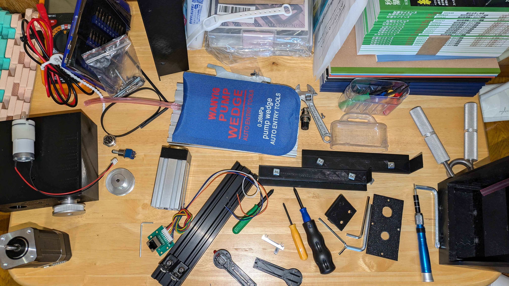
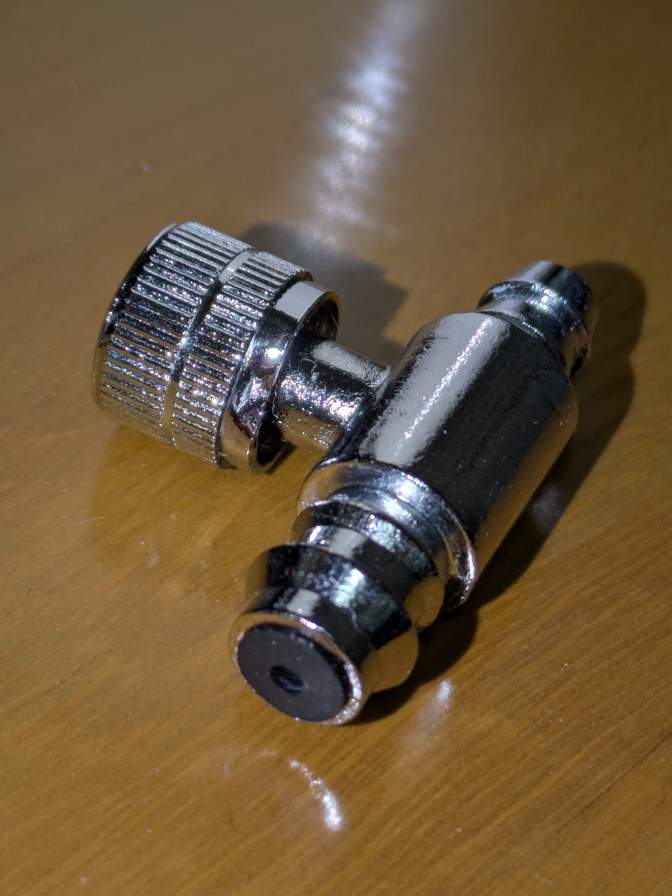
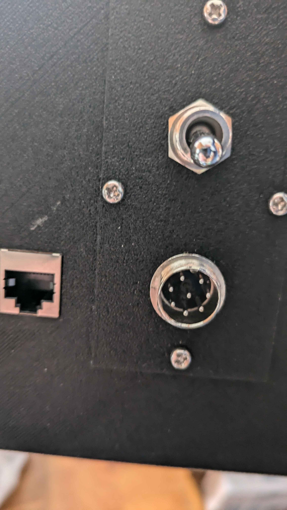
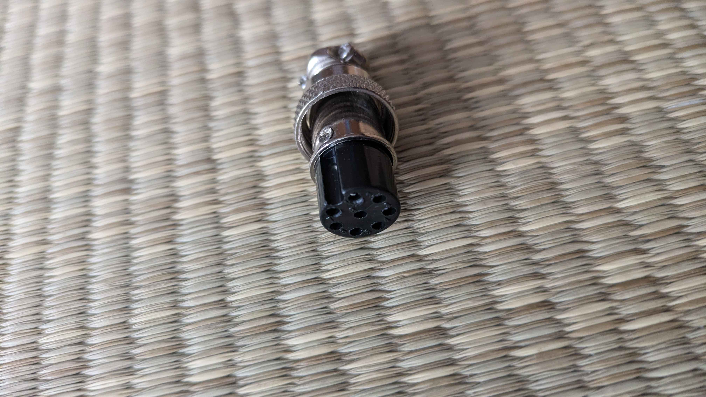
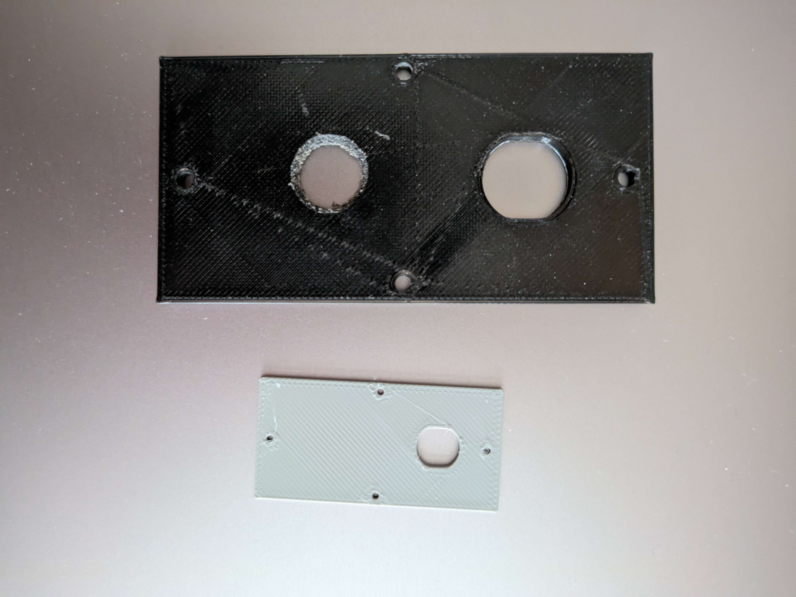

# Pro device — build photos (airback & drive unit)

Real photos of a bFaaaP **Pro** unit during build/disassembly, showing the
**airback (air‑jack) mechanism** and the **drive unit**. From the team Discord
(`#ハード`, 2025), by **Taguchi**.

> ✅ **Consent obtained (2026-06-18).** Taguchi (photographer) **consented**;
> released under the project **hardware layer (CERN-OHL-W-2.0)** — see
> [`../../../LICENSE`](../../../LICENSE). They contain no people or personal information.

## Airback (reaction-force anchoring)

**Components — airback + drive unit.** The blue **air‑pump wedge ("air‑jack")** is
the inflatable airback that absorbs the pedal reaction force; the aluminium
linear **drive unit** (lead‑screw + motor) and the control boards are also shown.

**Air valve.** The metal quick valve of the airback — the **rubber‑visible side is
the air input** (per the device co‑author).

## Enclosure & I/O

**I/O panel.** The 3D‑printed body's I/O panel: an **RJ45 socket** (hand
controller), a **toggle switch**, and the **8‑pin power connector**.

**Power connector.** The 8‑pin (M15‑type) power connector used on the prototype.

**3D‑printed panels.** The original panel (black) and a re‑printed copy (grey),
illustrating the print‑it‑yourself enclosure.

