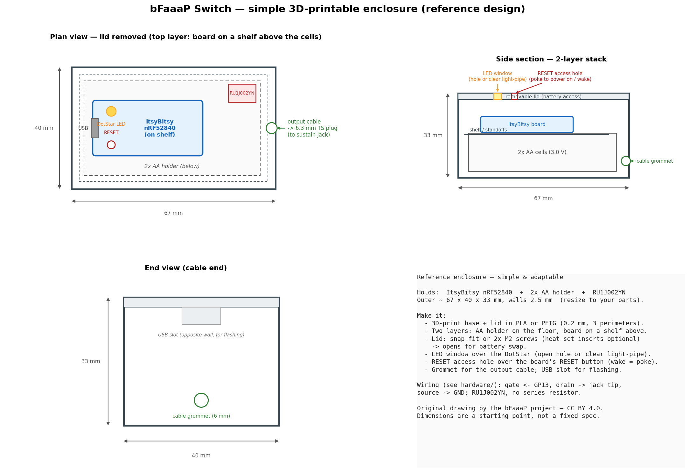

# Switch — enclosure & assembly (packaging)

> ⚠️ **AI DRAFT DESIGN.** This enclosure was drafted by the bFaaaP project (AI-assisted)
> from the device's known internals — it is **untested**. Treat the dimensions as a
> starting point: check them against your actual ItsyBitsy board, AA holder and cable,
> and adjust before printing. The electrical design (firmware + the RU1J002YN switch)
> is the verified part; this case is just convenient packaging.

A simple, adaptable two-part case that holds the **whole Switch**: an
**Adafruit ItsyBitsy nRF52840**, a **2× AA holder**, and the **RU1J002YN** sustain
switch (see [`../hardware/`](../hardware/)).

## What's here

| File | What it is |
|------|-----------|
| [`switch-enclosure.scad`](switch-enclosure.scad) | **Parametric source** (OpenSCAD) — edit the dimensions, then export STL. **Start here to adapt it.** |
| [`switch-enclosure-base.stl`](switch-enclosure-base.stl) | Ready-to-slice **base tray** (open-top; cable + USB notches; board shelf ledges). |
| [`switch-enclosure-lid.stl`](switch-enclosure-lid.stl) | Ready-to-slice **lid** (locating lip + DotStar LED window + RESET access hole). |
| `switch-enclosure-reference.png` | The dimensioned reference drawing above. |

> The STLs were generated from the `.scad` parameters and are **watertight/manifold**.
> To change anything (board size, AA-holder size, hole positions), edit the `.scad`
> in [OpenSCAD](https://openscad.org) (free) and re-export — that's the adaptable path.

## Design (≈ 67 × 40 × 33 mm outer, 2.5 mm walls)

- **Two layers:** the 2× AA holder sits on the floor; the ItsyBitsy board rests on
  two **shelf ledges** above it — keeps the footprint small.
- **Lid** nests in with a locating lip and lifts off for **battery swaps** (2× AA are
  replaceable). Hold it with a snap fit or **2× M2 screws** (heat-set inserts optional).
- **DotStar LED window** over the board's RGB LED (open hole, or drop in a clear
  light-pipe / hot-glue lens).
- **RESET access hole** over the board's RESET button — this is how you **power on /
  wake** the Switch (there is no separate power button; poke RESET).
- **Cable grommet / U-notch** for the output lead to the **6.3 mm TS plug**.
- **USB slot** lined up with the board's USB connector for **flashing**.

## Print settings (suggested)

- Material **PLA** or **PETG** (PETG if it may sit in a warm car/venue).
- 0.2 mm layers, **3 perimeters**, 15–20 % infill.
- Orientation: print both parts **open-side-down** — no supports needed (the notches
  are bridged by the lid, the holes are small).

## Assembly

1. Print `base` and `lid`. Test-fit the lid lip; loosen `CL` in the `.scad` if tight.
2. Drop the **2× AA holder** onto the floor (double-sided tape or a dab of hot glue).
3. Wire the **RU1J002YN** per [`../hardware/`](../hardware/): gate → `GP13`,
   drain → the sustain-jack lead, source → GND/battery −. Keep it on a tiny stub
   board or heat-shrink it inline near the cable exit.
4. Seat the **ItsyBitsy** on the shelf ledges, USB facing the USB slot, DotStar under
   the LED window, RESET under the RESET hole. Route the output cable through the notch.
5. Flash the firmware ([`../firmware/`](../firmware/)) via the USB slot, fit the lid.

---
**Credits:** original design by the **bFaaaP project** (AI-assisted draft). Hardware
layer **CERN-OHL-W-2.0**; the drawing is **CC BY 4.0**. Generators kept in the
project's private tooling — only the outputs (`.scad`, `.stl`, `.png`) are committed.
