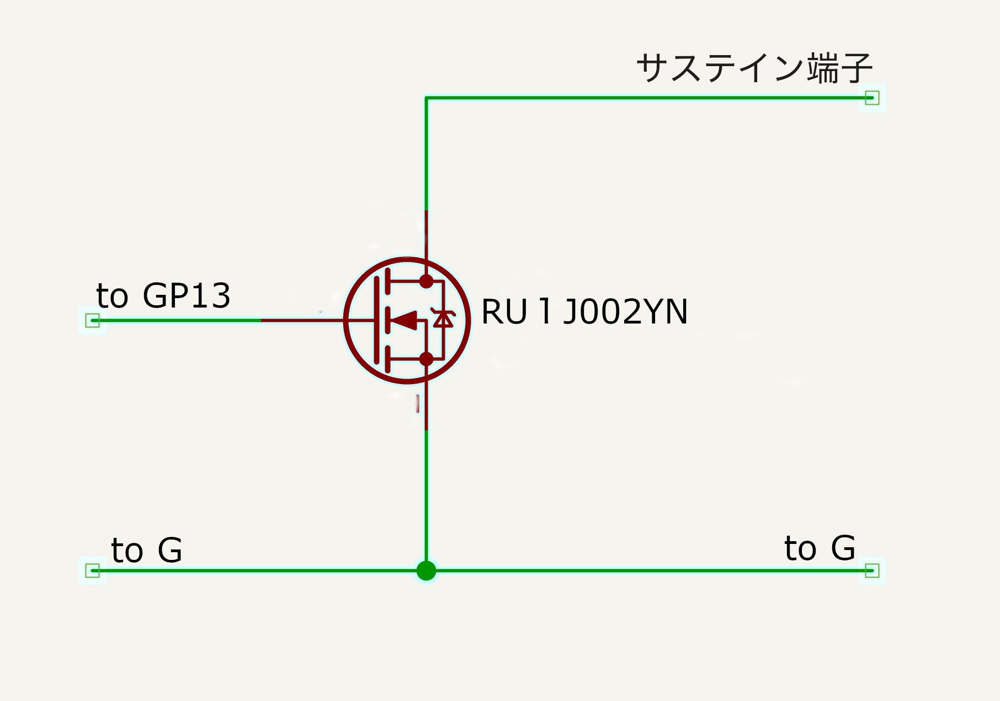

# Switch hardware — the sustain switch

The Switch needs **one transistor** between the BLE board's `GP13` output and the
instrument's sustain‑pedal jack: a **ROHM `RU1J002YN`** N‑channel logic‑level MOSFET
wired as a **low‑side switch**. Reference schematic by **Hiroyuki Narusawa**
(2026‑06‑24).



*(The one Japanese label, サステイン端子, = "sustain‑pedal terminal".)*

## Wiring

```
                Sustain jack (tip)
                       │
                       │  Drain
                    ┌──┴──┐
   GP13 ───── Gate ┤  Q1  │   RU1J002YN  (N-channel, logic-level;
                    └──┬──┘   body + ESD diodes internal)
                       │  Source
                       ●──── GND   ( = the sustain jack's sleeve / ground )
```

- **Gate ← `GP13`** (from the nRF52 BLE board). No series / gate resistor.
- **Drain → sustain‑jack tip** (the "sustain" signal of the digital piano).
- **Source → GND**, shared with the **sustain jack's sleeve** and the board ground.
- The RU1J002YN's **body diode and gate ESD diode are internal** — no extra parts.

## How it switches

`GP13` HIGH → the MOSFET turns **on** → it pulls the **sustain tip down to GND**,
which most digital pianos read as **"pedal pressed"** (sustain engaged). `GP13` LOW
→ MOSFET **off** → the tip floats → **released**.

Because the part is **logic‑level** (Vgs(th) ≈ 0.3–0.8 V; full 0.9 V drive), the
**3.3 V `GP13`** turns it fully on. The app's **on‑type / off‑type** toggle
(`n` / `f` in the firmware) flips the polarity for instruments whose sustain logic
is inverted.

> This is the whole "Switch" hardware: the **BLE board + this one MOSFET**. See the
> firmware in [`../firmware/`](../firmware/) for the BLE protocol and pin behaviour,
> and the device overview in [`../README.md`](../README.md).

---
**Credits:** reference schematic © **Hiroyuki Narusawa** (bFaaaP team). Part
datasheet is ROHM's (vendor copyright) — see the official
[ROHM RU1J002YN page](https://www.rohm.com/products/transistors/mosfets/standard/ru1j002yn-product).
