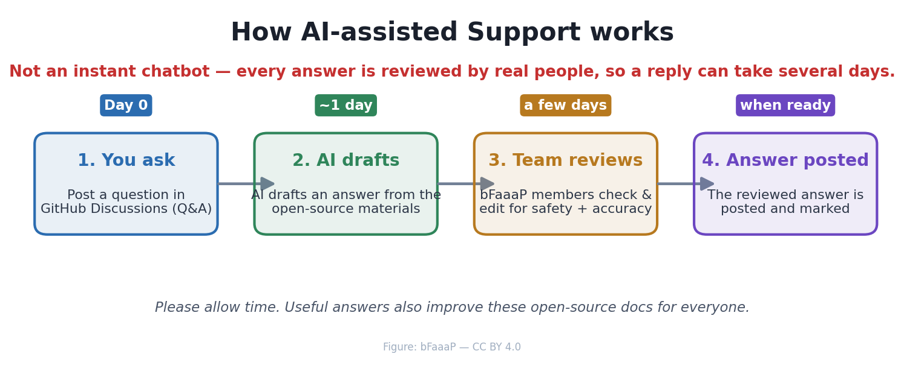

# 🙋 Getting help — GitHub Discussions

> 🌐 **English** · [日本語](../i18n/ja/docs/ai-support.md) · [Deutsch](../i18n/de/docs/ai-support.md)

Building bFaaaP yourself? **Ask in [GitHub Discussions](https://github.com/TomoShishido/bfaaap_opensource/discussions) (Q&A).**
This is a **community space**: post your build or usage question, and the bFaaaP community and team
help answer it using this repository's own open materials — build guides, schematics, firmware, and
the parts list. Everything you need to build bFaaaP is here in the open, and it stays free.

## ⏳ It is **not** an instant chatbot

Answers are written by **real people** (the bFaaaP community and team — e.g. Shishido and Narusawa),
so **a reply can take some time.** That review by real people is the point: it keeps answers
trustworthy on things that matter — wiring, 24 V power, Bluetooth/radio rules, and assistive‑device
safety. Please be patient and kind — this is a volunteer, community‑run project.

| Stage | What happens | Rough timing |
|------|--------------|--------------|
| **1. You ask** | Post a question in GitHub Discussions (Q&A) | Day 0 |
| **2. Community & team help** | Members answer using this repository's open materials | a few days |
| **3. Answer posted** | The answer is posted (and marked as the answer) | when ready |
| **4. Docs improve** | Useful answers are folded back into these docs | when ready |

Useful questions often **improve these docs** too — so your question helps everyone who
builds bFaaaP next.

## Two tracks: answerable now vs. needs the makers

When your question arrives, it tends to fall into one of two tracks:

- **① Answerable now** — the answer is already in this repository (build guides,
  schematics, firmware, the parts list). The community can point you straight to it.
  *Most questions are here, and these are the fastest.*
- **② Needs the makers** — the answer needs information only the device makers have yet
  to publish (e.g. an exact mechanical part number, or the next motor choice). We forward
  your question to them; once they answer we post it **and add it to the docs**, so the
  next builder finds it directly. *These take a little longer.*

Either way your question helps — track ② answers become new documentation.

> 🎭 **How bFaaaP was built in the open:** [**bFaaaP — AI & Team, Live**](ai-team-live.md) — a
> behind‑the‑scenes **record** of an earlier chapter, when AI teammates (Ponte and Harmonia) drafted
> answers and ideas for the team to review as we built bFaaaP **together** (figures, illustrations, and
> firmware reviewed live by the team). We keep it as a record of the project's story. A shorter
> single‑question example: [**"Which motor can replace the EOL one?"**](ai-support-example-pro-motor.md).

## 🧹 What we answer — a curated Q&A

To keep this a high‑signal resource for builders, **the bFaaaP team curates new questions**, and we
do this **in the open** — here's the deal:

- **We prioritize questions that help someone build, reproduce, debug, or improve bFaaaP** — including
  genuine **design ideas**, clear **bug reports**, and **show‑and‑tell** of your build. The useful ones
  become new docs.
- **Detail helps.** Say what you're building, what you tried, your parts/boards, and add an **error
  message or photo** — detailed questions get better, faster answers.
- **Be kind and constructive.** This is **assistive technology**; empathy is our foundation. We follow a
  simple code of conduct.
- **We remove noise.** **Spam, off‑topic posts, hostile/uncivil content, and automated or bulk questions**
  (e.g. bots or other AIs mass‑posting) are hidden or removed and won't be answered.
- **If a question is unclear, we ask — we don't reject.** So if you're a genuine builder, you'll always
  get a reply, even if it's a friendly request for more detail.

*Curation is by the bFaaaP team — transparent, and always erring toward helping a real builder.*

## How to ask a good question

- Say whether it's about the **iOS app, the Pro device, or the Switch device**.
- Include **what you've tried**, your parts/boards, and any **error message or photo**.
- For mechanical parts, mention your **3D printer** and the **part name**.
- Ask in **any language** — we reply in the language you used.

→ **[Open a Q&A discussion](https://github.com/TomoShishido/bfaaap_opensource/discussions)**

> ℹ️ Answers are general information to support DIY reproduction/improvement, provided **at
> your own risk**. bFaaaP's patents are licensed free of charge for public‑interest,
> inclusive use. Please mind local regulations (radio law for BLE, medical/assistive‑device
> rules) and electrical safety (24 V).
