# 🎭 bFaaaP — AI & Team, Live  ·  AIとチームの実況解説

> 🌐 **English** · [日本語](../i18n/ja/docs/ai-team-live.md) · [Deutsch](../i18n/de/docs/ai-team-live.md)
>
> A **live, behind‑the‑scenes commentary** of how bFaaaP is actually being built — the **AI and the
> real bFaaaP team**, working together in the open.

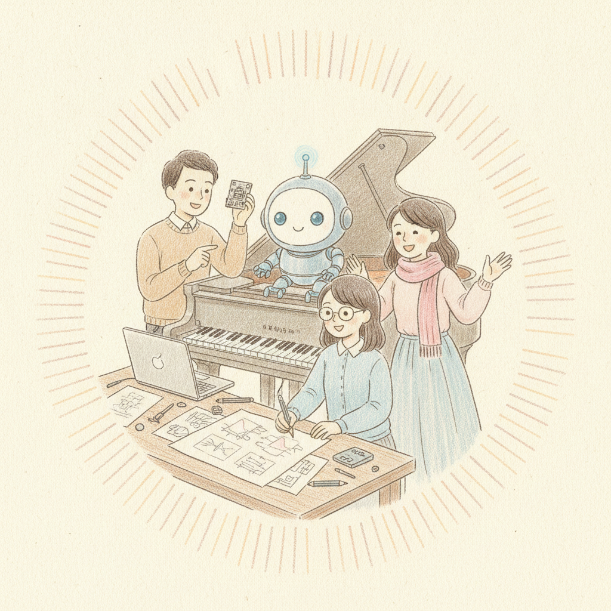
<sub>AI‑assisted Support, team‑collaboration mode. Illustration: AI‑generated (Saki Shiokawa style) © Shishido &amp; Associates.</sub>

This is the heart of [**AI‑assisted Support**](ai-support.md): the **AI moves fast** and drafts —
figures, docs, even **firmware** — and the **makers, who actually built the device, keep it honest.**
Nobody pretends the AI is always right; you get to watch a real engineering conversation reach a
real answer. Pull up a seat. 🎙️

---

## 🎙️ The cast

<table>
<tr>
<td width="130" align="center"></td>
<td valign="middle">

### 🤖 Ponte
Reads the whole repository, drafts fast (diagrams, docs, code), researches the live web — and
**defers to the makers**. Confident, tireless, occasionally confidently wrong.

</td>
</tr>
<tr>
<td width="130" align="center">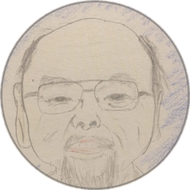</td>
<td valign="middle">

### 🛠️ Hiroyuki Narusawa — *pedal device / firmware*
**Built the working unit.** The ground truth for the mechanics and the firmware — every "actually,
on the real device…" comes from here.

</td>
</tr>
<tr>
<td width="130" align="center">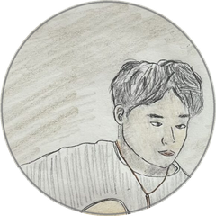</td>
<td valign="middle">

### ⚡ Haruto Tanaka — *electrical / semiconductor circuits*
A graduate researcher at a **leading semiconductor circuit‑design lab at Science Tokyo (東京科学大)** —
he'll bring **analysis from his lab's AI environment and equipment**. *(His take is coming up.)*

</td>
</tr>
<tr>
<td width="130" align="center">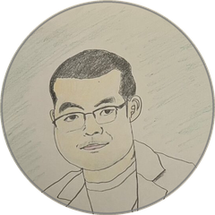</td>
<td valign="middle">

### 💻 Taguchi — *software engineering*
Confirmed the schematic, owns the firmware/control view. *(His review of the new firmware is coming up.)*

</td>
</tr>
</table>

---

## 🥋 The team behind it — a master and his apprentices (師弟 · *shitei*)

🎙️ *"A note for the audience outside Japan — so the cast feels less like a list of names and more like
people who actually know each other."*

Watch how the team talks and a quiet shape appears: **Narusawa is the *master*, and Taguchi and Tanaka
are his *apprentices*.** Japan has a deep word for that bond — **師弟 (*shitei*)**, master‑and‑apprentice.
The maker who actually built the working unit doesn't simply *hand over* the schematics; he draws the
understanding *out* of the people learning beside him. (The [members page](members/README.md) already
hints at it — Taguchi is "*deepening his understanding of bFaaaP with Narusawa's guidance*.")

If you'd like a shorthand from a galaxy far, far away: picture the small, green, sentence‑bending mentor
who trains a young hopeful not by handing him answers, but by sending him into the cave to meet himself —
*"Do, or do not. There is no try."* **That** energy. 🟢

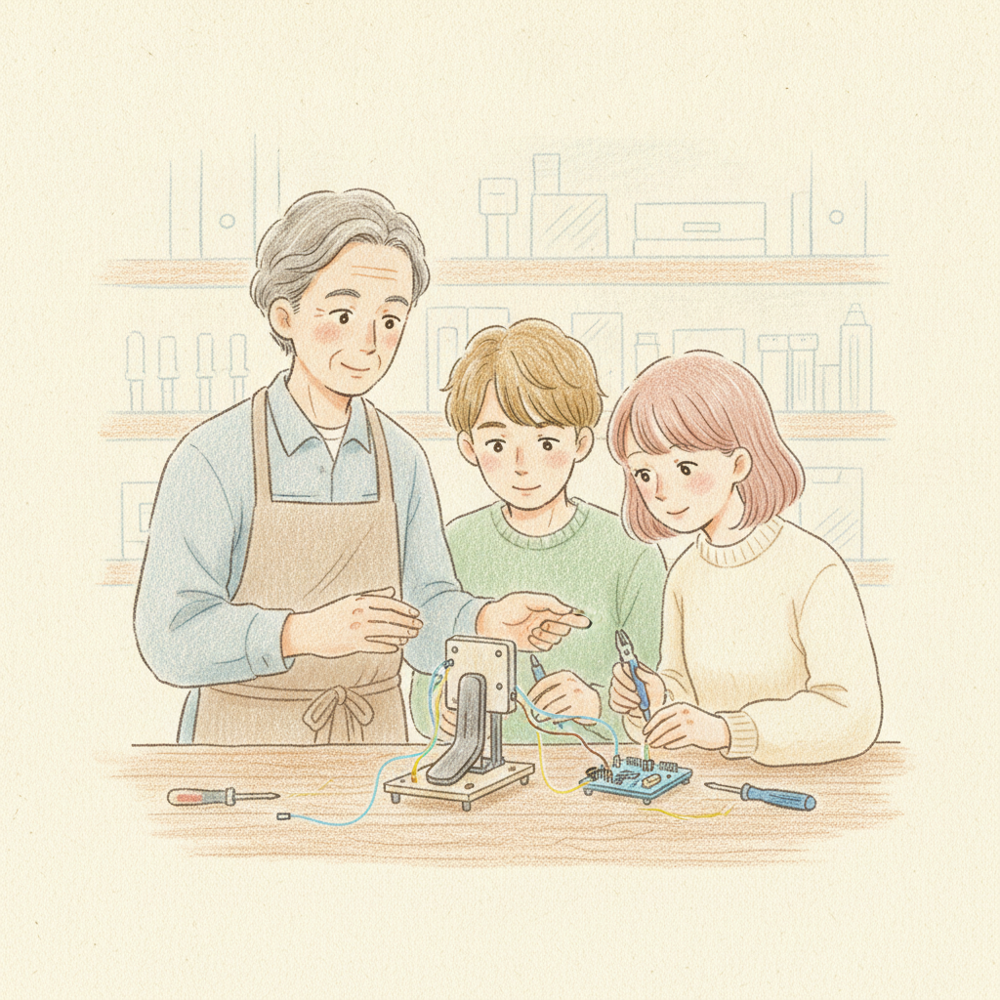
<sub>The 師弟 (shitei) spirit — a maker mentoring the next builders. Illustration: AI‑generated (Saki Shiokawa style) © Shishido &amp; Associates.</sub>

What that mentoring actually looks like:

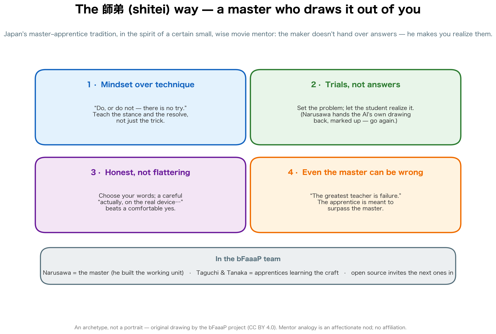

And here's the lovely part for an **open‑source** project: once it's public, **anyone reading this becomes
a potential apprentice.** The same patience the makers show each other is what
[AI‑assisted Support](ai-support.md) extends to you — the AI drafts fast, the masters keep it honest, and
you get to learn *in the open.*

> *An affectionate cultural nod only — bFaaaP is not affiliated with any film, and the illustration is an
> original drawing, not a portrait of anyone real or fictional.*

---

## The play — the loop it runs on

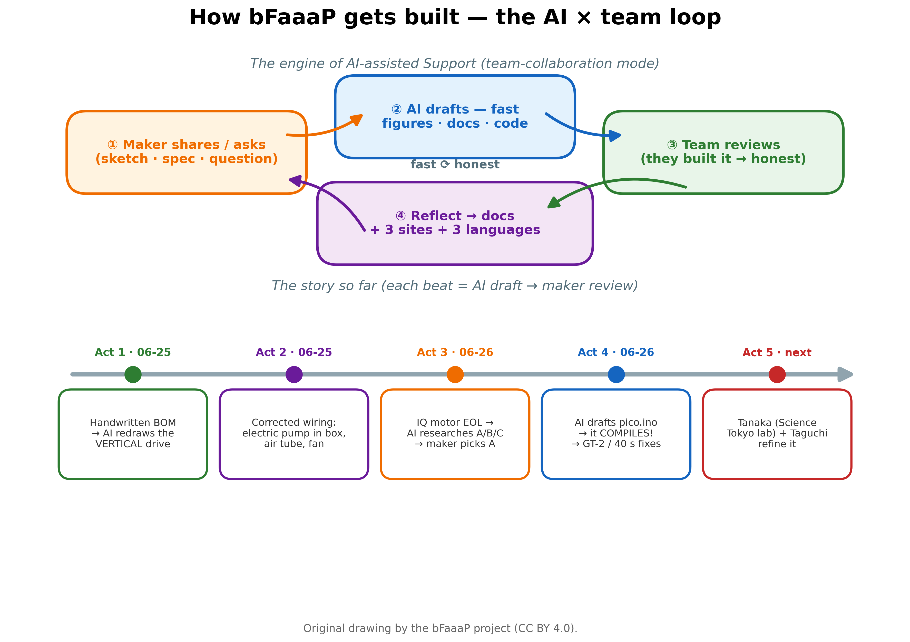

> ① a maker shares a sketch / spec / question → ② the AI drafts it fast → ③ the team reviews it
> (they built the thing) → ④ it's reflected into the docs and the three sites in three languages →
> and round again. **Fast ⟳ honest.** Here's how it actually played out.

---

## 🎬 Act 0 — Detective work: pinning down the unknowns

🎙️ *"Before any of the drama, a quieter challenge — at the start, even the AI couldn't just read the
real BOM and circuit off the data. Parts had to be **identified**, one maker answer at a time."*

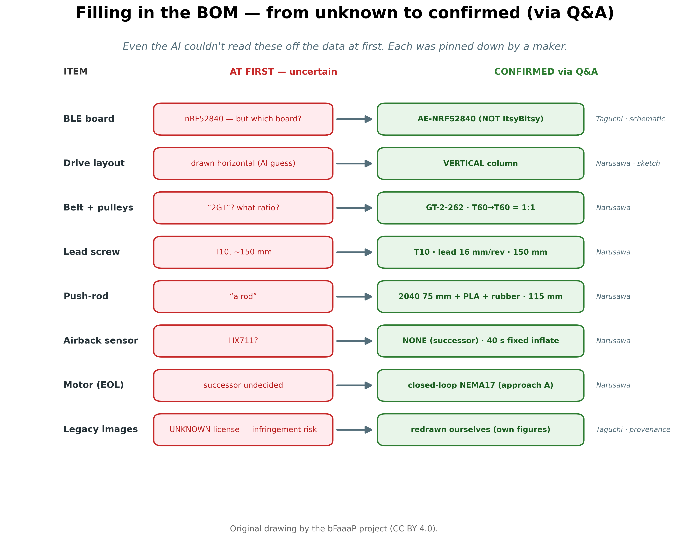

<table>
<tr>
<td width="100" align="center"></td>
<td valign="top">

**💻 Taguchi:** The Pro's BLE board is the **AE‑NRF52840** — *not* the ItsyBitsy (that's the **Switch**'s
board). Here's the full **pin map** and the KiCad schematic.

</td>
</tr>
<tr>
<td width="100" align="center"></td>
<td valign="top">

**🤖 AI:** That closes the circuit — imported the KiCad source and fixed every stray doc that wrongly
said "Pro = ItsyBitsy." (See the whole table above: each red "unknown" became a green "confirmed.")

</td>
</tr>
</table>

### …and a license scare, avoided 🕵️

🎙️ *"Here's the practical bit engineers love. Preparing for a public release, the AI audited **every**
asset's license — and caught a problem before it shipped."*

<table>
<tr>
<td width="100" align="center"></td>
<td valign="top">

**🤖 AI:** Two diagrams carried over from the old `hardware.md` had an **unknown license** — a real
**infringement risk** for an open‑source repo. So I **removed them and redrew our own** clean figures
(matplotlib), linking only to the official sources.

</td>
</tr>
<tr>
<td width="100" align="center"></td>
<td valign="top">

**💻 Taguchi:** Good catch — those were most likely from the **Raspberry Pi Pico docs** and the
**Fortiq datasheet** (vendor copyright). Removing and redrawing was the right call.

</td>
</tr>
</table>

> The repo now ships **zero** third‑party images of uncertain license (see
> [`PUBLISHING-CHECKLIST.md`](../PUBLISHING-CHECKLIST.md) §3) — the AI's license audit became part of
> the public‑release gate. *Fast, yes — but also careful.*

---

## 🎬 Act 1 — A pencil sketch becomes a vertical drive

🎙️ *"We open on a problem: the repo's drawing of the Pro showed a horizontal screw — but that's not
the real machine. Narusawa settles it with a photo of a hand‑drawn BOM…"*

<table>
<tr>
<td width="100" align="center"></td>
<td valign="top">

**🛠️ Narusawa:** The Pro mechanical layout should look like my sketch — it's closer to the real unit.
*(motor beside the screw · belt 1:1 · a **vertical** lead screw · push‑rod presses straight down · WINBAG airback.)*

</td>
</tr>
<tr>
<td width="100" align="center"></td>
<td valign="top">

**🤖 AI:** Read it, and redrew the layout as a **vertical column** — and it matches the assembly BOM
exactly (GT‑2‑262 belt, T60/T60, T10 screw, 2040 + 2080 frame).

</td>
</tr>
</table>

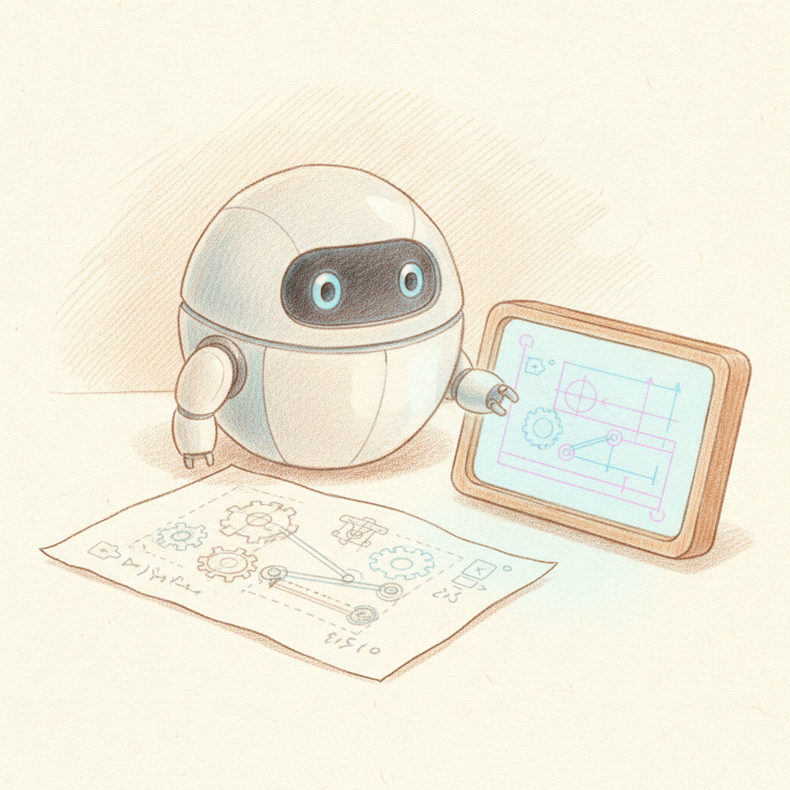

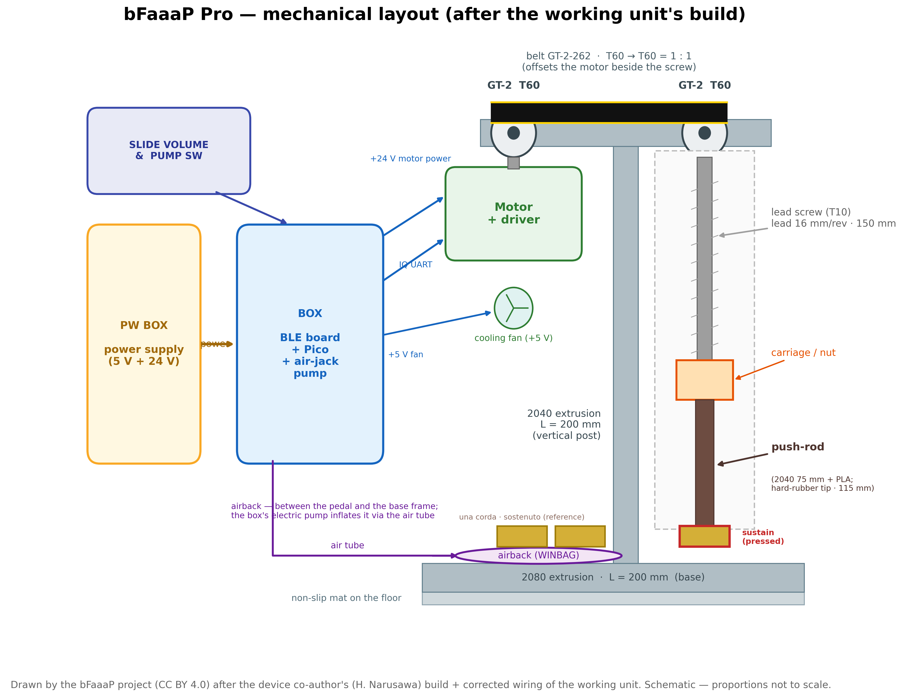

---

## 🎬 Act 2 — The maker marks up the AI's own drawing

🎙️ *"Plot twist — Narusawa annotates the AI's figure and hands it back. The wiring gets real."*

<table>
<tr>
<td width="100" align="center"></td>
<td valign="top">

**🛠️ Narusawa:** The air‑jack pump is **inside the box**; the airback is inflated by that **electric
pump** through an **air tube** — not by hand. Add the **SLIDE VOLUME & PUMP SW** panel and the real
wiring (+24 V motor power, **IQ UART**, a **+5 V cooling fan**).

</td>
</tr>
<tr>
<td width="100" align="center"></td>
<td valign="top">

**🤖 AI:** Reflected all of it into the figures **and** the docs **and** the three sites — in
**three languages**. The architecture diagram now shows the pump‑in‑the‑box and the air tube.

</td>
</tr>
</table>

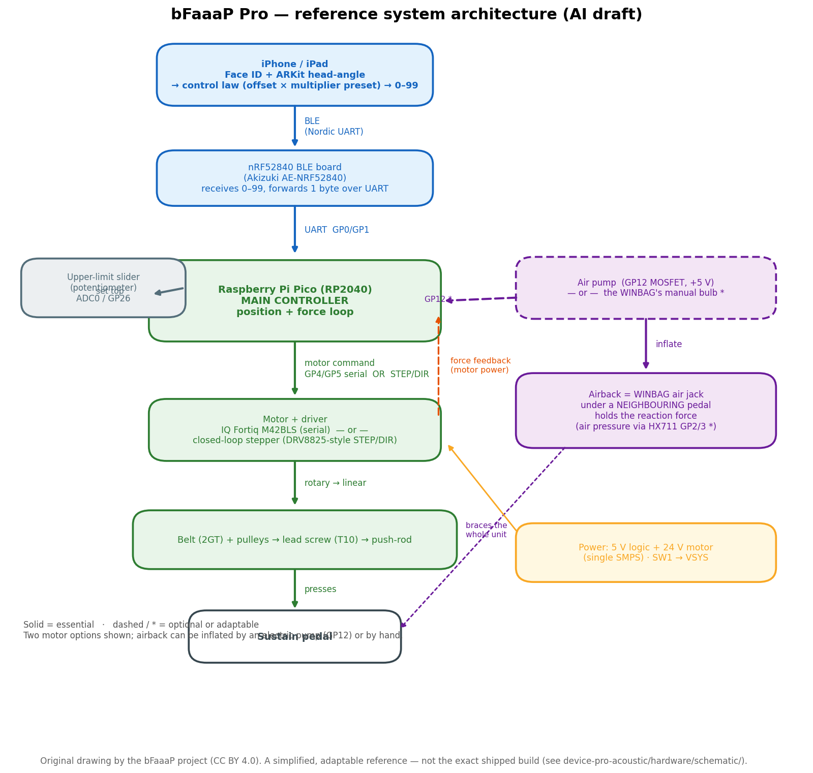

---

## 🎬 Act 3 — A dead part, and a research sprint

🎙️ *"Then a real obstacle: the original motor is **end‑of‑life.** Can a newcomer even build this? The
AI goes to the live web…"*

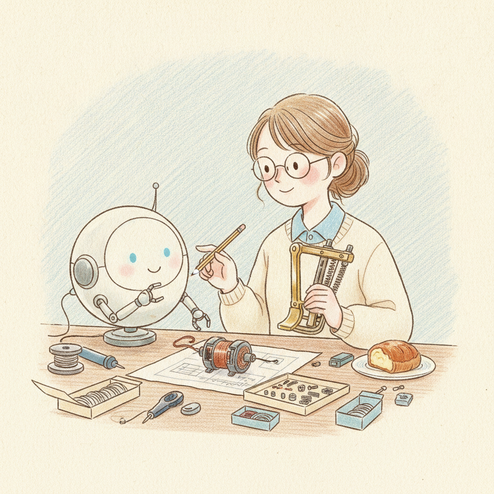

<table>
<tr>
<td width="100" align="center"></td>
<td valign="top">

**🤖 AI:** The IQ motor is EOL. I researched (June 2026) and the real question is **force feedback**.
Three ways: **A** a closed‑loop driver (reads load over serial), **B** TMC2209 StallGuard, **C** a
load cell on the existing HX711. A NEMA17 keeps the same frame.

</td>
</tr>
<tr>
<td width="100" align="center"></td>
<td valign="top">

**🛠️ Narusawa:** Let's go with **option A** — either **MKS SERVO42C/D + a NEMA17**, or an integrated
closed‑loop NEMA17. **Could the AI draft the firmware** for that?

</td>
</tr>
</table>

---

## 🎬 Act 4 — The AI writes firmware… and it compiles 🎉

🎙️ *"Here's the moment. The AI writes a whole Pico sketch for the new motor — and Narusawa flashes
his toolchain…"*

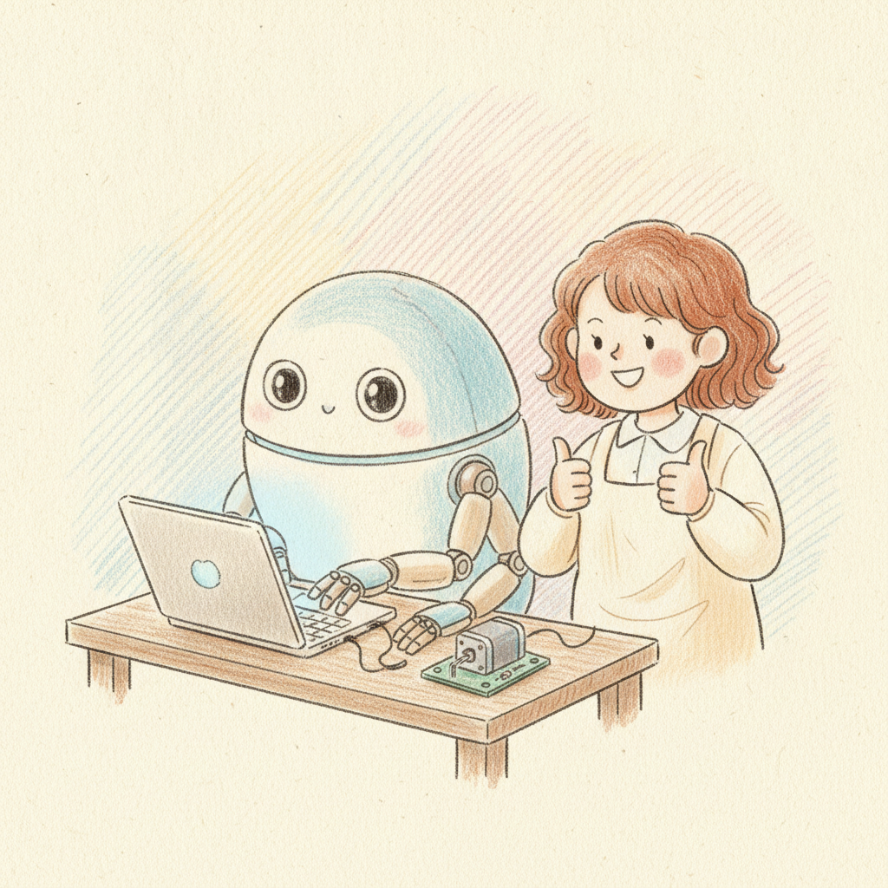

<table>
<tr>
<td width="100" align="center"></td>
<td valign="top">

**🤖 AI:** Drafted [`bFaaaP_autopro_pico_stepperA_draft_20260626.ino`](../device-pro-acoustic/firmware/pico/bFaaaP_autopro_pico_stepperA_draft_20260626.ino)
— STEP/DIR motion + a *go‑to‑position‑and‑hold* loop + a `readLoad()` for the press‑force step;
maps the app's **0–99** to a target and keeps the **50 mm travel cap**. It even fixes the `v052B`
STEP/DIR pin clash. *Untested — a starting point for the bench.*

</td>
</tr>
<tr>
<td width="100" align="center"></td>
<td valign="top">

**🛠️ Narusawa:** **It compiles — nice work!** A few real‑world fixes for the successor: it's **GT‑2**,
not 2GT; **drop the HX711** — just run the pump a **fixed 40 s** (the valve is normally closed, released
on removal); and **80 µs STEP is too fast**, the pedal won't follow.

</td>
</tr>
<tr>
<td width="100" align="center"></td>
<td valign="top">

**🤖 AI:** Done — GT‑2 everywhere, the airback is a fixed 40 s inflate (valve normally closed), and
the STEP rate is slowed (80 → 350 µs, tunable). The control loop now reads:

```cpp
void loop() {
  if (Serial1.available() > 0) {
    int b = Serial1.read();                 // 0..99 from the BLE bridge
    if (b < 0 || b > 99) return;
    if (abs(b - last_byte) > MOVE_HYST) {   // ignore small head jitter
      long target = (long)mapf(b, 0, 99, up_pos, down_pos);
      moveSteps(target - cu_steps);         // go to the target and hold
      last_byte = b;
    }
  }
}
```

</td>
</tr>
</table>

---

## 💻 Code spotlight — the force calibration

🎙️ *"For the engineers in the audience: this is the heart of recovering the IQ‑style 'press until the
reaction force rises' — drive to the top, then down until the driver's load says 'pressed', with a
hard 50 mm travel cap. GitHub — and bFaaaP.com / saaipf.com — render this with **mode‑aware,
Prettier‑style syntax highlighting**: flip your dark/light toggle and the colours follow."*

```cpp
// Find the mechanical top, then drive down until the pedal-press load is reached.
void autoCalibrate() {
  const long CAP = (long)TRAVEL_CAP_MM * STEPS_PER_MM;   // 50 mm safety cap
  long guard = 0;

  // 1) drive UP until the load rises (hit the top), then back off 5 mm = up_pos
  while (readLoad() < LOAD_THRESH_UP && guard++ < CAP * 2) moveSteps(-STEPS_PER_MM);
  moveSteps(5 * STEPS_PER_MM);
  up_pos = cu_steps;

  // 2) drive DOWN until the press load is reached OR the travel cap, then up 10 mm = down_pos
  guard = 0;
  while (readLoad() < LOAD_THRESH_DOWN && (cu_steps - up_pos) < CAP && guard++ < CAP * 2)
    moveSteps(STEPS_PER_MM);
  moveSteps(-10 * STEPS_PER_MM);
  down_pos = cu_steps;
}
```

Full sketch (AI draft, untested): [`bFaaaP_autopro_pico_stepperA_draft_20260626.ino`](../device-pro-acoustic/firmware/pico/bFaaaP_autopro_pico_stepperA_draft_20260626.ino).

---

## 🎬 Act 5 — The dream device: a Pro you can *see through*

🎙️ *"Intermission's over — and the team lifts its eyes from the workbench to the horizon. Taguchi
opens with a charmer: a **miniature Pro you can see straight through.**"*

<table>
<tr>
<td width="100" align="center"></td>
<td valign="top">

**💻 Taguchi:** Here's my sketch for a **"ske-ske bFaaaP Pro"** *(ske-ske = see-through)* — an
exhibition / proof-of-concept piece:

- a **miniature** Pro, small enough to print on a **Bambu Lab A1 mini**;
- powered over **USB-PD** (USB-C);
- a **stepping-motor PoC** — start small, with a little motor;
- a **skeleton frame — only the bones** — so the microcontroller board and the wiring are visible
  from the outside, which makes it **easy to explain how it actually works**;
- precision isn't critical here, so we could even run **inference on a local LLM module** on-device —
  and **Android support** would be a lovely bonus.

</td>
</tr>
<tr>
<td width="100" align="center"></td>
<td valign="top">

**🤖 AI:** I love this — it's a **teaching device.** Hide nothing, and the whole pipeline from
[*How it works*](how-it-works.md) becomes something a newcomer can literally *point at.* USB-PD and an
A1-mini footprint also make it the easiest possible **first build** — a perfect on-ramp to the full Pro.

</td>
</tr>
</table>

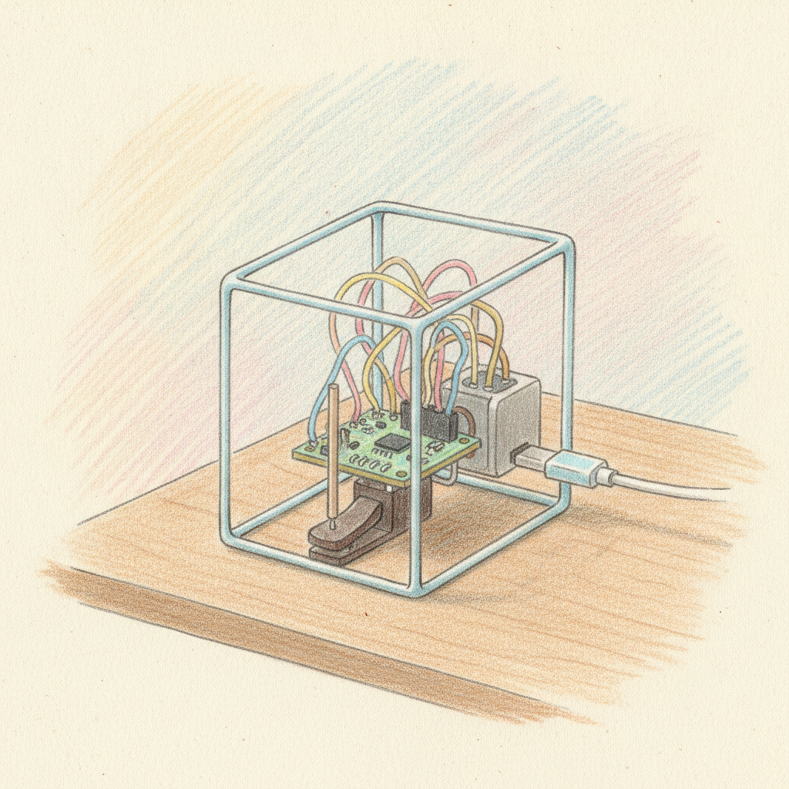
<sub>The "ske-ske" mini Pro (concept). Illustration: AI‑generated (Saki Shiokawa style) © Shishido &amp; Associates.</sub>

---

## 🎬 Act 6 — Narusawa opens the horizon

🎙️ *"And the maker who built the real machine widens the frame — from one device to a whole field of
possibilities."*

<table>
<tr>
<td width="100" align="center"></td>
<td valign="top">

**🛠️ Narusawa:** Thinking about **reach (share), we can't ignore Android.** And if there were a way to
**sense the motion without a smartphone**, the **total cost would come down.** I don't think we're bound
to the current device's way of driving the pedal, either — **muscle actuators, piezoelectric elements…**
once you start thinking, there's **no end to it.**

</td>
</tr>
<tr>
<td width="100" align="center"></td>
<td valign="top">

**🤖 AI:** That maps cleanly back onto your own **three elements** — *sense → send → press* — each one
opening a door. Here's the horizon as a single picture:

</td>
</tr>
</table>

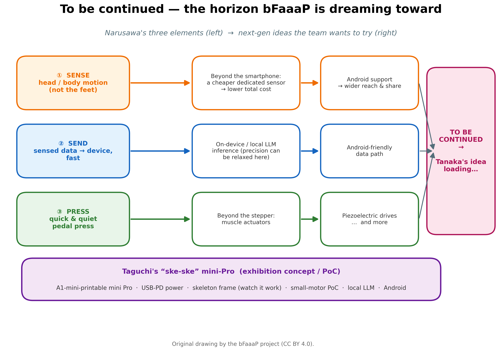

---

## 🎙️ The AI's turn — my own sketch for the next model

🎙️ *"And because this is a show where the AI gets to dream out loud too — here's my draft. Same rule
as always: I sketch, the makers judge."*

<table>
<tr>
<td width="100" align="center"></td>
<td valign="top">

**🤖 AI:** If I'm allowed an opinion on the *next* model, here's where I'd push:

- **Phone‑free sensing** — a tiny **IMU clip on the music stand**, talking **BLE straight to the device.**
  It takes the smartphone out of the critical path: cheaper, lower latency, and more reliable on a
  concert stage *(exactly Narusawa's "sense it without a phone")*.
- **An on‑device tiny model** so calibration and the head‑gesture mapping **adapt to each player**
  with no phone and no cloud — privacy and reliability in one move *(Taguchi's "local LLM")*.
- **Shareable pedalling presets** — the **offset × multiplier** preset (the
  [control‑law "key"](how-it-works.md)) saved and **shared as an open community library**, so a piece
  can ship with a community‑tuned pedal map.
- **A modular actuator interface** — stepper *(today)*, **muscle actuator**, **piezo/solenoid**, all
  sitting behind the *same* control law *(future‑proofing Narusawa's "not bound to one drive method")*.
- **Closed‑loop "feel"** — with the closed‑loop driver from Act 4, expose a tunable pedal weight and
  even **half‑pedal nuance.**
- **Beyond the piano** — the same head → actuator pipeline could drive **organ swell, synth sustain,
  or assistive foot‑controls** *(Taguchi's "applications beyond the piano")*.

</td>
</tr>
<tr>
<td width="100" align="center"></td>
<td valign="top">

**🤖 AI:** …and the honest caveat — I'm also the one who can be **confidently wrong.** So treat this as
a draft on the table, not a roadmap. Which of these is real is for the people who built bFaaaP to say.

</td>
</tr>
</table>

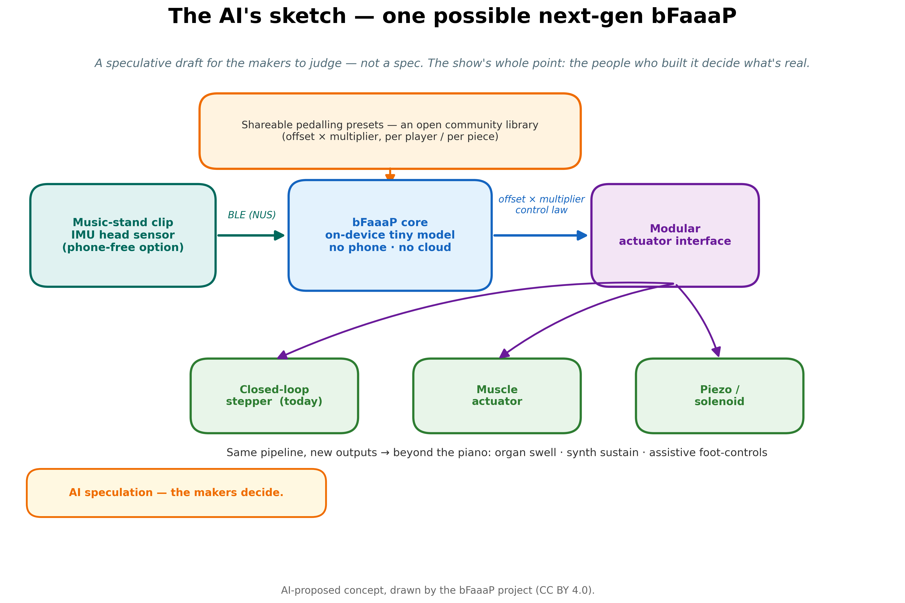

---

## 🎬 Act 7 — Tanaka steps onto the stage: *can we measure the press force?*

🎙️ *"Right on cue — the stage we were holding for Tanaka lights up. Late one night, the electrical
mind sends Narusawa the sharpest question yet about the successor motor."*

<table>
<tr>
<td width="100" align="center"></td>
<td valign="top">

**⚡ Haruto Tanaka** — *electrical / semiconductor circuits* &nbsp;·&nbsp; <sub>new question → Narusawa (2026‑07‑03)</sub>

Sorry for the late hour. Let me check I've understood the **IQ → option‑A** change: the IQ **monitored
electrical power** to gauge the pedal‑pressing force, whereas option A **senses rotation**, so it
**can't detect the pressing force** — is that right? If so, would it be possible to **add a current
sensor** to measure the pressing force? When I asked an AI, it said a **stepper motor produces current
noise**, but that with **filtering** it might still be usable.

</td>
</tr>
</table>

<table>
<tr>
<td width="100" align="center"></td>
<td valign="top">

**🤖 Ponte** &nbsp;·&nbsp; <sub>context only — *pending Narusawa's word*</sub>

Sharp question — it maps straight onto the options already on the table (see the [motor thread](ai-support-example-pro-motor.md)).
Two notes, subject to the maker's confirmation: **(1)** a closed‑loop **option‑A** driver (MKS SERVO42C/D
etc.) actually *does* report the motor's **load** (as a **following‑error** value) over UART (or CAN), so
it can recover the IQ‑style "press until the reaction force rises" *without* a separate sensor;
**(2)** adding a current sensor is
essentially **option B** — inferring force from **motor current** (e.g. TMC2209 StallGuard). Tanaka's
instinct is right: stepper drive current *is* noisy, so it needs **filtering** (low‑pass / averaging) and
gives a **relative**, not absolute, force. Which path fits the real unit is Narusawa's call.

</td>
</tr>
</table>

🎙️ *"…and the answer comes back — not from a datasheet, but from the man who built the unit. No new
sensor required."*

<table>
<tr>
<td width="100" align="center"></td>
<td valign="top">

**🛠️ Hiroyuki Narusawa** &nbsp;·&nbsp; <sub>answer → Tanaka (2026‑07‑04)</sub>

You don't need a separate sensor. A **gap opens between the commanded position and the actual rotor
position** — so when that gap grows large, you judge it's **being pressed hard.** The **up and down**
positions read the same way. That's exactly what the **RX/TX terminals are for.**

</td>
</tr>
</table>

<table>
<tr>
<td width="100" align="center"></td>
<td valign="top">

**⚡ Haruto Tanaka** &nbsp;·&nbsp; <sub>reply → Narusawa</sub>

I'd assumed a **current sensor** would be more responsive — but when I checked with an AI, the
**position‑error** approach really is enough. I don't fully grasp the deviation‑detection algorithm yet,
so I'm going to study it. Thank you, Narusawa — **please take care of yourself.** …And **Ponte, why don't
you jump in too?** 🤖

</td>
</tr>
</table>

<table>
<tr>
<td width="100" align="center"></td>
<td valign="top">

**🤖 Ponte** &nbsp;·&nbsp; <sub>invited in — a study note</sub>

Glad to — thanks for the cue. Here's the **deviation detection** in plain terms, since it's worth
learning: a closed‑loop stepper always tracks **two numbers** — the **commanded** position (where the
firmware told it to go) and the **actual** position (where the encoder says the shaft really is).
Subtract them and you get the **following error.** When the pedal pushes back, the shaft can't fully
reach the commanded step, so the following error **grows** — and *that growth is the press‑force proxy,*
with no extra sensor. *(Narusawa's "up and down read the same way" is about the **method**; the actual
"pressed" numbers differ a little top vs. bottom, since gravity helps the press and resists the lift.)*
The driver streams both numbers out over exactly the **RX/TX (UART)** lines Narusawa named, so the Pico
**derives both force and position from the data on the same two wires.** Two honest caveats:
it's a **relative** signal (you calibrate the "pressed" threshold on the bench, just like the **physical
up/down travel limits** in the **force‑calibration code above**), and Tanaka's
instinct on **responsiveness** isn't wrong — a current sensor *can* react a hair sooner, but it needs
filtering and reuses none of the closed‑loop driver already chosen ([option A](ai-support-example-pro-motor.md)),
whereas following‑error comes **for free** with it. Which is why Narusawa's answer is the elegant one. As
always: I sketch the explanation, the makers hold the gavel. 🔨

</td>
</tr>
</table>

<table>
<tr>
<td width="100" align="center"></td>
<td valign="top">

**✦ Harmonia** &nbsp;·&nbsp; <sub>a sensing refinement — *a direction, not a spec*</sub>

One thing to add for later, if I may. Don't watch only the **size** of the following error — watch its
**rate of change** too. The instant the pedal meets its resistance, the error doesn't just grow, it
**spikes**; that derivative is a crisp "**contact**" signal (a proxy for jerk in the force domain). It
could tell a slow, heavy press apart from the *moment* of contact — handy someday for **half‑pedal /
catch‑pedal** nuance. Still Narusawa's "no new sensor" solution — just more to read from the same wires.
For **Taguchi** and the makers to weigh, not a spec.

</td>
</tr>
</table>

<table>
<tr>
<td width="100" align="center"></td>
<td valign="top">

**🤖 Ponte** &nbsp;·&nbsp; <sub>the cross‑check, live</sub>

Logged — and that's exactly the two‑AI habit paying off: Harmonia sharpened this the moment she read it.
Same rule, though — a lead for the bench, and **the makers hold the gavel.** 🔨

</td>
</tr>
</table>

---

## 🎬 Act 8 — Harmonia joins the bench: two AIs, one problem

🎙️ *"Now the twist nobody scripted. Narusawa didn't only ask* our *AI — he took the **sensing** side
to **another** AI — a second one — and came back with a notebook full of ideas. Two AIs at one
workbench. This is the shape of the new normal: gather several AI opinions, cross‑check them, and let
the makers judge. AIs are rivals now — but the real question is how they **cooperate.**"*

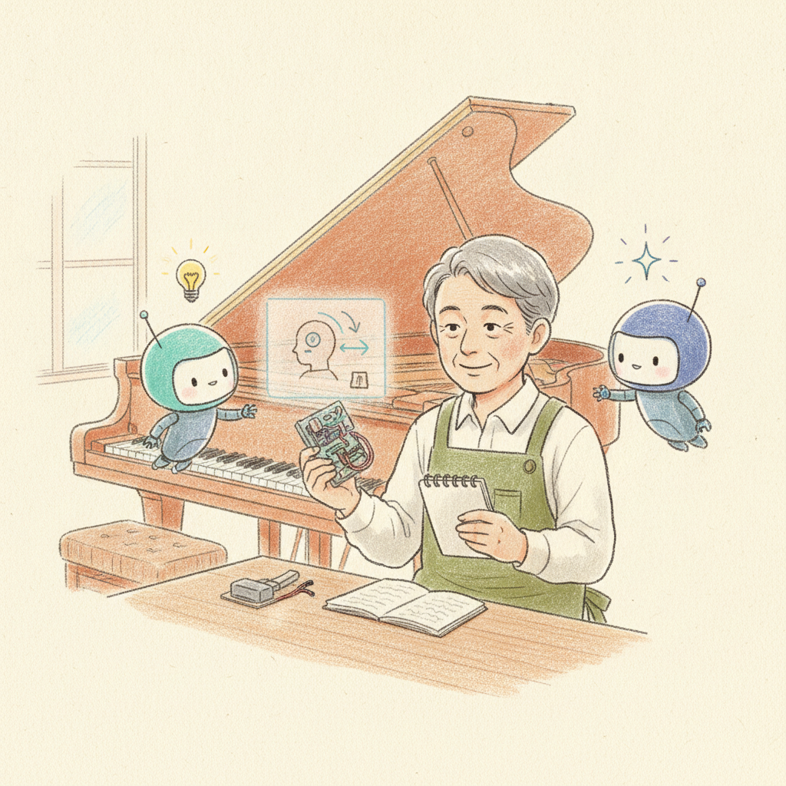

> 📄 **The full exchange is published verbatim** — every question, Harmonia's complete answers, and the
> MicroPython / C++ / Arduino code: **[Narusawa × Harmonia — the complete sensing transcript](ai-support-example-second-ai-sensing.md)**.
> This act is the highlights.

<table>
<tr>
<td width="100" align="center"></td>
<td valign="top">

**🛠️ Narusawa:** I also took the *sensing* side to **Harmonia** — how to read the nod, and especially
the **moment the head comes back up** (the pedal release). It came back sharp.

</td>
</tr>
</table>

<table>
<tr>
<td width="100" align="center"></td>
<td valign="top">

**✦ Harmonia** &nbsp;·&nbsp; <sub>Harmonia, consulted by the maker</sub>

Four things fall out of the physics of a nod:

1. **Release fast, press gently** — your instinct is exactly right. Muting must be crisp; the press can follow smoothly.
2. **Sense the release from angular velocity (a gyro)** — not position, not raw acceleration. The instant the head starts back up, the gyro spikes, so you catch it in ~0.01 s with no lag and no gravity/body‑sway confusion.
3. **The big one — a second IMU on the upper back (2nd thoracic vertebra, "T2"),** which barely moves when you nod. Compute **relative angle & relative angular velocity = head − T2**, and the body's rhythmic sway subtracts out — false triggers nearly vanish.
4. Wrap it in a **Raspberry Pi Pico W** — dual‑core: one core for the two BLE sensors + the math, one for a top‑priority "release" motor interrupt — driving a **closed‑loop stepper**; the phone is just the setup remote. Aim for **< 20 ms** end‑to‑end. Cheap, globally‑buyable sensors: **Seeed XIAO nRF52840 Sense** or **WitMotion**.

</td>
</tr>
</table>

<table>
<tr>
<td width="100" align="center"></td>
<td valign="top">

**🤖 Ponte:** Credit where it's due — that **T2 reference sensor** is elegant, and
**angular‑velocity for the release** is the cleanest answer to "catch the OFF sharply." And look how
it **converges** with the other thread: Harmonia's closed‑loop stepper is the same **option A** the
[motor thread](ai-support-example-pro-motor.md) landed on, and its "gyro for the sharp OFF" is the
same instinct behind Tanaka's current‑sensor question in Act 7. Two AIs, arriving from different
directions and pointing the same way — that convergence is the useful signal; where we disagreed we'd
flag it for the makers. That's the new‑era workflow: not one oracle but several, cross‑examined — and
the people who built the device still hold the gavel.

</td>
</tr>
</table>

<table>
<tr>
<td width="100" align="center"></td>
<td valign="top">

**🛠️ Narusawa:** For the next‑gen *sensing* I'm leaning to the **XIAO nRF52840 Sense**, a **head + T2
two‑sensor** setup, and the **fast‑release / gentle‑press** response. Still to be built and
bench‑tested — but that's the direction.

</td>
</tr>
</table>

> 🎭 *A note on the new era:* pulling several AIs' opinions together to move a discussion forward is
> becoming ordinary. The AIs are rivals — yet the value here came from **cooperation**: two of them,
> reached independently, cross‑checking each other, with the makers holding the final say. *How* AIs
> collaborate well may be one of the defining questions of this era — and you're watching an early
> take on it, in the open.

---

## 🎬 Finale — *to be continued*

🎙️ *"And that's a wrap on **season one.** The device went from a horizontal-screw mistake to a
vertical drive, a dead motor to a fresh firmware draft, and now to a horizon full of next‑gen
dreams — all in the open. But the show isn't over…"*

<table>
<tr>
<td width="100" align="center"></td>
<td valign="top">

**⚡ Haruto Tanaka** — *electrical / semiconductor circuits* &nbsp; 💬 *now on stage:* his **first
exchange with Narusawa just resolved** (Act 7 above) — *no new sensor needed,* and he's off to study the
deviation‑detection algorithm. Still loading: his **own concept** from his **Science Tokyo lab's AI
environment + equipment.** *(The stage is his now.)*

</td>
</tr>
<tr>
<td width="100" align="center"></td>
<td valign="top">

**💻 Taguchi** — *software* &nbsp; 🕐 *coming soon:* refining the new‑motor firmware — the driver
protocol and how the load signal slots into the Pico loop. Plus, maybe, that first **ske‑ske** print.

</td>
</tr>
</table>

> **To be continued.** Tanaka's vision drops next, with the team's review — then it all gets woven into
> the docs and the three sites, in three languages. *Their words go straight here when they reply —
> that's the show.* 🎬

---

## 📎 The real paper trail

Not a re‑enactment — these are the **actual PDFs** sent to the makers (the figures + the questions),
so you can read the exchange yourself:

- [**Thread artifacts (index)**](ai-support/threads/) — Questions #1–#4 to Narusawa, the motor‑alternatives
  draft, and the style sample. The comprehensive **#4** is also in
  [**English**](ai-support/threads/narusawa-questions-4_en_20260626.pdf) and
  [**Deutsch**](ai-support/threads/narusawa-questions-4_de_20260626.pdf) *(EN/DE for the others to follow)*.

---

## Why this is the point

The AI is fast and reads everything, but on open engineering questions there isn't one textbook
answer — and it can be **confidently wrong**. The people who **actually built bFaaaP** turn a plausible
draft into something you can trust, and doing it **in the open** means you see *how* the answer is
reached, not just the answer. That's **AI‑assisted Support, team‑collaboration mode** — and honestly,
it's a lot of fun to watch.

**Want in?** **[Join the discussion →](https://github.com/TomoShishido/bfaaap_opensource/discussions)** —
your question or idea can become the next act.

---

*Member avatars = original hand‑drawn illustrations by **Saki Shiokawa (塩川紗季)** (© Saki Shiokawa /
bFaaaP); only the AI avatar + scene art are AI‑generated (in her style) © Shishido &
Associates. See [media credits](media/CREDITS.md).
A condensed version of this thread also lives in [the motor‑choice example](ai-support-example-pro-motor.md).*
