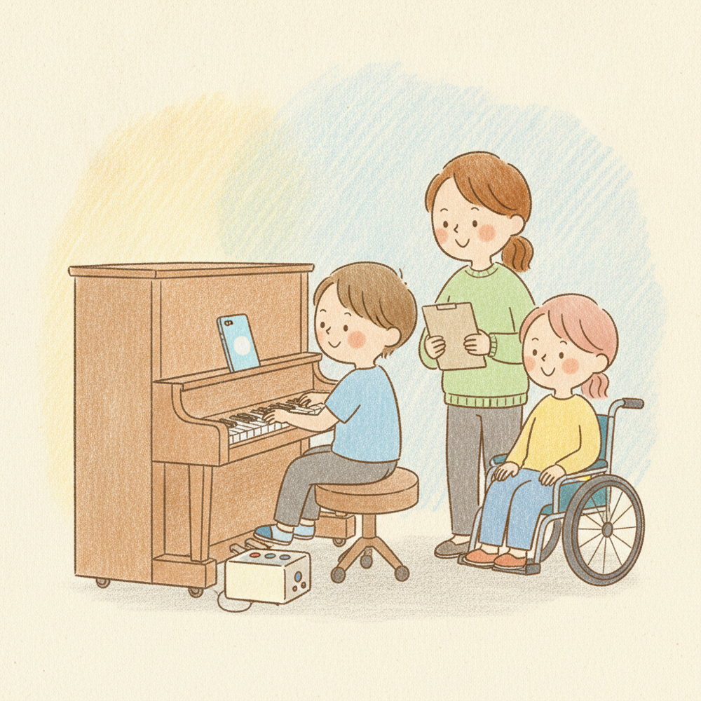
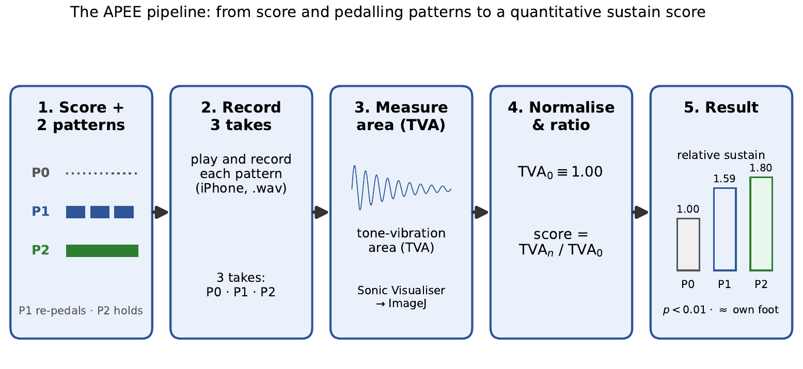
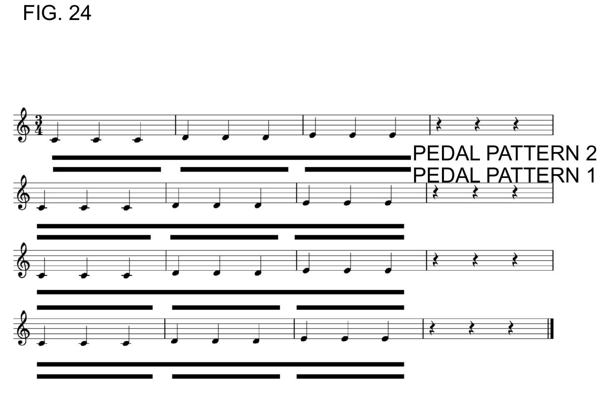
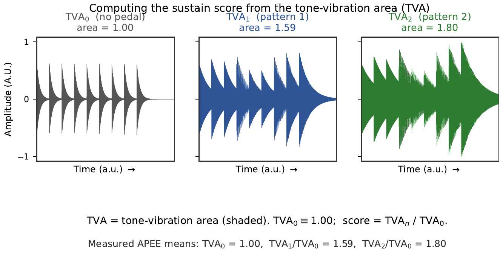
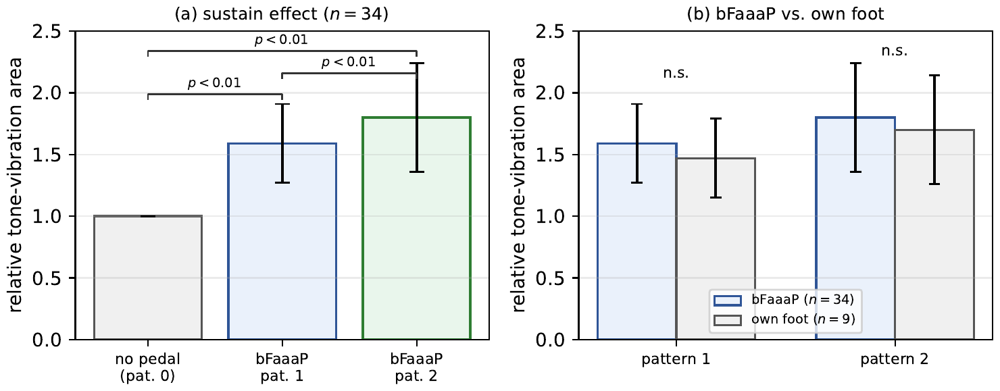
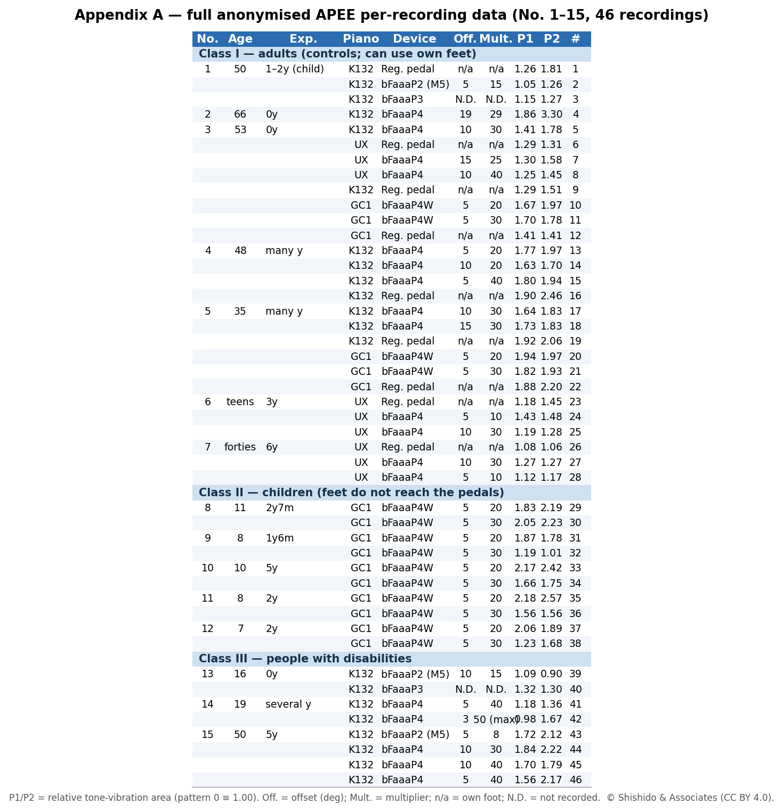

# The APEE study — does bFaaaP really work?

> 🌐 **English** · [日本語](../i18n/ja/docs/apee-study.md) · [Deutsch](../i18n/de/docs/apee-study.md)

Does pressing the pedal *with your head* really give the rich, sustained sound of a foot on the
pedal? We ran a human‑subject study — the **Auxiliary Pedal Effect Evaluation (APEE)** — with
**15 participants**: adults, children whose feet don't reach the pedals, and people with
disabilities.

*An APEE session (illustration). AI‑generated (Gemini, Saki Shiokawa style) © Shishido & Associates.*

## How we measured it
Each participant played the same short motif **three ways** — with **no pedal** (pattern 0), with
**bFaaaP pattern 1** (re‑pedal at each three‑note group), and with **bFaaaP pattern 2** (hold the
pedal across groups) — and we recorded each take. We then measured the **tone‑vibration area
(TVA)**: the shaded area of the recorded waveform, which grows when notes ring on. Every recording
is normalized to its own no‑pedal take (TVA₀ ≡ 1.00), so the **sustain score = TVAₙ / TVA₀**.

*Figure (paper) — the APEE method end to end. © Shishido & Associates (CC BY 4.0).*

*The actual test score and its two pedalling patterns (reproduced from the patent figures).*

### Measuring sustain (TVA)
More pedal → more ringing strings → a larger shaded waveform area. Across the study the means were
**1.00 / 1.59 / 1.80** for no‑pedal / pattern 1 / pattern 2.

*Figure (paper) — computing the sustain score from the tone‑vibration area. © Shishido & Associates (CC BY 4.0).*

## What we found
- **bFaaaP significantly increases sustained‑tone energy** — both patterns beat no‑pedal
  (**p < 0.01**).
- **It is statistically indistinguishable from the player's own foot** (**p > 0.05**, "n.s.").
- **No significant difference across participant classes** (adults / children / people with
  disabilities). One participant with a **leg disability and a tracheostomy** performed
  successfully, using a small offset with a large multiplier.

*Figure (paper) — APEE clinical results. © Shishido & Associates (CC BY 4.0).*

## The full anonymized data (Appendix A)
Every one of the **46 recordings** (participants anonymized as **No. 1–15**), with each player's
chosen offset and multiplier and the relative sustain of patterns 1 and 2. Transcribed from the
original study figures; source: [`bfaaap_arxiv_latex`](../bfaaap_arxiv_latex/README.md), Appendix A.

*Appendix A — full anonymized APEE data (No. 1–15, 46 recordings). © Shishido & Associates (CC BY 4.0).*

The original anonymized study figures are archived in
[`docs/history/pct-original-figures/`](history/pct-original-figures/README.md). For the full method,
statistics and discussion, see the [paper](../bfaaap_arxiv_latex/README.md).

---

← Back to [How it works](how-it-works.md) · [Glossary](GLOSSARY.md) · [Story](story.md)
