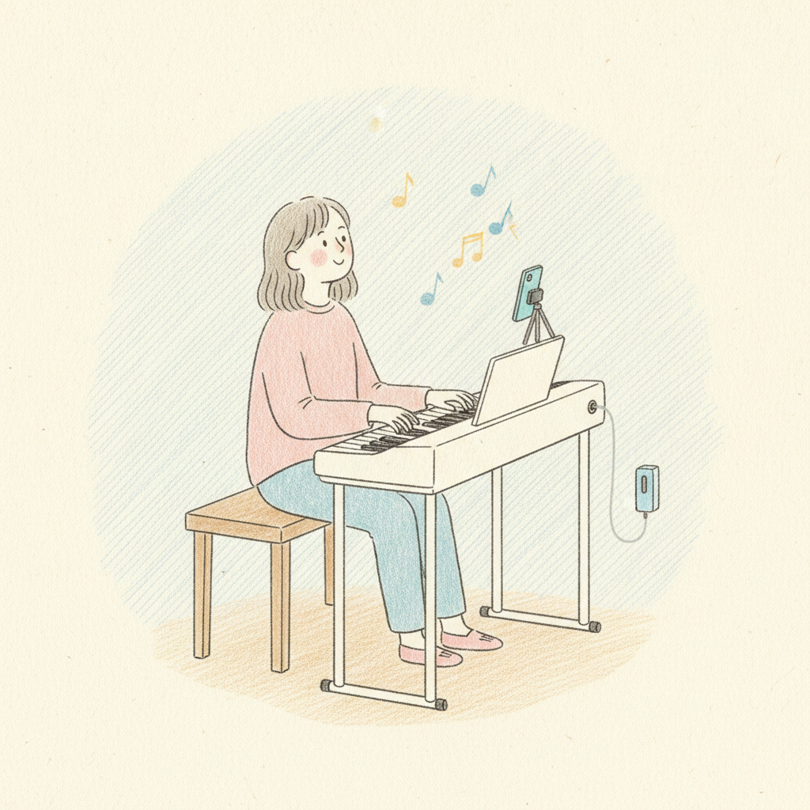

# 🎛️ Build the **Switch** (digital piano / keyboard)

> 🌐 **English** · [日本語](../../i18n/ja/docs/build/switch.md) · [Deutsch](../../i18n/de/docs/build/switch.md)

The Switch is the small, inexpensive version for **digital** pianos and keyboards. Instead of a
motor, it switches the sustain **electronically** through the instrument's **sustain‑pedal jack** —
no motor, no airback. It uses the **same iOS app** and BLE board as the Pro.


<sub>What you're building toward: foot‑free sustain on a digital piano, from a matchbox‑sized device. Illustration: AI‑generated (Saki Shiokawa style) © Shishido &amp; Associates.</sub>

> ✅ **Hardware confirmed.** The Switch electronics are now fully confirmed by the maker (H. Narusawa):
> board = **ItsyBitsy nRF52840**; a **ROHM `RU1J002YN`** logic‑level N‑MOSFET on **`GP13`** switches the
> sustain line **low‑side** (**no series resistor**); power = **2× AA**; it **starts on RESET**. The only
> draft part left is the **printed enclosure** (an AI draft in [`device-switch-electronic/assembly/`](../../device-switch-electronic/assembly/)).
> The **[Switch user‑manual video](https://youtu.be/XOVENtBsOp4)** shows it in use.

```
 1. Get the BLE board ─▶ 2. Add the sustain switch ─▶ 3. Wire to the pedal jack ─▶ 4. Flash ─▶ 5. Pair & use
```

## Before you start
- An **Adafruit ItsyBitsy nRF52840** BLE board (the Switch's board; has the onboard DotStar)
- A **ROHM `RU1J002YN`** N-channel logic-level **MOSFET** to switch the sustain line (**no series resistor**)
- **2× AA batteries** for power (no USB charging)
- A connector for the instrument's **sustain‑pedal jack** (commonly a 6.3 mm / TS jack)
- An iPhone/iPad with **Face ID** + the [iOS app](ios.md)

## Step 1 — Flash the BLE board
Flash the **standalone Switch firmware**
([`device-switch-electronic/firmware/`](../../device-switch-electronic/firmware/)) to the nRF52840
(double‑tap RESET → UF2 bootloader → upload). Full steps: [`docs/toolchain/`](../toolchain/).
Confirm it advertises (`bFaaaPSwitch_1…4`) in a BLE scanner.

## Step 2 — Add the sustain switch
Drive a **MOSFET** from the BLE board's `GP13` so it opens/closes the sustain contact (no series
resistor). Part = **ROHM `RU1J002YN`**; full reference circuit in
[`device-switch-electronic/hardware/`](../../device-switch-electronic/hardware/).

## Step 3 — Wire to the pedal jack
Wire the MOSFET across the instrument's **sustain‑pedal jack** (TS tip/sleeve). Match the **polarity /
normally‑open vs normally‑closed** behaviour of your instrument with the app's **on‑type / off‑type**
toggle (`n` / `f`).

## Step 4 — Pair & use
Build/install the [iOS app](ios.md), connect over Bluetooth, preset your **offset (threshold)** and
**multiplier** (together they set how fast the pedal follows your head), and play. See the
[Switch user manual](../user-manual/).

---
→ [Build hub](README.md) · [Pro build](pro.md) · [iOS build](ios.md)
