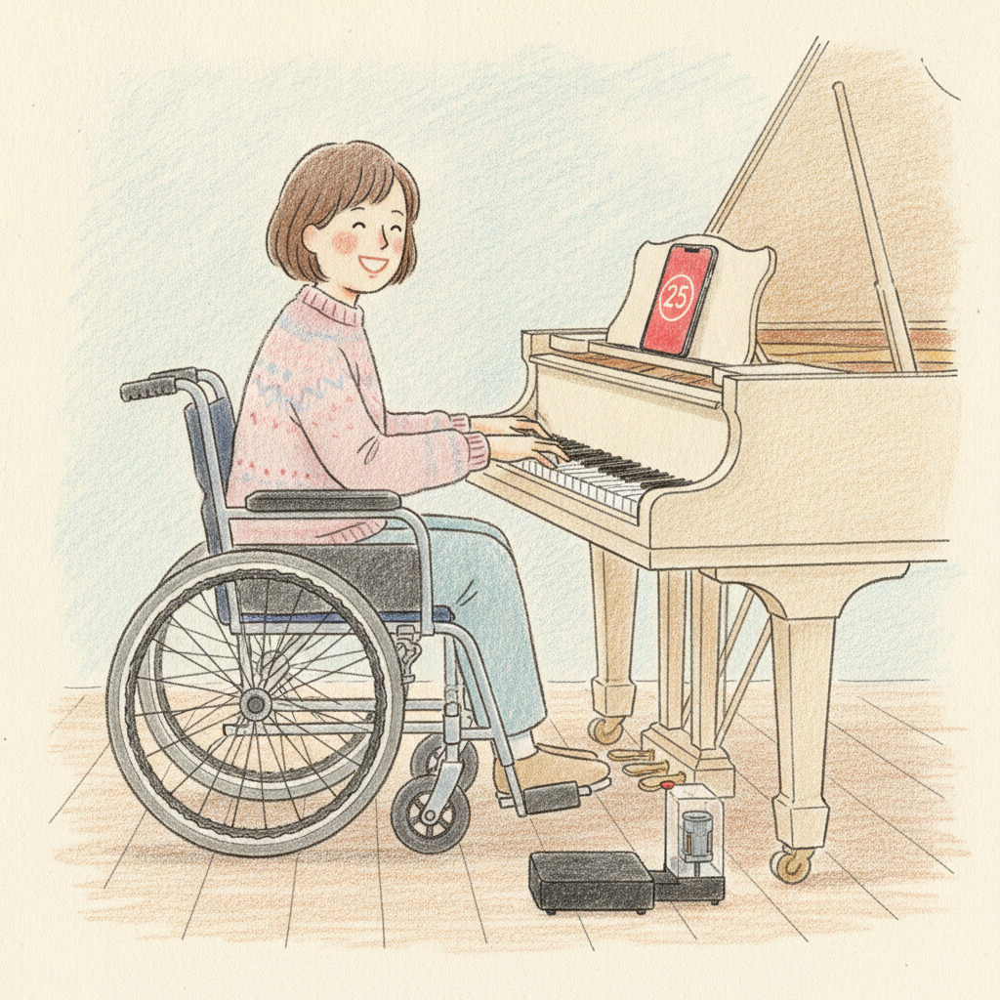
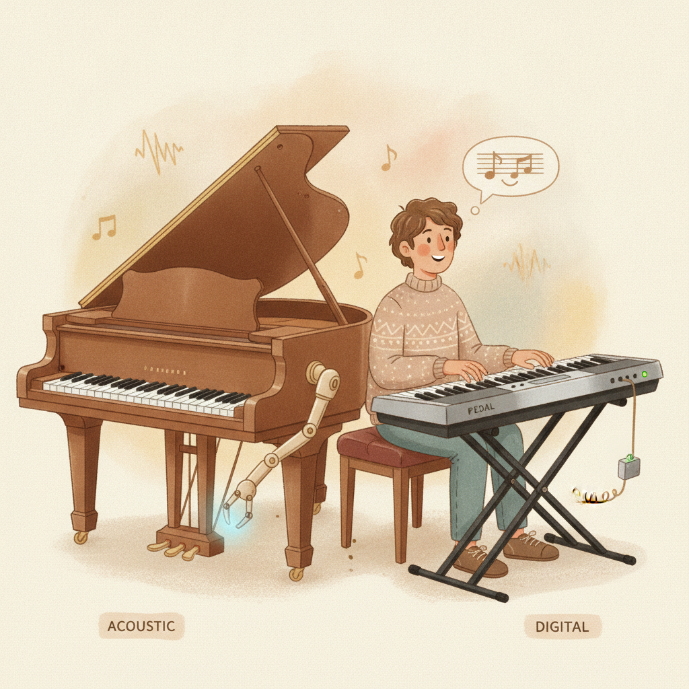
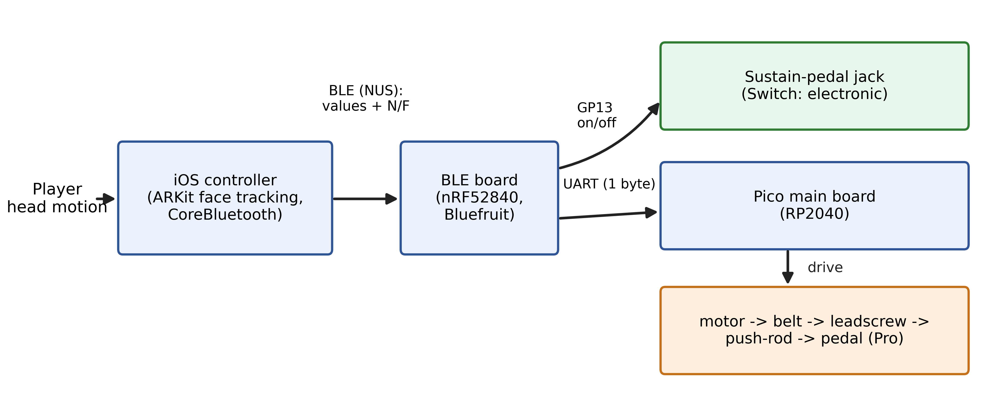
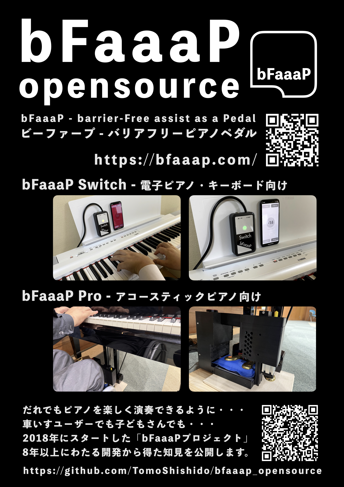

# bFaaaP — ein fußfreies Klavierpedal zum Selberbauen 🎹

> 🌐 [English](../../README.md) · [日本語](../ja/README.md) · **Deutsch**

[](https://apps.apple.com/app/id1545866059)



> **bFaaaP** — *(barrier‑Free assist as a Pedal)* — ist ein **KI‑gestütztes System zur
> Bedienung des Klavierpedals**. Neige den Kopf ein wenig, und das Haltepedal (Sustain) senkt sich —
> **ganz ohne Füße.** Ein iPhone/iPad erfasst den Kopfwinkel mit On‑Device‑KI und sendet ihn per
> Bluetooth an ein kleines Gerät, das das Klavierpedal drückt (oder elektronisch schaltet).

Es entstand, damit Menschen, die ein Fußpedal nicht leicht benutzen können — Menschen mit
Gliedmaßen‑Behinderungen, kleine Kinder, ältere Menschen, sogar Nutzer mit Tracheostoma — Klavier
mit der vollen Ausdruckskraft des Pedals spielen können. Und es ist **Open Source**: dieses
Repository enthält alles, um das Gerät zu bauen und den Controller selbst zu betreiben.

### Hier starten
🌱 **Neu?** → [**Die bFaaaP‑Geschichte**](docs/story.md) · [Funktionsweise](docs/how-it-works.md) · [Glossar](docs/GLOSSARY.md)
🔧 **Selber bauen** → [**Selbst bauen**](docs/build/) (iOS · Pro · Switch)
🗂 **Quelldateien finden** → [Quellenübersicht](../../docs/SOURCE-MAP.md) — welche Datei/Abbildung/Code zu welcher Erklärung gehört
🙋 **Hilfe bekommen** → [Community‑Support](docs/ai-support.md) · 💛 [Projekt unterstützen](SUPPORT.md)

> Status: dieser Ordner (`github_opensource/`) ist der Staging‑Bereich zur Vorbereitung der
> Veröffentlichung (siehe [`PUBLISHING-CHECKLIST.md`](../../PUBLISHING-CHECKLIST.md)). Die
> Dokumentation ist **Englisch zuerst**; Japanisch & Deutsch folgen unter `i18n/`.

---

## Was ist bFaaaP?


Eine kleine Kopfbewegung wird zum Pedaldruck. Du legst deinen eigenen **Offset** (wie weit du
neigst) und einen **Multiplikator** fest — also kein bloßes Ein/Aus, sondern auf dich abgestimmt.
Die einfache Erklärung: [Funktionsweise](docs/how-it-works.md).

## Zwei Hardware‑Linien, eine App



| Linie | Für | Wie es betätigt |
|------|-----|-----------------|
| 🎹 **bFaaaP Pro** | Akustische Klaviere (**Flügel & Pianino**) | ein **Motor drückt** das Haltepedal physisch, fixiert durch ein *Airback*‑Luftkissen → [`device-pro-acoustic/`](../../device-pro-acoustic/) |
| 🎛️ **bFaaaP Switch** | **E‑Pianos & Keyboards** | als **elektronischer Schalter** in die **Pedalbuchse** gesteckt (kein Motor/Airback) → [`device-switch-electronic/`](../../device-switch-electronic/) |

Die **gleiche iOS‑App** ([`ios-app/`](../../ios-app/)) steuert beide Linien; das Bluetooth‑Protokoll ist identisch.

## Funktionsweise



```
   Kopfneigung
        │  ARKit / TrueDepth Gesichts‑Tracking (KI im iPhone/iPad)
        ▼
┌──────────────┐   BLE  "i00".."i99"   ┌─────────────────┐  UART  ┌──────────────┐  Antrieb
│   iOS‑App    │ ────────────────────▶ │ BLE‑Board nRF52  │ ─────▶ │  Pico RP2040 │ ─────▶ Klavierpedal
└──────────────┘                       └─────────────────┘        └──────────────┘
```

Ein wichtiger Designpunkt: ARKit liefert Kopfwinkel viel schneller, als BLE sie senden sollte —
deshalb **taktet** die App den Funk (100‑ms‑Timer + Drossel), um die Verbindung stabil zu halten.
Siehe [`ios-app/DESIGN-HIGHLIGHTS.md`](../../ios-app/DESIGN-HIGHLIGHTS.md).

## Selber bauen

Öffne den [**Build‑Hub**](docs/build/) und wähle eine Linie. Kurzfassung (Pro):

1. Mechanische Teile **drucken & montieren** — [`device-pro-acoustic/hardware/`](../../device-pro-acoustic/hardware/).
2. Beide Boards **verdrahten & flashen** — [`docs/toolchain/`](../../docs/toolchain/) (VS Code / PlatformIO / Arduino).
3. Mit dem Airback **fixieren**; den Weganschlag einstellen.
4. Die **iOS‑App bauen & installieren** — [`ios-app/`](../../ios-app/) (eigenes Signing‑Team & Bundle‑ID).
5. **Koppeln, kalibrieren und spielen** — [`docs/operation/`](../../docs/operation/).

Bei einem Schritt hängengeblieben? **[Frag in unserem Community‑Q&A](docs/ai-support.md)** — die
bFaaaP‑Community und das Team prüfen jede Antwort, also keine Sofortantwort.

### Stückliste (Überblick, Pro‑Linie)
- iPhone / iPad mit **TrueDepth**‑Frontkamera (Kopf‑Tracking)
- **Raspberry Pi Pico** (Hauptplatine) + **nRF52840** BLE‑Board (Brücke)
- **IQ‑FORTIQ‑M42BLS‑100** Motor *(Referenz v039B; EOL → Nachfolger: **Closed‑Loop‑Schrittmotor der NEMA17‑Klasse**, in Evaluierung)*, treibt **GT-2‑Riemen → T10‑Gewindespindel → Druckstange** auf
  einem Aluprofil‑Rahmen
- **HX711** Luftdrucksensor, **2SK4017** MOSFET (Pumpe), Weganschlag‑Schieber, **24‑V‑Netzteil**
  *(die Selbstkalibrierung nutzt die Motor‑**Leistung**, nicht den Strom — die Versorgungsspannung spielt also keine Rolle)*
- 3D‑gedruckte Teile (PLA+) + **Airback**‑Fixierset
- Vollständige Stückliste & Teilenummern: [`device-pro-acoustic/hardware/PARTS-REFERENCE.md`](../../device-pro-acoustic/hardware/PARTS-REFERENCE.md)

> ⚠️ Einige Originalteile sind **EOL** (insbesondere der IQ/Fortiq‑Motor). Ersatz & Firmware‑Tipps:
> [`device-pro-acoustic/HARDWARE-AVAILABILITY.md`](../../device-pro-acoustic/HARDWARE-AVAILABILITY.md).

## Geschichte, Menschen, Musik 🎬

bFaaaP begann **2018** mit dem Wunsch einer Rollstuhlnutzerin, Klavier zu spielen, und wuchs zu
einem Team aus Ingenieuren und Musikern. Den ganzen Weg — mit Vorstellung der Mitglieder und
**allen Aufführungs‑Videos** — gibt es in **[Die bFaaaP‑Geschichte](docs/story.md)**.


- 📜 [Geschichte](../../docs/HISTORY.md) · 👥 [Mitglieder](../../docs/members/) · 💬 [Voices](../../docs/voices.md) · 🎥 [Alle Videos](../../docs/videos/)
- ▶ **Beste Einzel‑Demo** (Flügel, *mit Einrichtungs‑Walkthrough ab 25:01*): <https://www.youtube.com/watch?v=V3cXeNW9jXY>

## 💛 Unterstützen

Die Geräte werden nicht verkauft — deine Unterstützung hält bFaaaP frei und am Wachsen
(Entwicklung, Community‑Support, Teile/Leihgeräte sowie inklusive Konzerte & Unterricht).
Siehe [**SUPPORT.md**](SUPPORT.md) (PayPal jetzt; Stripe — Karte / Apple Pay / Google Pay — folgt) oder
nutze den **Sponsor**‑Button dieses Repos.

## 📣 Poster & Veranstaltungen

Bitte weitersagen — hier ist das bFaaaP‑Open‑Source‑Poster (Vorder‑ und Rückseite). Drucken und Teilen ausdrücklich erwünscht.

<p align="center">
  <a href="../../docs/media/poster/opensource-poster-front.jpg"></a>
  <a href="../../docs/media/poster/opensource-poster-back.jpg"></a>
</p>

<p align="center"><sub>Poster‑Design: <b>Masahiro Ootaki</b> (Ootaki Architekturbüro)</sub></p>

> 📅 Dank der freundlichen Unterstützung der **Tokyo Women's Choral Society** wird dieses Poster bei ihrem Konzert **„Composer Exhibition Series Vol.6: Hideki Chihara"** am **Freitag, 31. Juli 2026** verteilt. Wir sind dankbar, unsere Geschichte teilen zu dürfen. → [Konzert‑Ankündigung](https://tokyowomens-cs.website/2026/05/12/composerexhibitionseries-vol6-hidekichihara/)

## Repository‑Aufbau

| Ordner | Inhalt |
|--------|--------|
| [`ios-app/`](../../ios-app/) | iOS‑Controller‑App — Code, Design‑Notizen, Build‑Anleitung, bereinigter `src/`. Steuert beide Linien. |
| [`device-pro-acoustic/`](../../device-pro-acoustic/) | **Pro** (akustisch): Firmware, Hardware (`cad/`, `3d-print/`, `airback/`, `schematic/`), Motor‑Infos, Montage. |
| [`device-switch-electronic/`](../../device-switch-electronic/) | **Switch** (elektrisch/Keyboard): elektronisches Sustain‑Design (in Arbeit). |
| [`docs/`](../../docs/) | Geschichte, Funktionsweise, Glossar, Build‑Hub, Community‑Support, Architektur, Betrieb, Toolchain, Videos, Mitglieder, Historie. |
| [`bfaaap_arxiv_latex/`](../../bfaaap_arxiv_latex/) | Forschungs‑**arXiv‑Preprint** (LaTeX). |
| [`bfaaap_patent_info/`](../../bfaaap_patent_info/) | Allgemeinverständlicher Patent‑Leitfaden + Erteilungsakten. |

## Lizenz

Das Projekt ist **schichtweise mehrfachlizenziert (verabschiedet).** Vollständige Texte in
[`LICENSES/`](../../LICENSES/); die Aufteilung (siehe [`LICENSE`](../../LICENSE)) — **Apache‑2.0**
(Software: iOS‑App, Firmware; mit ausdrücklicher Patentgewährung), **CERN‑OHL‑W‑2.0** (Hardware: CAD,
3D‑Druck, Schaltplan), **CC‑BY‑4.0** (Dokumentation). Drittkomponenten behalten ihre eigenen Lizenzen
(z. B. die IQ‑Modul‑Bibliothek). Importierte Beiträge (Schaltplan/CAD/Fotos) sind **mit Zustimmung**
enthalten (alle Mitglieder haben zugestimmt — siehe [`PUBLISHING-CHECKLIST.md`](../../PUBLISHING-CHECKLIST.md)).

## 📄 Forschung

Ein LaTeX‑**arXiv**‑Preprint (`main.tex`) liegt in [`bfaaap_arxiv_latex/`](../../bfaaap_arxiv_latex/).
Er rahmt bFaaaP als inklusives Design / Mensch‑Maschine‑Interaktion, dessen erfinderischer Kern ein
**quantitatives, nutzerseitig einstellbares Kopfwinkel‑Regelgesetz** ist, validiert durch eine
**klinische Evaluierung am Menschen (APEE)**. Autoren: T. Shishido (korrespondierend), H. Narusawa.
*(Eine peer‑reviewte ACM‑TACCESS‑Version wird privat gepflegt.)*

## Patente, Marke & Design

Das Steuerungsverfahren — ein quantitatives, nutzerabstimmbares Steuergesetz, bei dem die spielende Person eine winkelige **Totzone (Offset)** (einen Bereich, in dem der Aktuator nicht angetrieben wird) und einen **Multiplikator** vorgibt, die zusammen eine sekundäre, zeitliche **Reaktionsgeschwindigkeit** festlegen (wie schnell der Aktuator dem Kopf jenseits der Totzone folgt) — ist patentiert. **Zwei Patente sind in Japan in Kraft**, mit einer englischen
**PCT**‑Anmeldung als Prioritätsgrundlage:

| Art | Nummer | Titel | Link |
|------|--------|-------|------|
| Patent (JP) | **特許第6726319号** — JP 6726319 B2 | Hilfspedal‑System | <https://patents.google.com/patent/JP6726319B2/en> |
| Patent (JP) | **特許第7004771号** — JP 7004771 B2 | Geräte‑Controller | <https://patents.google.com/patent/JP7004771B2/en> |
| PCT (EN, Priorität) | **WO 2019/176164** | Hilfspedal‑System | <https://patentscope.wipo.int/search/en/detail.jsf?docId=WO2019176164> |

Erfinder: H. Narusawa, M. Ootaki, T. Shishido, K. Yamaguchi, D. Tokushige. **bFaaaP®** ist eine
eingetragene Marke; der brillengestützte Bewegungssensor ist ein eingetragenes Design. Vollständige
Akten & ein verständlicher Leitfaden: [`bfaaap_patent_info/`](../../bfaaap_patent_info/).

### Patent‑Lizenzierung
Die Lizenzierung hängt grundsätzlich von der beabsichtigten Umsetzung ab. Für Verwendungen mit
echtem öffentlichem, offenem Zweck beabsichtigen die Autoren jedoch eine **kostenlose Lizenz** —
insbesondere wird die bFaaaP‑Patentlizenzierung für Produkte/Dienste (auch kommerzielle), die
Menschen mit Behinderungen eine **inklusivere** Teilhabe ermöglichen, **als Richtlinie kostenlos**
gewährt. Falls das zutrifft, kontaktiere bitte **Tomoyuki Shishido** (ORCID
<https://orcid.org/0000-0002-8944-2088>).

## Mitwirkende

Entwickelt von **Tomoyuki Shishido** und den bFaaaP‑/**Platanus**‑Mitgliedern (u. a. M. Ootaki,
H. Narusawa — siehe [Mitglieder](../../docs/members/)). Die iOS‑App ist **kostenlos** im App Store als
**bFaaaP Pro & Switch** erhältlich. Illustrationen von Saki Shiokawa und dem bFaaaP‑Projekt (KI‑gestützt).
