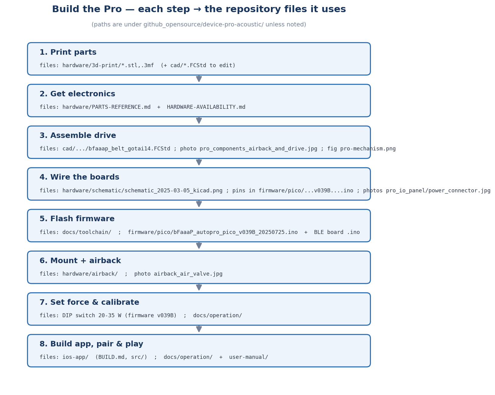
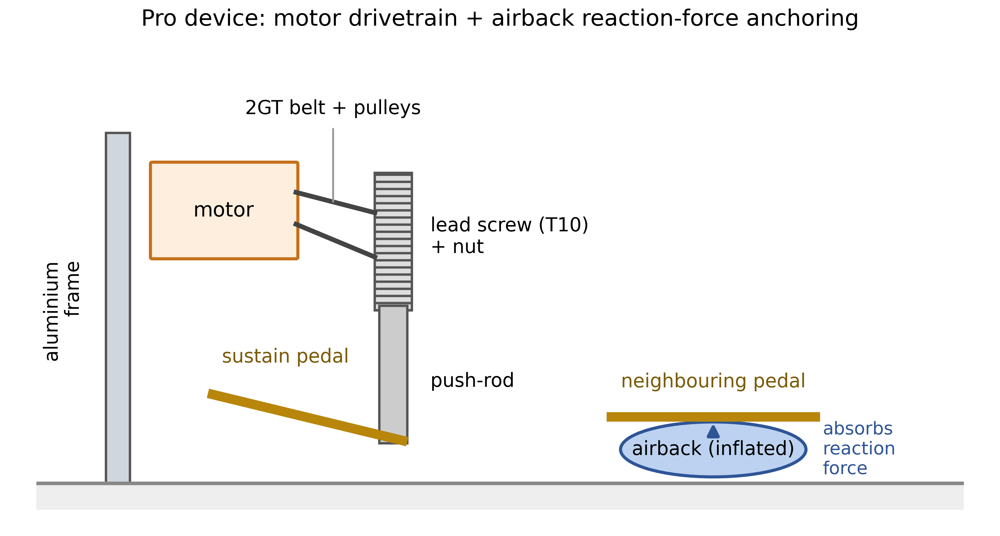

# 🎹 Den Pro bauen (akustisches Klavier)

> 🌐 [English](../../../../docs/build/pro.md) · [日本語](../../../ja/docs/build/pro.md) · **Deutsch**

Schritt‑für‑Schritt‑Anleitung für das Pro‑Gerät — ein kleiner Motor drückt das Haltepedal eines
akustischen Klaviers, fixiert durch ein *Airback*‑Luftkissen (nichts wird ans Klavier geschraubt).
Begriffe unklar? Siehe das [Glossar](../GLOSSARY.md). Hängengeblieben? Frag im
[KI‑gestützten Support](../ai-support.md).

> 🚧 **Entwurf.** Das Grundgerüst steht; einige genaue Pin‑Belegungen und mechanische Maße werden
> noch von den Bauenden (Narusawa / Taguchi) ergänzt. Das
> **[Pro‑Einrichtungs‑Video](https://www.youtube.com/watch?v=_9YopbCYTmI)** zeigt es in echt.

```
 1. Teile drucken ─▶ 2. Elektronik holen ─▶ 3. Antrieb montieren ─▶ 4. Boards verdrahten
       ─▶ 5. Firmware flashen ─▶ 6. Montage + Airback ─▶ 7. Kraft einstellen & kalibrieren ─▶ 8. koppeln & spielen
```


<sub>Jeder Schritt verweist auf bestimmte Dateien — vollständiger Index in der [Quellenübersicht](../../../../docs/SOURCE-MAP.md).</sub>



## Bevor du beginnst — was du brauchst
- Einen **3D‑Drucker** (Bett ≥240 mm hilft) + **PLA+**‑Filament
- Lötkolben, Schaltdraht, einfaches Handwerkzeug
- Die **Elektronik** (siehe [`PARTS-REFERENCE.md`](../../../../device-pro-acoustic/hardware/PARTS-REFERENCE.md)):
  Raspberry Pi **Pico**, **nRF52840**‑BLE‑Board, **IQ‑Fortiq**‑Motor *(oder den Schrittmotor‑Nachfolger)*,
  **HX711**, **2SK4017** MOSFET, Weganschlag‑Schieber, **24‑V‑Netzteil**
- Rahmenmaterial: **Aluprofil**, **2GT‑Riemen**, **T10‑Gewindespindel**, Druckstange
- Das **Airback**‑Set (Luftheber + Pumpe + Handsteuerung)
- Ein iPhone/iPad mit Face ID + die [iOS‑App](ios.md)

## Schritt 1 — Mechanische Teile drucken
1. Öffne die `.stl` / `.3mf` in [`hardware/3d-print/`](../../../../device-pro-acoustic/hardware/3d-print/) in einem Slicer (Bambu Studio, PrusaSlicer, OrcaSlicer …).
2. Nutze **PLA+**, **0,1–0,2 mm** Toleranz; achte auf die Ausrichtung (Löcher ohne Stützen). Siehe die [3D‑Druck‑Hinweise](../../../../device-pro-acoustic/hardware/3d-print/README.md).
3. Drucke Rahmenteile, PCB‑Halter, Strombox, Druckstange und Abdeckungen.

## Schritt 2 — Elektronik beschaffen
Bestelle die Teile aus [`PARTS-REFERENCE.md`](../../../../device-pro-acoustic/hardware/PARTS-REFERENCE.md).
**Hinweis:** der originale IQ/Fortiq‑Motor ist **EOL** — siehe [`HARDWARE-AVAILABILITY.md`](../../../../device-pro-acoustic/HARDWARE-AVAILABILITY.md) für den Closed‑Loop‑Schrittmotor‑Nachfolger (DRV8825‑kompatibel).

## Schritt 3 — Antriebseinheit montieren
1. Baue den Rahmen aus dem Profil.
2. Setze **Motor → 2GT‑Riemen → T10‑Gewindespindel → Druckstange** so, dass die Stange aufs Pedal fährt.
3. Montiere die Boards auf dem gedruckten PCB‑Halter.


## Schritt 4 — Boards verdrahten
Folge dem Schaltplan in [`hardware/schematic/`](../../../../device-pro-acoustic/hardware/schematic/). Wichtige Verbindungen (Referenz v039B):
- Motor‑Seriell → Pico **GP4 / GP5**
- **HX711** Luftdruck → **GP2 / GP3**; Luftpumpe über **MOSFET → GP12** auf +5 V
- Weganschlag‑Schieber → **ADC0 / GP26**; **DIP‑Schalter** für Kraft/Hub
- BLE‑Board ↔ Pico über **UART (`Serial1`)**, gemeinsame Masse; **24 V** zum Motor


> 🚧 *Die genaue Pin-/Stecker‑Tabelle wird mit den Bauenden bestätigt — gesicherte Details in
> [`DISCORD-FINDINGS.md`](../../../../device-pro-acoustic/DISCORD-FINDINGS.md).*

## Schritt 5 — Firmware flashen
Flashe **zwei Boards** (alle Schritte in [`docs/toolchain/`](../../../../docs/toolchain/)):
- **BLE‑Board (nRF52):** Adafruit‑nRF52‑Support installieren, RESET zweimal tippen, BLE‑Sketch hochladen.
- **Hauptplatine (Pico):** den **arduino‑pico‑(Philhower‑)Core** + HX711 + IQ‑Bibliothek installieren,
  **BOOTSEL** halten und **`bFaaaP_autopro_pico_v039B_…ino`** hochladen *(nicht den Schrittmotor‑Snapshot `v052B` verwenden)*.

## Schritt 6 — Am Klavier montieren + Airback
1. Platziere den Antrieb so, dass die Druckstange über dem Haltepedal sitzt.
2. Fixiere mit dem **Airback**: den Luftheber gegen ein Nachbarpedal aufpumpen, um die Reaktionskraft
   aufzunehmen — nichts berührt die Klavieroberfläche. Siehe [`hardware/airback/`](../../../../device-pro-acoustic/hardware/airback/).


## Schritt 7 — Druckkraft einstellen & kalibrieren
- Stelle am **DIP‑Schalter** die Druckkraft **20–35 W** (1‑W‑Schritte) und den Hubweg **5–20 mm** ein.
  Beginne im unteren 20‑W‑Bereich und erhöhe, bis der Ton zuverlässig klingt (Kraft ist **leistungsbasiert**,
  klavierabhängig).
- Führe die Selbstkalibrierung aus; beobachte den **Serial Monitor @ 115200**. Eine Sicherheitsgrenze stoppt Wege über ~50 mm.

## Schritt 8 — App koppeln & spielen
Baue/installiere die [iOS‑App](ios.md), koppele per Bluetooth, stelle **Schwelle** & **Geschwindigkeit**
ein, kalibriere den Kopfwinkel‑Nullpunkt — und spiele. Siehe [`docs/operation/`](../../../../docs/operation/).

## Mechanische Stückliste & CAD‑Referenz

Die vollständige Stückliste (mit Preisen, Zukaufteilen) steht in
[`assembly/README.md`](../../../../device-pro-acoustic/assembly/README.md). Unten die **3D‑gedruckten
Teile** mit aus dem **CAD (BREP) gemessenen Maßen** und der **bearbeitbaren Quelldatei** je Teil.

> 🚧 Die **endgültige Variante** jedes Teils und die **Schraubenliste** werden mit dem Hardware‑Autor
> (H. Narusawa) bestätigt; die folgenden Dateien sind die neuesten aus dem Discord‑CAD‑Satz.

| Gedrucktes Teil | Maße (mm, L×B×H) | Bearbeitbares CAD — `device-pro-acoustic/hardware/cad/from-discord-2025/` |
|---|---|---|
| Neues Gehäuse **AA** | 135×120×62 | `bFaaaP_AA.FCStd` (STL: `3d-print/from-discord-2025/bFaaaP_AA-A.stl`) |
| Neues Gehäuse **CC / DD** | 250×100×60 / 250×100×10 | STL `bFaaaP_CC-CC.stl` / `bFaaaP_DD-DD.stl` *(großer Drucker nötig)* |
| Basis + Airjack | 292×124×50 | `bfaaap_base_plus_airjack2.FCStd` |
| Basis + Halter (osae) | 260×121×55 | `bfaaap_base_plus_osae_d.FCStd` |
| Luftbox | 200×125×35 | `bfaaap_airbox_a_2.FCStd` *(Varianten a/a‑1/a‑2/c)* |
| Schieber (Weganschlag) | 243×132×25 | `bfaaap_slide2_20241028.FCStd` |
| DIP‑Schalter‑Box | 60×30×6 | `bfaaap_dipsw_box_top_bot.FCStd` |
| Handsteuerungs‑Knöpfe | 50×50×10 / 50×50×20 | `bfaaap_nob_a.FCStd` / `bfaaap_nob_b.FCStd` |
| Druckstange | (siehe CAD) | `bfaaap_push_poll.FCStd` |
| **Antriebsbaugruppe (Referenz‑Layout)** | 530×290×216 | `bfaaap_belt_gotai14.FCStd` |

Zukauf‑Mechanikteile (IQ‑Motor, **T10‑Gewindespindel ~150 mm**, **2GT‑262‑Riemen**, **T60‑Riemenscheiben**
5/10 mm Bohrung, Lager, **4040 / 2040 / 20100** Aluprofil, **Luftheber 119×11 cm**, φ3‑Pumpe): siehe die
[Stückliste](../../../../device-pro-acoustic/assembly/README.md). Vollständiger Datei‑↔‑Thema‑Index:
[**Quellenübersicht**](../../../../docs/SOURCE-MAP.md).

---
→ [Build‑Hub](README.md) · [iOS bauen](ios.md) · [Switch bauen](switch.md) · [Funktionsweise](../how-it-works.md) · [Quellenübersicht](../../../../docs/SOURCE-MAP.md)
