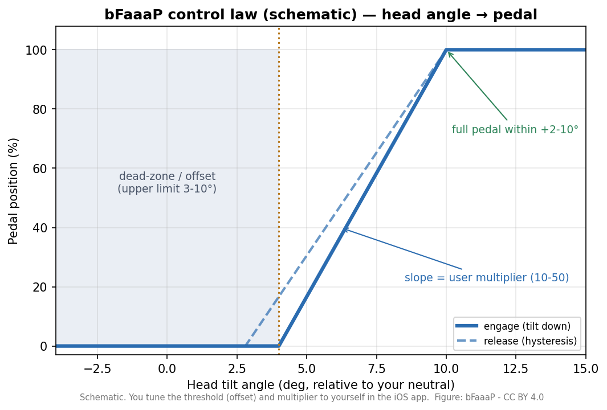

# Wie bFaaaP funktioniert (die einfache Version)

> 🌐 [English](../../../docs/how-it-works.md) · [日本語](../../ja/docs/how-it-works.md) · **Deutsch**

Neu hier? Diese Seite erklärt die ganze Idee in einfachen Worten. Unbekannte Begriffe stehen im
[Glossar](../../../docs/GLOSSARY.md).


## In einem Satz
Du **neigst den Kopf** ein wenig; ein iPhone/iPad **sieht die Neigung**; es sendet sie per
**Bluetooth** an ein kleines Gerät am Klavier; das Gerät **drückt das Haltepedal**. Keine Füße nötig.

## Die vier Schritte
1. **Deine Absicht (Kopfwinkel).** Du neigst den Kopf leicht. Diese Bewegung ist deine Absicht
   „Pedal hoch / Pedal runter“.
2. **Das Telefon liest sie.** Apples Gesichts‑Tracking (**ARKit / TrueDepth**) misst den Kopfwinkel
   und macht daraus eine Zahl von 0–99 %.
3. **Bluetooth überträgt sie.** Die App sendet kleine Nachrichten (`i00`–`i99`) per **BLE** an das
   Gerät. Du legst deine eigene **Schwelle** (wie weit neigen) und **Geschwindigkeit** fest — passend zu dir.
4. **Das Gerät drückt das Pedal.**
   - **Pro** (akustisch): ein kleiner **Motor** schiebt eine Stange auf das Haltepedal; ein
     **Airback**‑Kissen fixiert es, ohne die Klavieroberfläche zu berühren.
   - **Switch** (E‑Piano): das Gerät schließt die Sustain‑Funktion **elektronisch** über die
     Pedalbuchse des Instruments — ganz ohne Motor.

### Das Regelgesetz — wie eine Neigung zum Pedaldruck wird
Das ist das Herzstück von bFaaaP (und Gegenstand der Patente). Eine kleine **Totzone (Offset)**
sorgt dafür, dass kleine, unwillkürliche Kopfbewegungen nichts bewirken; jenseits deiner Schwelle
folgt das Pedal deiner Neigung mit einem von dir gewählten **Faktor** und erreicht innerhalb
weniger Grad das volle Pedal. Eine kleine **Hysterese** (Eingriff vs. Lösen) verhindert Flattern.



**Schwelle** und **Faktor** stellst du in der iOS‑App auf dich ein. (Hintergrund: das patentierte
Verfahren nutzt eine Offset‑Obergrenze von 3–10°, einen Faktor von 10–50 und volles Pedal innerhalb
+2–10°. Siehe den [Patent‑Leitfaden](../../../bfaaap_patent_info/general_description/README.md).)

## Ein eleganter Designtrick
Das Telefon erzeugt Kopfwinkel *viel schneller*, als Bluetooth sie senden sollte. Daher **taktet**
die App den Funk (≈100‑ms‑Timer + Drossel), um die Verbindung absolut stabil zu halten. Ein kleiner
Trick mit großer Wirkung — siehe [`ios-app/DESIGN-HIGHLIGHTS.md`](../../../ios-app/DESIGN-HIGHLIGHTS.md).

## Was im Gerät steckt
```
iPhone/iPad‑App ──BLE (i00–i99)──▶ BLE‑Board (nRF52840) ──UART (1 Byte)──▶ Pico (RP2040) ──▶ Pedal
```
Der **Pico** ist das Gehirn, das den Motor (Pro) oder den Schalter (Switch) ansteuert; das
**nRF52840** übernimmt Bluetooth. Verdrahtung, Teile und Schritt‑für‑Schritt: [Selbst bauen](../../../docs/build/).

---
→ Weiter: [Selbst bauen](../../../docs/build/) · [Die bFaaaP‑Geschichte](../../../docs/story.md) · [Glossar](../../../docs/GLOSSARY.md) · [Quellenübersicht](../../../docs/SOURCE-MAP.md)
