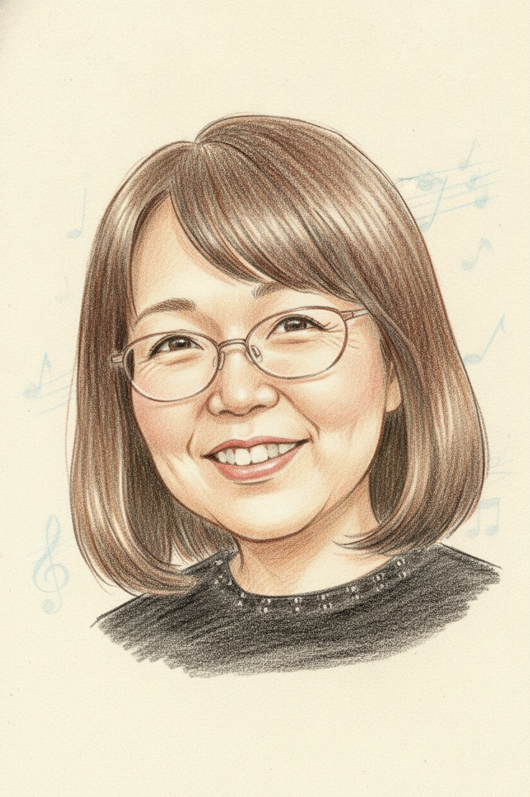

# Voices — Botschaften des bFaaaP-Teams

> 🌐 [English](../../../docs/voices.md) · [日本語](../../ja/docs/voices.md) · **Deutsch**

Als bFaaaP Open Source wurde, schickten die Menschen, die es gebaut, beraten und damit gespielt haben,
ein paar Worte — in ihrer eigenen Stimme. Hier sind sie, beginnend mit unserem Gründer. Jeder Eintrag
verlinkt die **vollständige Botschaft** der Person — ihre Originalworte mit englischer und deutscher
Übersetzung — unter [`voices/`](../../../docs/voices/). *(Weitere Stimmen kommen hinzu, sobald sie
eintreffen.)*

---

### 🎹 Tomoyuki Shishido — *Gründer & Projektleitung*

📖 **[Vollständige Botschaft lesen](../../../docs/voices/shishido.md)** — Original (Japanisch) + englische & deutsche Übersetzung

Willkommen — und danke, dass du hier bist. Ich begann mit dem Klavier mit **45 Jahren**, ohne eine
einzige Note lesen zu können, angestoßen von einer Bemerkung meiner verstorbenen Frau: *„Du hast keine
Freunde, also lern fürs Alter Klavier spielen.“* Der Unterricht war eine Freude — doch ich dachte immer
wieder, wie viel mehr ich ausdrücken könnte, **wenn ich nur die Pedale benutzen könnte.** Aus diesem
Wunsch wurde bFaaaP.

Mit Freundinnen und Freunden — einem Architekten, einem früheren Wettersatelliten-Ingenieur, einem
Patentkollegen, einer Stimmerin, Studierenden, Lehrenden und einem Komponisten — wuchs aus dem kleinen
Wunsch einer Person, **einen Ton ausklingen zu lassen**, ein gemeinsamer Traum: *eine Welt, in der alle
Musik inklusiver genießen können.* Das tägliche „kleine Glück“ des nachklingenden Klavierklangs wurde zu
einem „großen Glück“, das ich nie erwartet hatte.

bFaaaP Open Source zu machen, ist unsere Art, das weiterzugeben. Bitte lerne **[die Menschen kennen, die
es geschaffen haben](members/)** — und wenn es dir oder jemandem, den du kennst, hilft: **bau es, verbessere
es und spiele.**

 

— **Tomoyuki Shishido** · Gründer

---

### 🛠️ Hiroyuki Narusawa — *Pedalgerät & Firmware*

📖 **[Vollständige Botschaft lesen](../../../docs/voices/narusawa.md)** — Original (Japanisch) + englische & deutsche Übersetzung

Auf dem Weg zur Open-Source-Veröffentlichung: Anfangs schien dieses Projekt einfach, doch als wir
begannen, verflochten sich die verschiedensten Faktoren — und bis heute ist es nicht wirklich fertig.
Durch die Öffnung hoffe ich, dass viele Menschen es kennenlernen und **als Sprungbrett nutzen**, sodass
Verbesserungen, Kostensenkungen und neue Ansätze immer weiter entstehen.

Einfach gesagt läuft es auf **drei Elemente** hinaus:
1. wie man eine Körperbewegung außer den Füßen **erfasst**, um das Pedal zu treten;
2. das Mittel, diese Daten schnell an das Gerät zu **senden**;
3. mit diesen Daten das Pedal schnell und leise zu **drücken**.

 

— **Hiroyuki Narusawa** · Naru Science Soft

---

### 📐 Masahiro Ootaki — *Entwurf & Koordination*

📖 **[Vollständige Botschaft lesen](../../../docs/voices/ootaki.md)** — Original (Japanisch) + englische & deutsche Übersetzung

**2008** wurde ich gebeten, ein Zuhause barrierefrei umzubauen, und seither hält meine Verbindung zu
Shishido an. Am **Neujahrstag 2018** lud er mich ein: *„Lass uns gemeinsam ein Pedalsystem entwickeln,
damit auch ein Rollstuhlnutzer das Klavierspiel genießen kann.“*

Als Architekt hatte ich keine technische Ausbildung, also holte ich meinen Mentor **Narusawa** hinzu — und
eine erste Erfahrung folgte der nächsten: ein Einführungsbuch zur App-Entwicklung, Patentzeichnungen, ein
Besuch beim Patentamt. In meinem eigenen Beruf möchte ich an die nachfolgende Generation weitergeben, was
ich von meinen Vorgängern gelernt habe — daher nickte ich nachdrücklich zu dem Grundsatz, dass **das Wissen
aus bFaaaP allen offenstehen sollte**. *„Produkte, die allen Freude bereiten, entwickelt von allen“* — ich
hoffe, diese Open-Source-Veröffentlichung bindet Mitstreiter aus der ganzen Welt ein.

 

— **Masahiro Ootaki** · Architekt (barrierefreies Wohnen)

---

### 💻 Taguchi — *Software-Engineering*

📖 **[Vollständige Botschaft lesen](../../../docs/voices/taguchi.md)** — Original (Japanisch) + englische & deutsche Übersetzung

Herzlichen Glückwunsch zur Open-Source-Veröffentlichung — es freut mich, dass meine Unterlagen ein wenig
helfen konnten. Nun, da es offen ist, ist die Tür für alle geöffnet, die **„einen Motor passend zur
Kopfbewegung ansteuern“** möchten, um es auch über das Klavier hinaus anzuwenden, und auch Menschen
außerhalb des Teams können Funktionen ergänzen und Fehler beheben. Ich hoffe, das Projekt gewinnt weiter
an Schwung.

Eine persönliche Anmerkung: Ich habe kürzlich **angefangen, Klavier zu lernen** (ich übe *„Canon“*). Ich
habe gerade erst begonnen und noch nicht mit dem Pedal geübt — aber auch als **Nutzer** von bFaaaP möchte
ich es weiter genießen und mich verbessern, um selbst nach Open Source beizutragen.

 

— **Taguchi** · *(als er erzählte, er habe mit dem Klavier begonnen, jubelte das Team: „genau dafür ist bFaaaP da.“)*

---

### ⚡ Haruto Tanaka — *Elektrotechnik*

📖 **[Vollständige Botschaft lesen](../../../docs/voices/tanaka.md)** — Original (Japanisch) + englische & deutsche Übersetzung

Herzlichen Glückwunsch zur Open-Source-Veröffentlichung. Ich hoffe, dass die Arbeit, die bFaaaP über
viele Jahre entwickelt hat, mit diesem Anfang noch weiter wächst — und dabei **Freundinnen, Freunde und
Freiwillige nicht nur in Japan, sondern weltweit** einbindet. Künftig möchte ich auch mit der
**Platanus-Gesellschaft** zusammenarbeiten und mich dafür einsetzen, dass bFaaaP **Menschen aus allen
Lebensbereichen** erreicht.

 

— **Haruto Tanaka**

---

### 📜 Daisuke Tokushige — *Geistiges Eigentum*

📖 **[Vollständige Botschaft lesen](../../../docs/voices/tokushige.md)** — Original (Japanisch) + englische & deutsche Übersetzung

Es ist zutiefst bewegend zu sehen, wie die bFaaaP-Technologie — die ich auf der Seite des **geistigen
Eigentums** unterstützen durfte — als Open Source mit der Welt geteilt wird. Ein Mechanismus, mit dem man
das Pedal **genau wie beabsichtigt im Takt der eigenen Kopfbewegungen steuern** kann, ist wahrhaft
bahnbrechend. Als Mitglied des Projekts hoffe ich, dass bFaaaP noch viele weitere Menschen erreicht und
jede und jeden zu dem freien Spielerlebnis führt, das sie sich vorstellen.

 

— **Daisuke Tokushige** · Patentingenieur

---

### 🎵 Kyoko Yamaguchi — *Klavierlehrerin*

📖 **[Vollständige Botschaft lesen](../../../docs/voices/yamaguchi.md)** — Original (Japanisch) + englische & deutsche Übersetzung

Herzlichen Glückwunsch zur Open-Source-Veröffentlichung. Als Klavierlehrerin freue ich mich, Teil dieses
wunderbaren Projekts zu sein — ich glaube, **Musik sollte für alle da sein**, und ich hoffe, dass bFaaaP
mehr Menschen ermutigt, die spielen möchten.

Mein Klavierstudio bietet **Unterricht mit bFaaaP** an, auch als Hausbesuch — wenn der Weg zum Unterricht
im Rollstuhl schwierig ist und Sie aufgegeben hatten, sprechen Sie mich gern an. Und bei unseren
**Vorspielen** können Sie bFaaaP bei Ihren Auftritten nutzen: Ich unterstütze den Wunsch jedes Einzelnen, auf
der Bühne zu spielen.

 

— **Kyoko Yamaguchi**

---

### 🎶 Keiko Nagasawa — *Klavierlehrerin · Studio PASTEL*

📖 **[Vollständige Botschaft lesen](../../../docs/voices/nagasawa.md)** — Original (Japanisch) + englische & deutsche Übersetzung

Herzlichen Glückwunsch zur Open-Source-Veröffentlichung. Das **Pedal** ist eine wesentliche Funktion, die
den Ausdruck des Klavierspiels stark prägt — und doch gibt es Menschen, denen seine Bedienung aus
körperlichen Gründen schwerfällt.

bFaaaP **nimmt diese Hürde** und gibt dem Wunsch der Spieler, zu *„spielen“* und *„mehr
auszudrücken“*, Gestalt. Weil es selbst auf **feine Pedalwechsel** reagiert, glaube ich, dass es vielen
Menschen hilft, ein Spiel zu verwirklichen, das *wirklich ihr eigenes* ist. Auf eine Gesellschaft hin, in
der alle Musik genießen und sich auf ihre eigene Weise ausdrücken können, hoffe ich, dass dieses Projekt
noch mehr Menschen erreicht.

 

— **Keiko Nagasawa** · Klavierstudio **PASTEL** — <https://www.pastelpiano.org>

---

### 🔧 kana — *Klavierstimmerin*

📖 **[Vollständige Botschaft lesen](../../../docs/voices/kana.md)** — Original (Japanisch) + englische & deutsche Übersetzung

Das Pedalspiel ist sehr feinfühlig: Tritt man zu weit, kann das eine Passage trüben und die Schönheit der
Harmonie verlorengehen lassen. bFaaaP setzt diese feine Steuerung **nicht mit den Zehen, sondern über die
Neigung und Geschwindigkeit der Kopfbewegung** um — und lässt die Spieler ihre Musik reicher und
präziser ausdrücken.

Das Klavier kann jeder Mensch auf der Welt genießen. Als Stimmerin bin ich tief beeindruckt, dass bFaaaP
ein so breites Spektrum des Spielens ermöglicht, **ohne die Mechanik des Klaviers im Geringsten zu
belasten.** Mit dieser Veröffentlichung wünsche ich mir von Herzen, dass noch viel mehr Menschen bFaaaP
kennenlernen — und dass es jene erreicht, die bisher eingeschränkt waren.

 

— **kana**

---

### 🎼 Fehmiju Fati — *Komposition / Computermusik*

📖 **[Vollständige Botschaft lesen](../../../docs/voices/fati.md)** — Original (Japanisch) + englische & deutsche Übersetzung

Herzlichen Glückwunsch zur bFaaaP Open Source! Dieses System — mit dem man das Klavierpedal
**allein durch die Bewegung des Kopfes** steuern kann, während man spielt — ist außerordentlich flexibel
einzustellen: **alle, von Kindern bis zu älteren Menschen, können es mühelos beherrschen.** Es erweitert,
was Spieler zu tun vermögen.

Als wichtiges Projekt zur Verwirklichung des Wunsches, dass Musik für alle da sein soll, hoffe ich
aufrichtig, dass es so vielen Menschen wie möglich bekannt wird.

 

— **Fehmiju Fati**

---

### 🎶 kyoko — *Musikliebhaberin · Amateur-Chorsängerin*

📖 **[Vollständige Botschaft lesen](../../../docs/voices/kyoko.md)** — Original (Japanisch) + englische & deutsche Übersetzung

Als Amateur-Chorsängerin, die sich an der Musik erfreut, erfuhr ich durch einen glücklichen Zufall von bFaaaP — und war zutiefst beeindruckt von dieser wunderbaren Technik; zugleich war es mir peinlich, die Menschen, die beim Bedienen des Pedals Hilfe brauchen, bis dahin kaum wahrgenommen zu haben. Den Nervenkitzel meines ersten Pedaltritts als Kind erinnere ich noch: **Der Wunsch, sich auszudrücken, darf niemals aus körperlichen Gründen versperrt werden.**

Diese Open-Source-Initiative hat mich tief bewegt. Ich hoffe, dass bFaaaP zu etwas wird, *„das Menschen, die es brauchen, selbstverständlich nutzen können — so wie jemand mit schwacher Sehkraft eine Brille trägt“*, damit die Welt der Musik **reicher und sanfter** wird.

 

— **kyoko** · hilft bei der **Tokyo Women's Choral Society** *(einem Chor, den das Projekt gern unterstützt)*

---

> *Die Porträts sind **Saki Shiokawas** handgezeichnete Originalwerke — mit Ausnahme des Porträts von
> Keiko Nagasawa, das mit ihrer Zustimmung **KI-generiert** im Stil von Saki Shiokawa ist (© Shishido &
> Associates). Die Botschaften werden mit Zustimmung der jeweiligen Person veröffentlicht; maßgeblich ist
> das Original (Japanisch).* Siehe auch **[Mitglieder](members/)** · **[Die bFaaaP-Geschichte](story.md)** ·
> **[Unterstützen](../SUPPORT.md)**.
