# bFaaaP 1 — 発明が始まった場所（2018年）

> 🌐 [English](../../../../../docs/history/bfaaap-1-original/README.md) · **日本語** · [Deutsch](../../../../de/docs/history/bfaaap-1-original/README.md)

これらは **bFaaaP 最初の図面**で、**2018年**に最初の特許ファミリ（PCT **WO 2019/176164**、2018‑11‑12 出願）
のために作成されました。この世代を **「bFaaaP 1」** と呼びます。今日のスマホ＋airback のシステムとは
微笑ましいほど違って見えますが、よく見ると **重要なアイデアのほとんどが既にここに在る** ことが分かります。
bFaaaP 1 は、**発明そのものと、優れた非破壊デバイス設計の基礎**が始まった場所です。

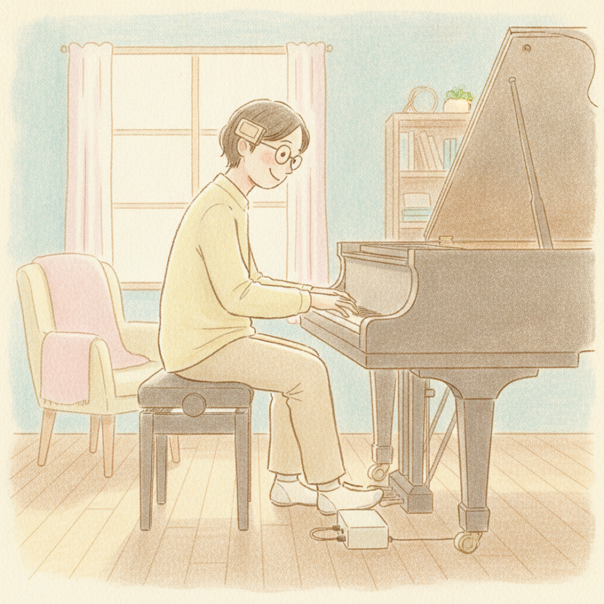

*最初の bFaaaP（2018年）：メガネに付けたセンサーと、床のペダル装置。イラスト：AIイラスト：Harmonia による塩川紗季風 © 宍戸＆アソシエーツ。*

## 発明は既にここに在った
2018年のハードウェアを取り除くと、**核は今日とまったく同じ**です。**定量的でユーザー調整可能な制御則**
——頭の角度から **不感帯（オフセット）** を引き、**倍率** を掛け、**0–99** にクランプして、無線でペダル
アクチュエータへ送る。奏者がオフセットと倍率を **事前設定** する。これこそ特許成立の対象となった「鍵」です
（[仕組み](../../how-it-works.md)・[論文](../../../../../bfaaap_arxiv_latex/README.md)参照）。
変わったのは **センサー** と **取り付け** だけです。

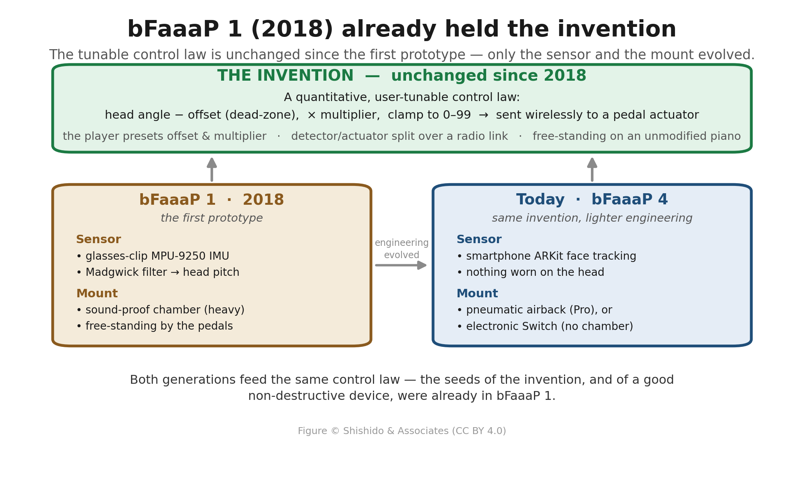

**bFaaaP 1 が既に正しく捉えていたこと（種）：**
- **貢献＝制御則** —— オフセット＋倍率＋クランプ、ユーザー事前設定（FIG. 2・FIG. 3）。
- **頭部角度による foot‑free センシング** —— 頭を測り、足を解放（メガネ型センサー、FIG. 1）。
- **検出側／駆動側を無線で分離** —— まさに今日の スマホ → BLE → 装置 の形。
- **非破壊・自立型の装置** —— ペダルのそばに自立し、ピアノは無改造。今日の **[airback](../../how-it-works.md)** は、この「楽器に触れない」原則の直系の子孫です。
- **工学的な配慮** —— 振動対策の *防音チャンバー* まで備え、CADの前に清書された **手描き** 三面図で詰めていた。

## 何が変わったか —— 巨大モーターとメガネ
今日との最も目を引く違いは **駆動モーター** と **センサー** です。bFaaaP 1 は、**オリエンタルモーター（株）製の
ステップモーター**（産業用ロボットを駆動する大型品）で重い防音チャンバー内からペダルを動かし、頭部は
**メガネに装着したセンサー** で読み取っていました。今日では同じ役割を、**手のひらサイズの閉ループモーター**
（airbackで固定）——あるいは電子式 Switch では **モーターなし**——と、**譜面台のスマホ（顔に何も付けない）** が
担います。その間の頭部角度制御則は一度も変わっていません。

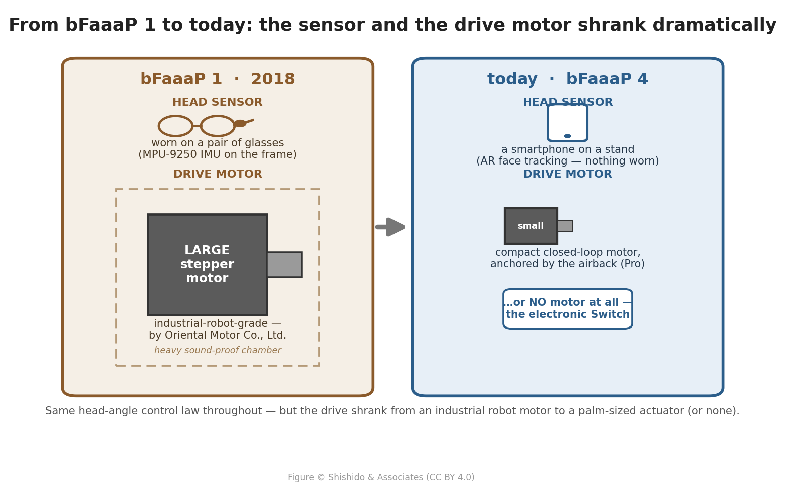

## 反力のアンカリング —— 重い錘から airback へ
bFaaaP 1 が大きく重かったもう一つの理由は **固定の仕方** でした。ペダルを踏むと **反力** が生じ、軽い装置は
押しのけられてしまうため、bFaaaP 1 は **筐体の底部区画に重い金属（錘）を詰めて自重を増やし**、押さえ込んで
力を質量で受け止めていました。のちにプロジェクトは **「airback」を開発** ——エアバッグのような空気クッションが **隣のペダルに突っ張り**、
反力を **ピアノ自体の構造へアンカリング** します。力を発生源で受け止める方がはるかに効率的で、装置は
**格段に小型・軽量化** できました（airback は非破壊で設置も速い。[仕組み](../../how-it-works.md)参照）。

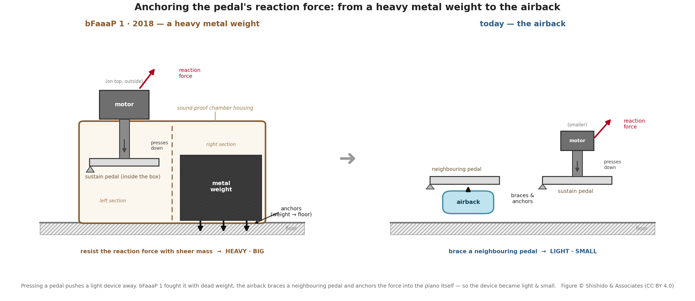

## オリジナル図面

### FIG. 1 — 全体像（メガネ型センサー）
**1000**＝メガネフレーム、**1100**＝それに付けた頭部角度センサー、**1200**＝手元コントローラ（オフセット・倍率
ダイヤル）、**100**＝ペダルのそばの防音チャンバー装置。**メガネ装着型センサー部は意匠登録もされています。**

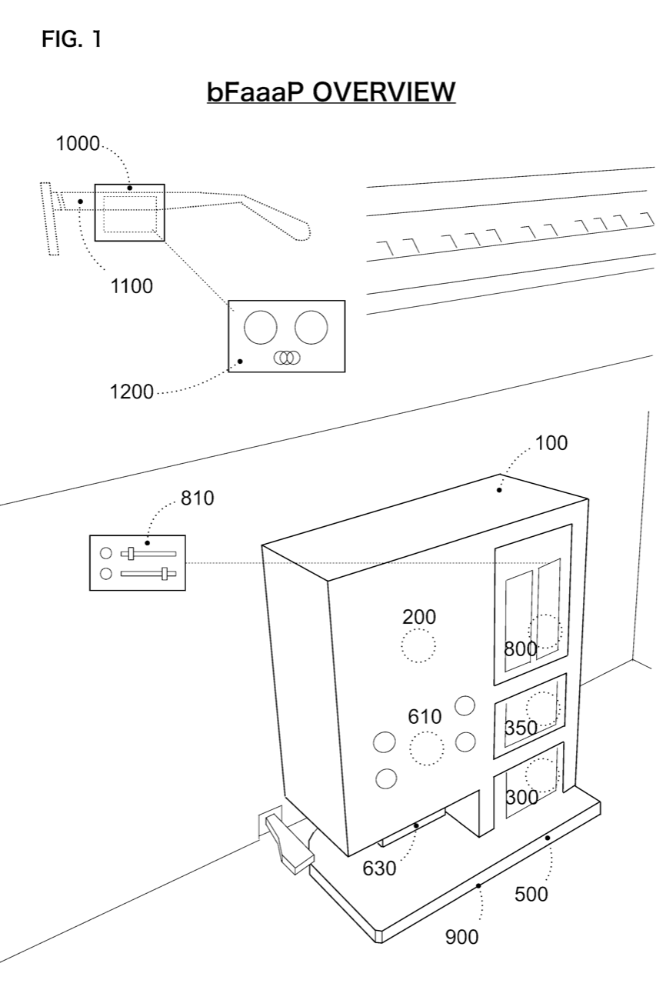

### FIG. 2 — システムブロック図（2018年の制御則）
検出側（角度センサー→データ処理→送信）が既に **オフセット値** と **倍率** を、駆動側（受信→コントローラ→
アクチュエータ）が **遊び量オフセット** と **駆動範囲** を備えています。

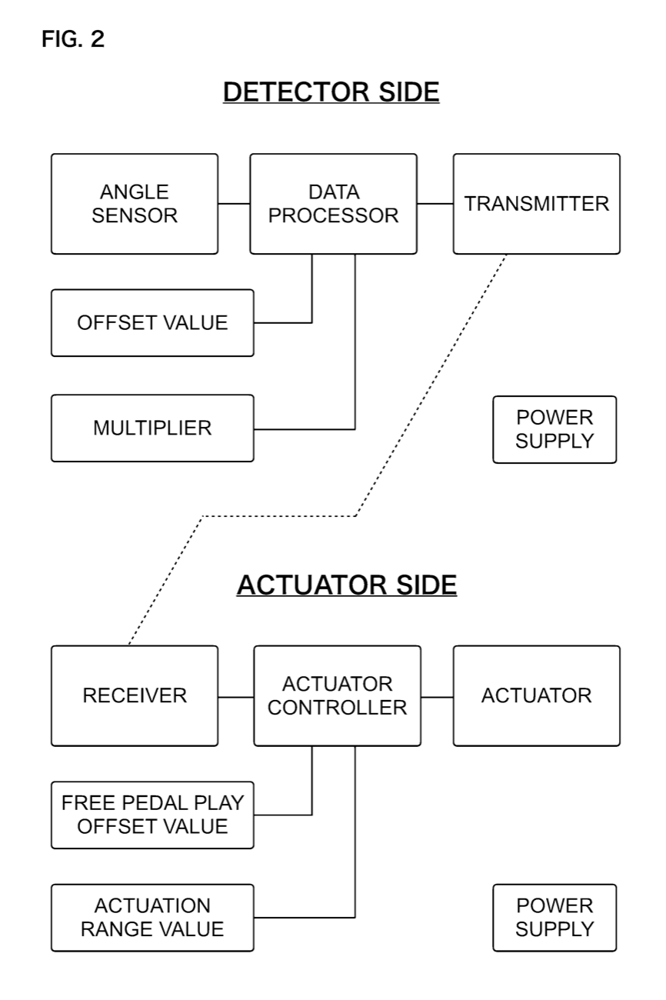

### FIG. 3 — 検出側ファーム処理フロー
BLE と **MPU‑9250** IMU を初期化し、加速度/ジャイロ/地磁気を読み、**Madgwick フィルタ**で頭部ピッチを求め、
**オフセットを引き**、**倍率を掛け**、**0–99 にクランプ**して BLE 送信。オフセット・倍率調整も逐次再読込。

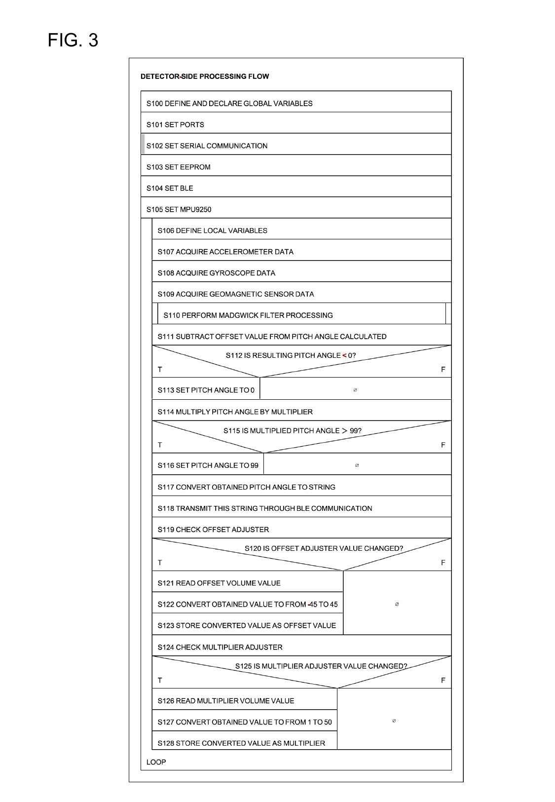

### FIG. 5 — 駆動部 MOV（移動）関数
コントローラがモータビットを切り替えてペダルを1ステップ進める手順。

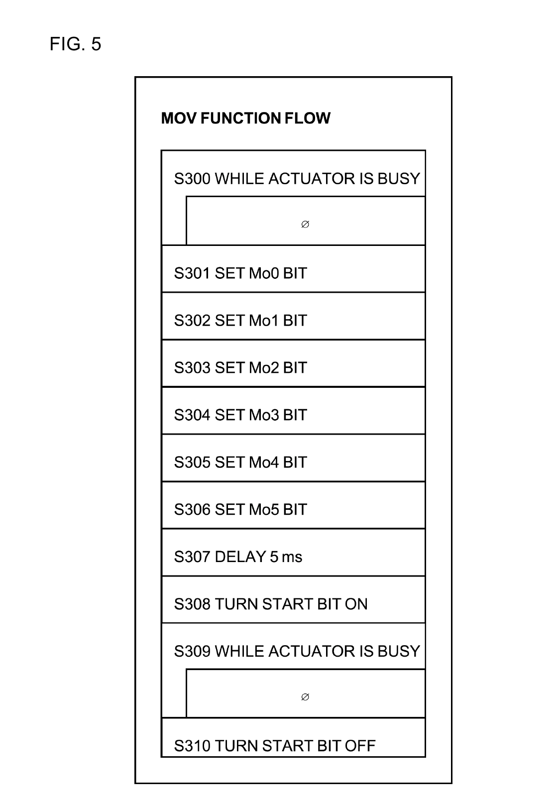

## 手描きの設計スケッチ（楽しいところ）
清書された CAD の前に、防音チャンバーは **手描き**（宍戸、2018‑09‑11）で詰められました——正面断面・側面・背面・
上/中/下面、正式図と同じ部品番号付き。良い装置はしばしば紙の上から始まることを思い出させてくれます。

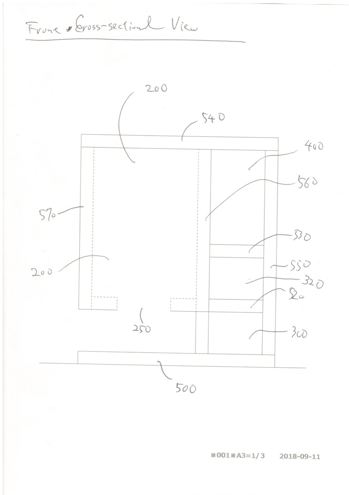

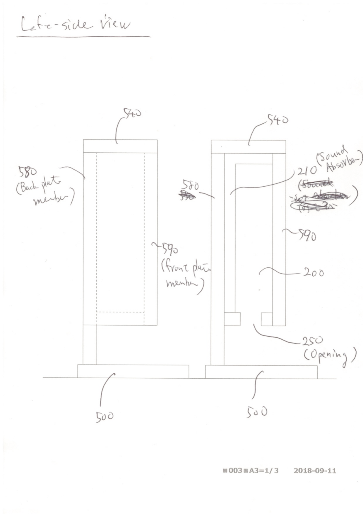

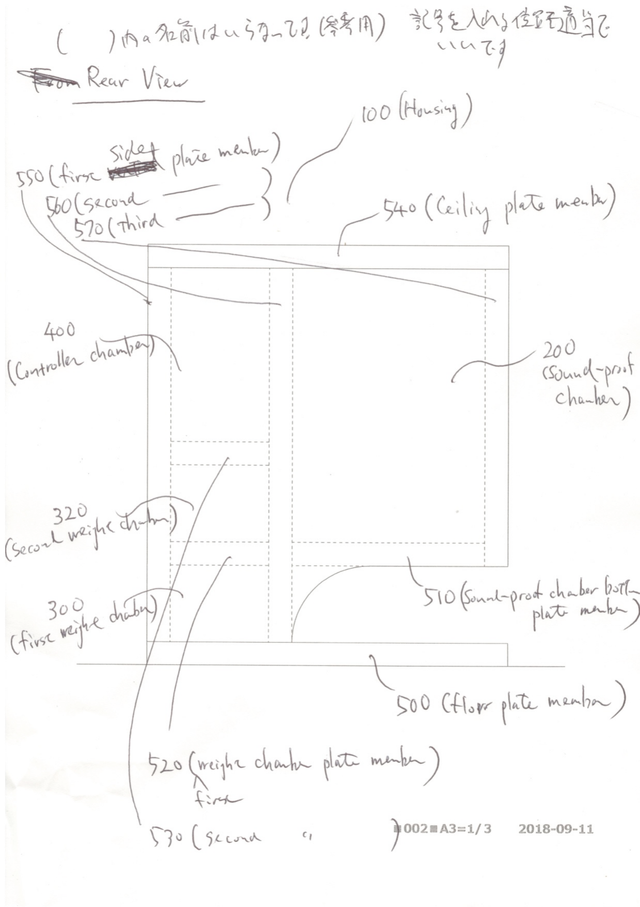

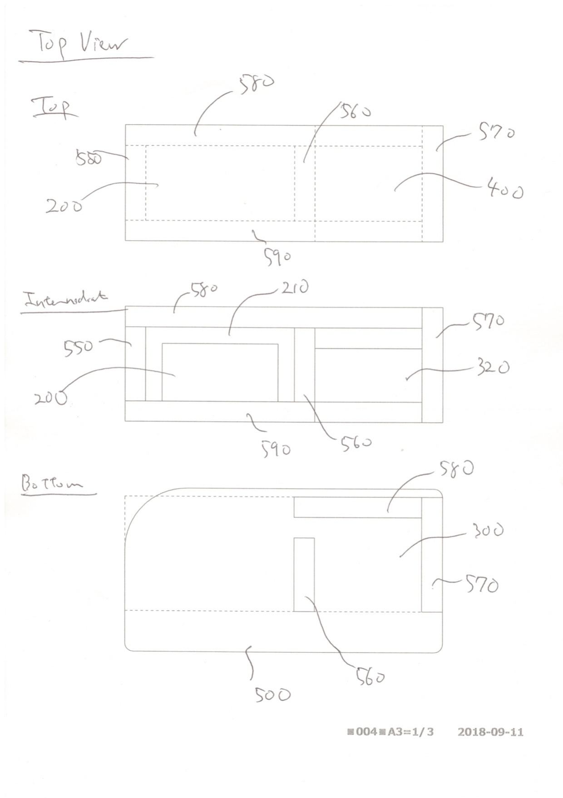

*オリジナル手描きスケッチ © bFaaaP team（宍戸）。*

---

## プライバシーとデータ
ここにあるのは **技術図面のみ**で、人物・氏名・個人データはありません。ヒト対象の **APEE 試験は別に詳述**して
おり、ここでは繰り返しません——[PCT／APEE オリジナル図](../pct-original-figures/README.md)（**bFaaaP 2** の
M5Stack センサーと**匿名化**APEE図を収録）と論文の Appendix A をご覧ください。

## ファイル
- イラスト：`bfaaap1-pianist-2018.png`（AI生成）、`the-invention-from-the-start.png`（matplotlib）。
- オリジナル図（PNG）：`fig1-overview-glasses-sensor.png`、`fig2-system-block-diagram.png`、`fig3-detector-side-flow.png`、`fig5-actuator-mov-function.png`、および 4枚の `handdrawn-*.png`。
- 保存用ソースPDF：`source-handdrawn-embodiment-2018.pdf`、`source-configuration-diagram-2018.pdf`。

## 関連
[History](../../HISTORY.md) · [ストーリー](../../story.md) · [仕組み](../../how-it-works.md) ·
[PCT／APEE 図](../pct-original-figures/README.md) · [論文](../../../../../bfaaap_arxiv_latex/README.md)
