# 歴史資料 — PCT／APEE のオリジナル図（2018年）

> 🌐 [English](../../../../../docs/history/pct-original-figures/README.md) · **日本語** · [Deutsch](../../../../de/docs/history/pct-original-figures/README.md)

これらは **2018年当時のオリジナル図**で、最初の bFaaaP 特許ファミリ（PCT **WO 2019/176164**、
2018‑11‑12 出願）と、ヒト対象の **補助ペダル効果評価試験（APEE study）**（2018‑08〜2018‑10 実施）
のために作成されたものです。**歴史資料**としてここに保存します。

いくつかは **現在のデバイスでは使われていない初期コンセプト**を示します —— M5Stack ベースの頭部
センサーや、重い「防音チャンバー」筐体など —— 現在の軽量な
[Pro（エアバック）](../../build/pro.md) や [Switch](../../build/switch.md) との対比が物語になります。
一方で **APEE の図は今もプロジェクトの実証の土台**です。制御則の数値（不感帯オフセット・倍率）や
「自分の足と同等」という結果は、ここから出ています。同じデータは
[arXiv 論文](../../../../../bfaaap_arxiv_latex/) の基礎であり、[`docs/HISTORY.md`](../../HISTORY.md) や
[ストーリー](../../story.md) でも紹介しています。

### プライバシー／匿名化

ここに含まれるヒト対象データは**すべて匿名化済み**です。被験者は **No. 1〜No. 15** としてのみ登場し
（クラスIII には「足に障害あり」等の**非識別の記述**が付くのみ）、**氏名欄・氏名・住所・写真・連絡先は
いずれのファイルにも一切ありません**。氏名を含む元の表計算ファイルは**あえて非公開**としており、
ここに公開するのは既に匿名化された図のみです。公開は試験の同意（特許出願後の開示を許可）と整合します。

---

## A. APEE ヒト対象試験

モチーフ（ド・ド・ド／レ・レ・レ／ミ・ミ・ミ、3/4拍子、4回反復）を3通り —— **ペダルなし（pattern 0）**
と2つの bFaaaP **ペダリングパターン** —— で録音し、サスティンを **音振動面積（TVA）** として測定
（ペダルなし＝1.00 に正規化）。被験者15名・3クラス。各人が選んだパラメータ範囲が、特許の請求項と
論文の報告値になっています。

**ひと目でわかる APEE の全体像**（下記の各オリジナル図が示す工程を、現代風にまとめた図）:

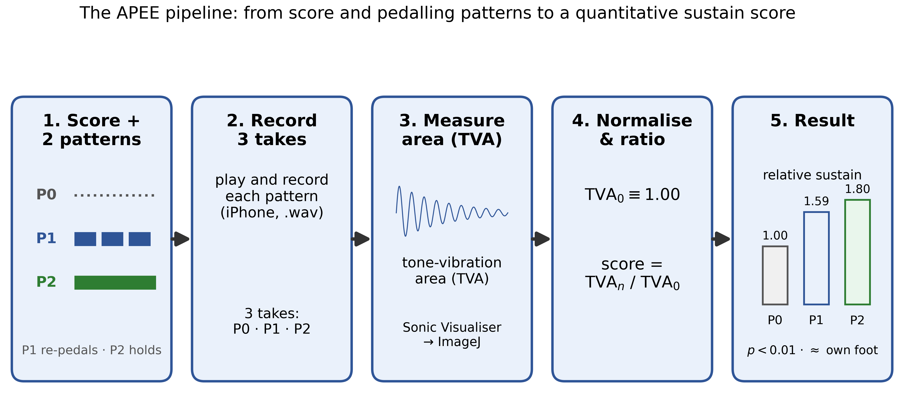

### A1 ・ 試験楽譜と2つのペダリングパターン
`apee-01-test-score-and-pedal-patterns.pdf` — PCT Fig. 23/24。
Pattern 1 は3音グループごとにペダルを踏み替え、Pattern 2 はグループをまたいで保持（より長く連続した
サスティン）。だから Pattern 2 は Pattern 1 より音が伸びます。

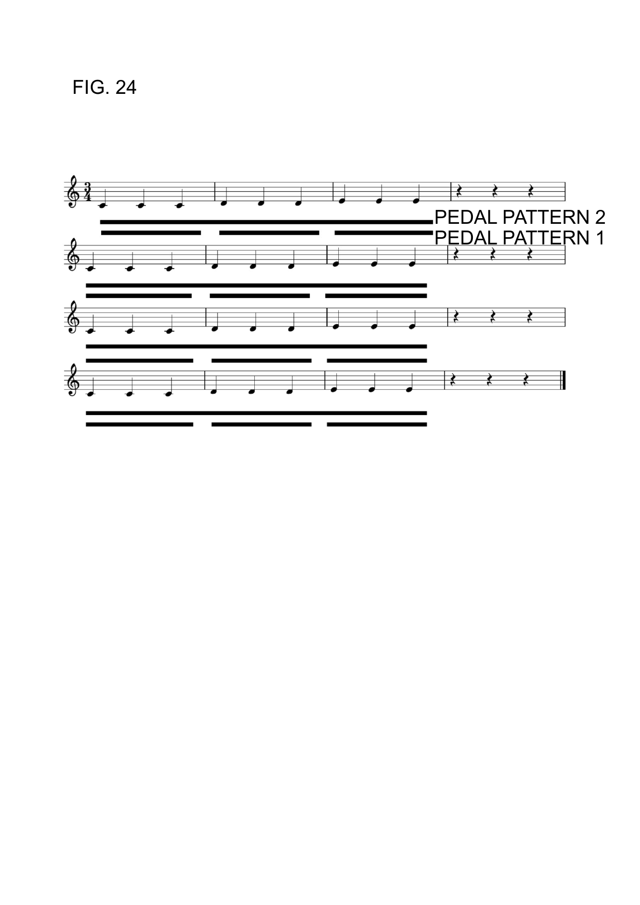

### A2 ・ サスティンの点数化（TVA 比率）
`apee-02-tva-ratio-method.pdf` — PCT Fig. 25。
各録音の波形面積を測定（Sonic Visualiser → ImageJ）。TVA₀ ≡ 1.00 として、各パターンの点数は
TVAₙ / TVA₀。サスティンが大きいほど面積が大きい。

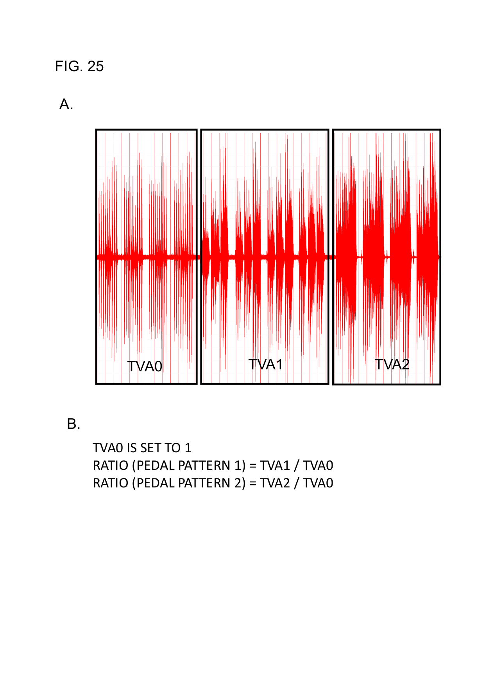

### A3 ・ 結果表（サスティン効果／自分の足との比較）
`apee-03-results-tables.pdf` — 相対TVA平均（pattern 0/1/2 = 1.00 / 1.59 / 1.80、すべて *p* < 0.01）と、
bFaaaP 対 自分の足（有意差なし、*p* > 0.05）。

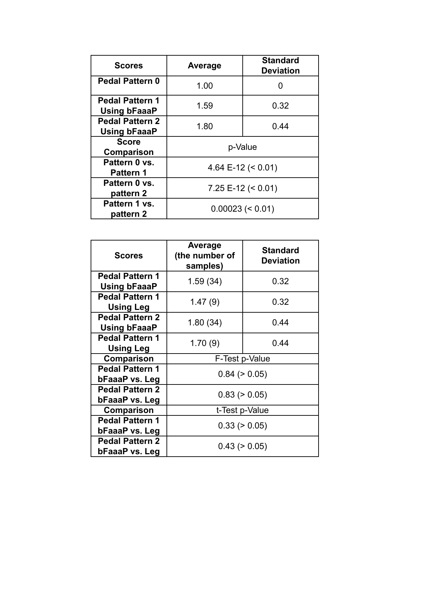

### A4 ・ 録音ごとのデータ — クラスI（成人, 匿名化）
`apee-04-classI-subjects-data-anonymized.pdf` — 被験者 **No. 1〜7**、録音ごとの全表
（日付・年齢・ピアノ・装置・offset・倍率・pattern 0/1/2 の TVA・テスト番号）。

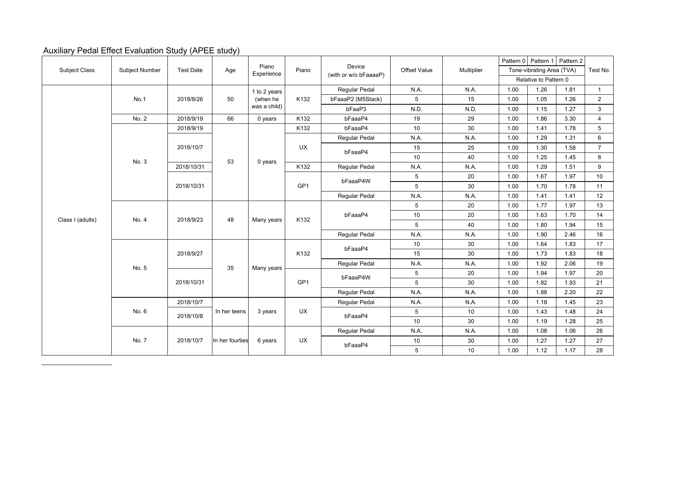

### A5 ・ 録音ごとのデータ — クラスII（子供）・クラスIII（匿名化）
`apee-05-classII-III-subjects-data-anonymized.pdf` — 被験者 **No. 8〜15**。
No. 14（部分的な足の障害**かつ**気管切開）は、限られた頭部可動域でもペダル全域を使えるよう
**小さな offset（3〜5°）と大きな倍率（40〜50）**を選択 —— 論文が強調する「包摂の到達範囲」の実例です。

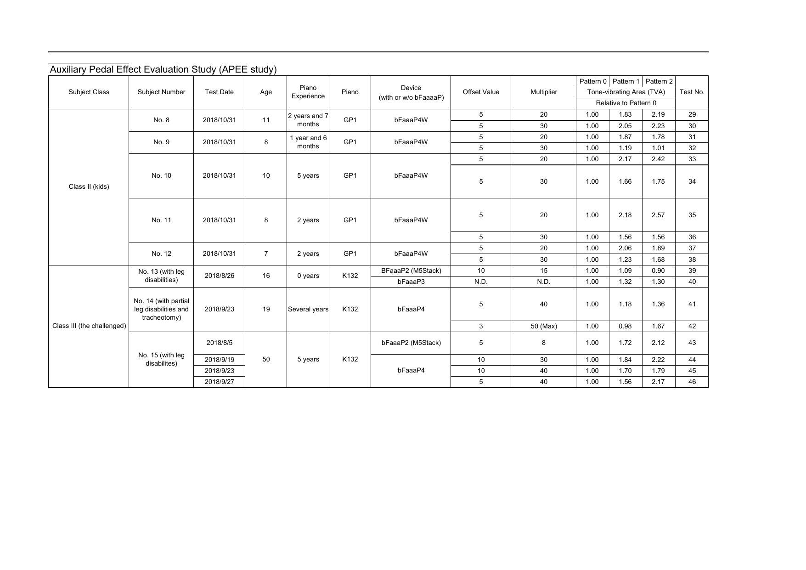

### A6 ・ 試験プロトコル
`apee-06-test-protocol.pdf` — 試験で用いた被験者向けの手順書。

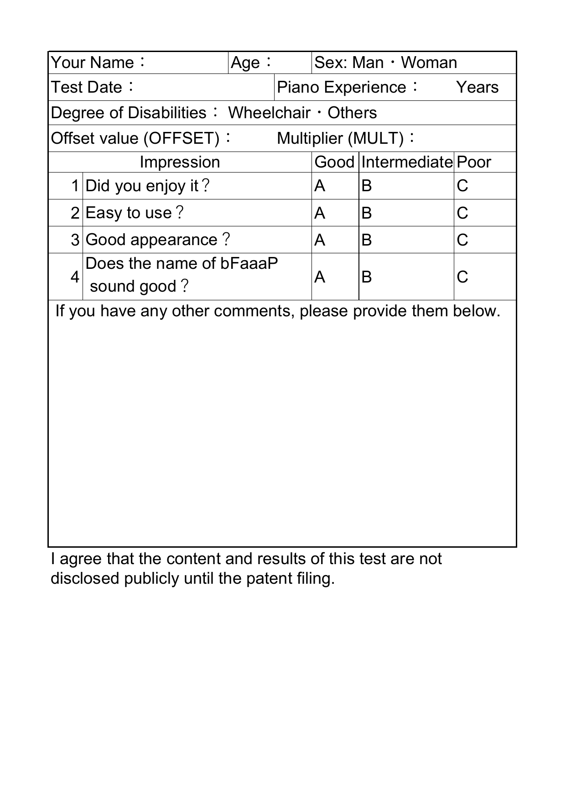

### A7 ・ 実演奏中の頭部傾き角
`apee-07-head-tilt-angle-histogram.pdf` — PCT Fig. 26。実際にピアノを弾いているときの頭部傾きの分布
（多くは ≈ ±5° 以内）。小さな **offset／不感帯** を置く実証的な根拠です（普段の演奏動作でペダルが
誤作動しないように）。

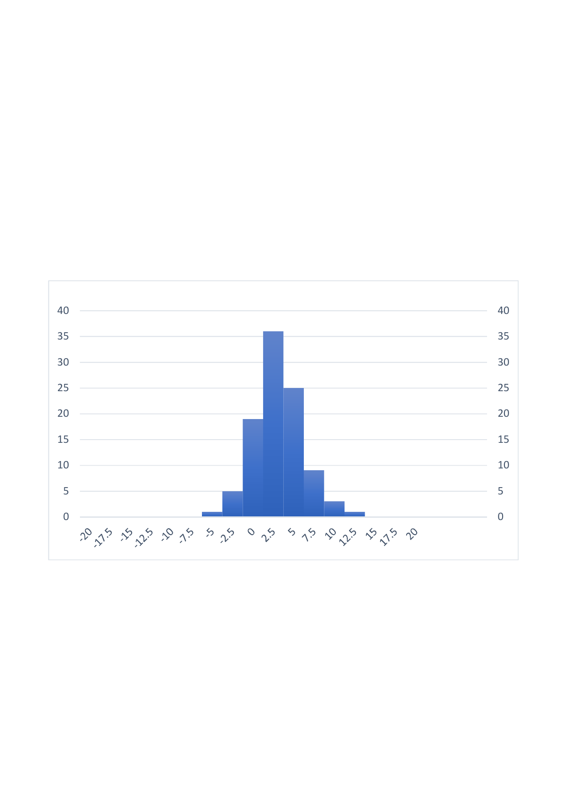

---

## B. システム構成（2018年 PCT 形）

### B1 ・ システム構成ブロック図
`system-01-configuration-block-diagram.pdf` — 検出側（角度センサー → **offset**・**倍率** をもつ
データプロセッサ → 送信機）と駆動側（受信機 → **遊び**・**作動幅** をもつアクチュエータ制御 →
アクチュエータ）。制御則の用語が2018年時点で既に存在することがわかります。

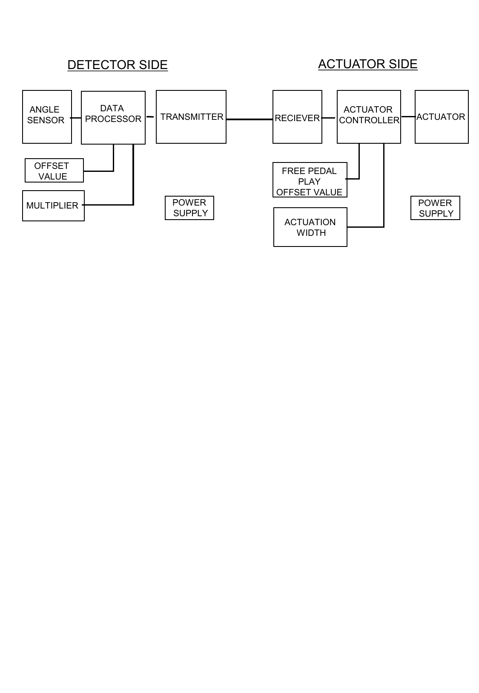

### B2 ・ 検出側処理フローチャート
`system-02-flowchart-sensor-side.pdf`

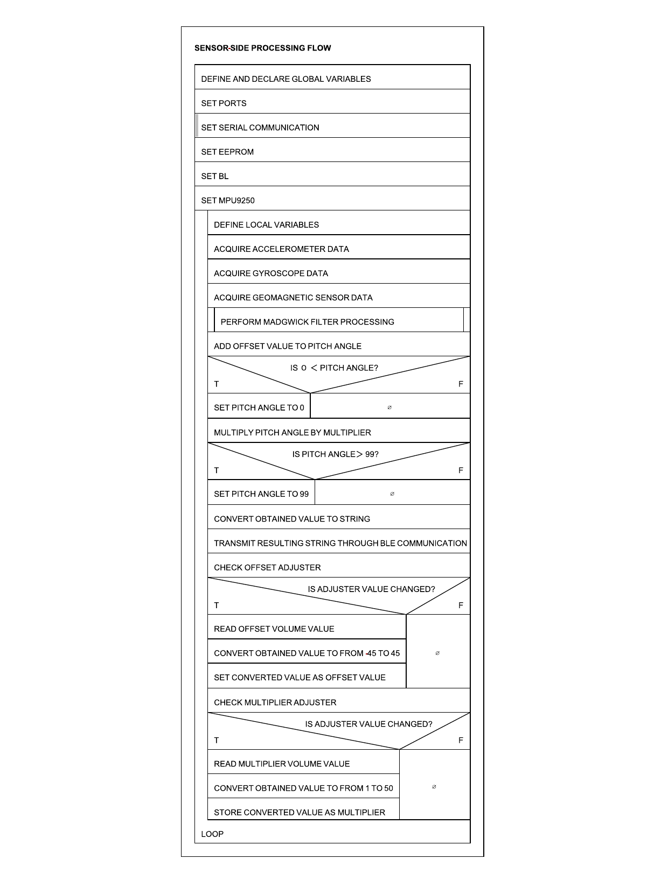

### B3 ・ プログラムフロー（検出側＋駆動側）
`system-03-program-flow-detector-actuator.pdf`

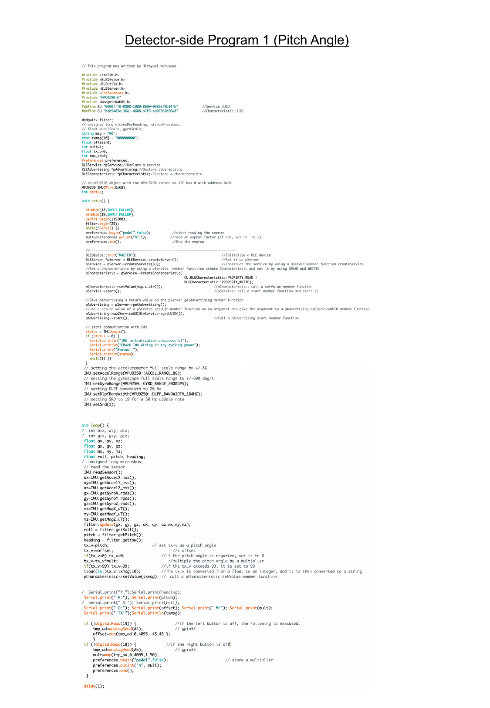

---

## C. 初期コンセプト（現在は不採用 — 歴史的興味）

### C1 ・ 初期 M5Stack 二値変化 頭部センサー（2018‑06）
`history-01-early-m5stack-binary-motion-detector.pdf` — スマホ ARKit 顔認識に移行する前の、M5Stack
（ジャイロ）ベースの初期検出器。（APEE の初期録音のいくつかは「bFaaaP2 (M5Stack)」と記載。）

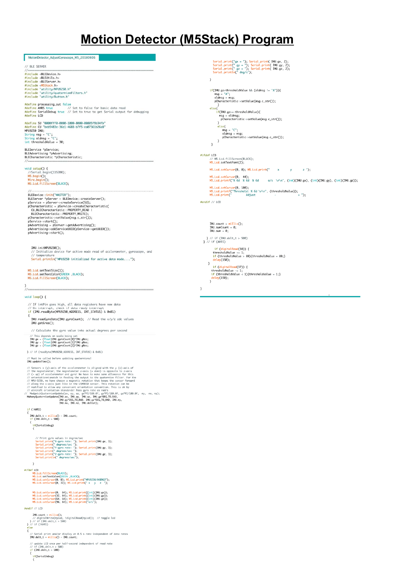

### C2 ・ 初期「防音チャンバー」筐体コンセプト
`history-02-early-embodiment-soundproof-chamber.pdf` — 防音チャンバーと錘室をもつ手描きの実施形態。
反力を隣のペダル上の**エアバック**で吸収する現在の軽量 Pro とは**大きく異なり**、設計の進化を物語ります。

---

*出典:* 図は bFaaaP PCT 出願（WO 2019/176164）とその APEE 試験に由来（bFaaaP チーム作成）。登録特許と
審査経過は [`bfaaap_patent_info/`](../../../../../bfaaap_patent_info/) を参照。複数ページの PDF
（被験者データ表・実施形態図）は全ページ収録しており、上のインライン画像は1ページ目のみを表示しています。
画像・PDF は英語版フォルダ（`docs/history/pct-original-figures/`）を共有参照しています。
