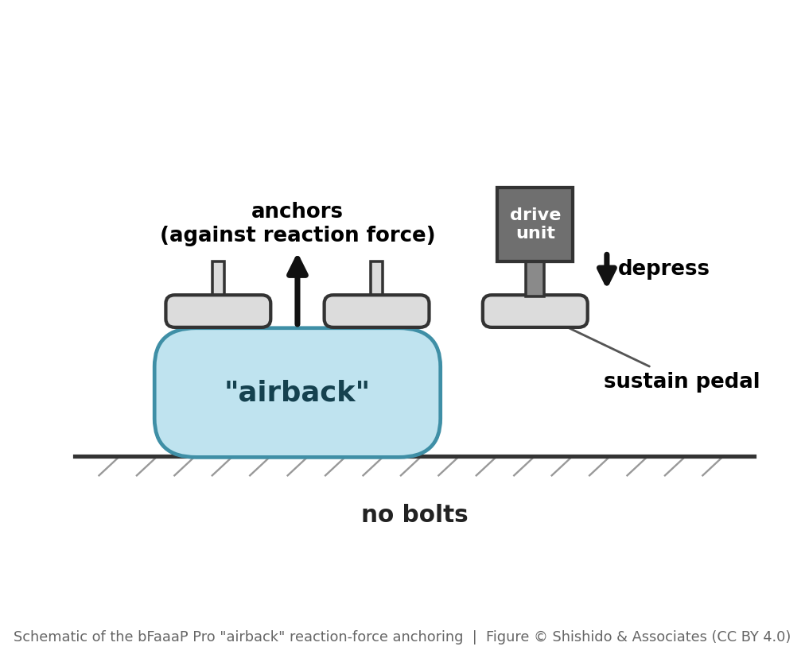
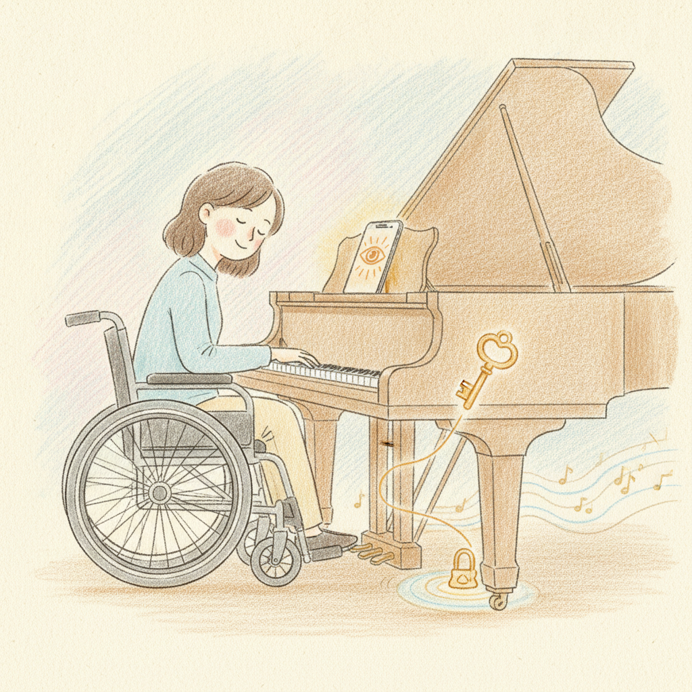
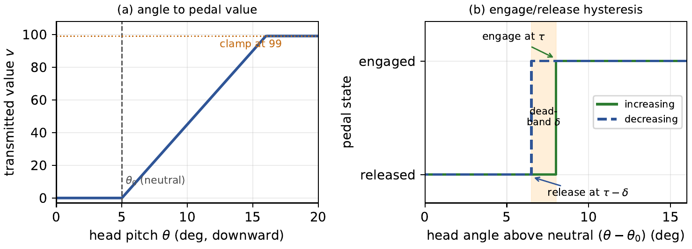
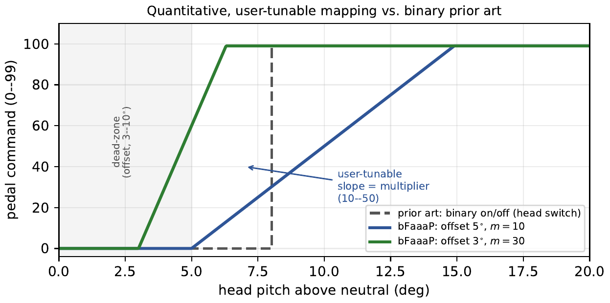

# bFaaaP の仕組み（やさしい版）

> 🌐 [English](../../../docs/how-it-works.md) · **日本語** · [Deutsch](../../de/docs/how-it-works.md)

初めての方へ。ここでは全体の考え方を平易に説明します。分からない用語は[用語集](GLOSSARY.md)を参照してください。


## 一文で言うと
**頭を少し傾ける** → iPhone/iPad が**その傾きを見る** → **Bluetooth** でピアノのそばの小さな装置に送る →
装置が**サステインペダルを押す**。足は要りません。

## 4つのステップ
1. **あなたの意図（頭の角度）。** 少し頭を傾けます。その動きが「ペダルを上げる/下げる」意思になります。
2. **スマホが読み取る。** Apple の顔トラッキング（**ARKit / TrueDepth**）が頭の角度を測り、0〜99% の数値にします。
3. **Bluetooth で送る。** アプリが小さなメッセージ（`i00`〜`i99`）を **BLE** で装置に送信。**しきい値**（どれだけ
   傾けるか）と**速さ**を自分で設定でき、あなた仕様になります。
4. **装置がペダルを押す。**
   - **Pro**（アコースティック）：小さな**モーター**が押し棒でサステインペダルを押し、**エアバック**の
     クッションがピアノを傷つけずに固定します。
   - **Switch**（電子ピアノ）：装置が**電子的に**サステインを楽器のペダル端子で閉じます —— モーター不要。

#### 「airback（エアバック）」とは —— 造語であって "airbag" ではありません
**「airback」** は bFaaaP の造語で、**"airbag（エアバッグ）" ではありません**。空気クッション（**WINBAG**
エアジャック。装置内の小型**電動ポンプ**がエアチューブで膨らませます）が隣のペダルの下でふくらみ、
アクチュエータの**反力を受け止めて**、**Pro** 装置を**未改造の**アコースティック
ピアノにしっかり固定します —— **ネジ留め不要・非破壊・着脱も速い**。語源は *air*＋*back*（支える・裏打ち
する）で、"airbag" の「安全用クッション」ではなく「**支持・固定**」を表す **air‑braced anchor（空気で
支えるアンカー）** です。



*airback による反力アンカリング（模式図）。© 宍戸＆アソシエーツ（CC BY 4.0）。*

### 制御則 —— 傾きがどうペダルになるか
これが bFaaaP の核心（であり特許の対象）です。小さな**デッドゾーン（オフセット）**により、無意識の小さな
頭の動きでは何も起きません。しきい値を超えると、選んだ**倍率**で傾きに追従し、数度で全ペダルに達します。
わずかな**ヒステリシス**（踏み込みと戻し）でばたつきを防ぎます。


iOS アプリで設定するのは**しきい値（オフセット）**と**倍率**の2つだけです。この2つの事前設定により、
二次的・時間的な指標である**応答速度**（不感帯を超えてから頭にどれだけ速く追従するか）が決まります
（応答速度を単独で設定するわけではありません）。この定量的でユーザー調整可能な制御則こそが、わずかな
頭の傾きを奏者**自身の意図したペダリング**——単純なオン/オフではない、自然で表情豊かな演奏——へと
変える**鍵**です。そしてこれが bFaaaP の**特許成立の要件**でもあります：頭→ペダルという素の構成は既知で
あり、特許は構成ではなく**この具体的で調整可能な制御則**に対して認められました。（背景：特許の方式は
オフセット上限 3〜10°、倍率 10〜50、+2〜10° で全ペダル動作。
[特許ガイド](../../../bfaaap_patent_info/general_description/README.md)参照。）



*制御則こそが**鍵**です：あなたが事前設定したオフセットと倍率で形づくられた**わずかな頭の傾き**が、
単純なオン/オフではなく、**あなた自身の意図した自然な**ペダリングを解き放ちます。そして、頭→ペダルという
素のアイデアではなく、この具体的で調整可能な制御則こそが特許成立の対象でした。イラスト：AI生成
（塩川紗季風）© 宍戸＆アソシエーツ。*

#### 制御則を正確に（論文の図3・図4）
この2つの図（[論文](../../../bfaaap_arxiv_latex/README.md)より）が制御則を厳密に示します（図中は英語）。

**図3 — 制御則。** (a) 中立（**オフセット**）を超えると、頭の角度がペダル値（0〜99）に**比例**し、
あなたの**倍率**で拡大され、全踏みで頭打ちになります。(b) 踏む／離すに小さな**ヒステリシス（不感帯 δ）**を
設け、しきい値付近で頭が揺れてもペダルがパタつかないようにします。



*論文の図3 —— 頭角度の制御則。© 宍戸＆アソシエーツ（CC BY 4.0）。*

**図4 — 特許になった理由。** 従来技術は頭の**二値オン/オフ**スイッチ（破線の段差）でした。bFaaaP は
**連続的で比例的な**指令を送り、その**不感帯**（オフセット 3〜10°）と**傾き**（倍率 10〜50）を奏者が
事前設定します —— これが特許成立の対象となった、定量的でユーザー調整可能な制御則です。



*論文の図4 —— 定量的でユーザー調整可能な対応づけ vs 二値の従来技術。© 宍戸＆アソシエーツ（CC BY 4.0）。*

**本当に効くの？** 15名を対象とした人での試験が「効く」と示しています ——
**[APEE 試験](apee-study.md)**（手法・結果・匿名化した全データ）をご覧ください。

**誰の役に立つ？ コントローラは他に何ができる？** **[アクセシビリティへの波及](accessibility-impact.md)**
を参照 —— 再利用可能なアクセシビリティ入力としてのコントローラと、車いす・在宅人工呼吸の全世界人口（引用付き）。

## 設計上の妙
スマホは Bluetooth で送るべき速度より*ずっと速く*頭の角度を生成します。そこでアプリは無線を
**ペーシング**（約100msタイマー＋スロットル）して接続を盤石にしています。小さな工夫ですが効果は大 ——
[`ios-app/DESIGN-HIGHLIGHTS.md`](../../../ios-app/DESIGN-HIGHLIGHTS.md)参照。

## 装置の中身
```
iPhone/iPadアプリ ──BLE (i00–i99)──▶ BLEボード (nRF52840) ──UART (1バイト)──▶ Pico (RP2040) ──▶ ペダル
```
**Pico** がモーター（Pro）またはスイッチ（Switch）を駆動する頭脳、**nRF52840** が Bluetooth を担当します。
配線・部品・手順は[自分で作る](build/)へ。

---
→ 次へ：[自分で作る](build/) · [bFaaaP の物語](story.md) · [用語集](GLOSSARY.md) · [ソースマップ](../../../docs/SOURCE-MAP.md)
