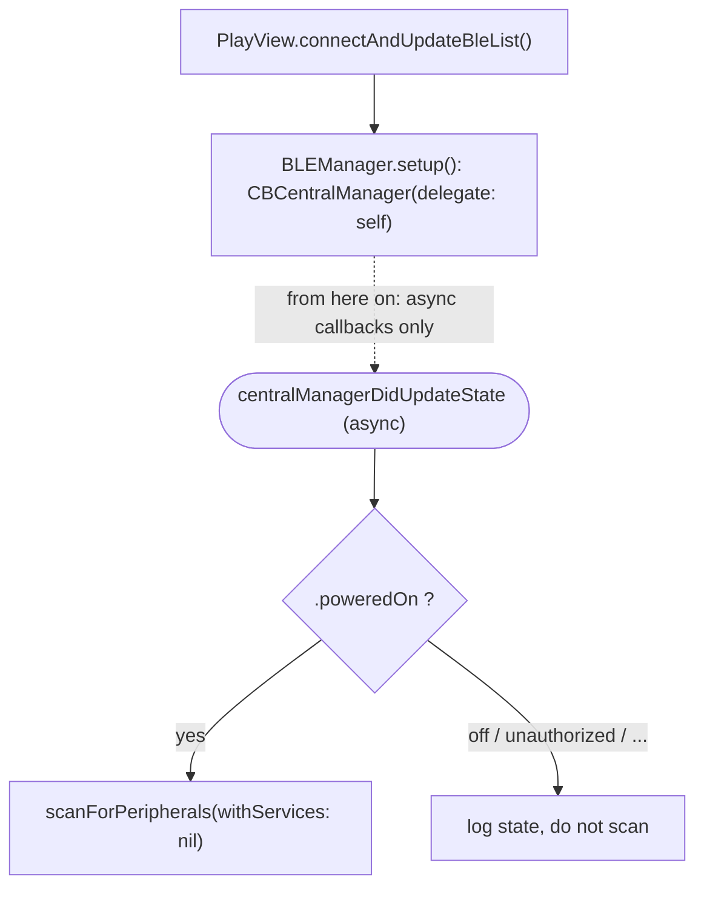
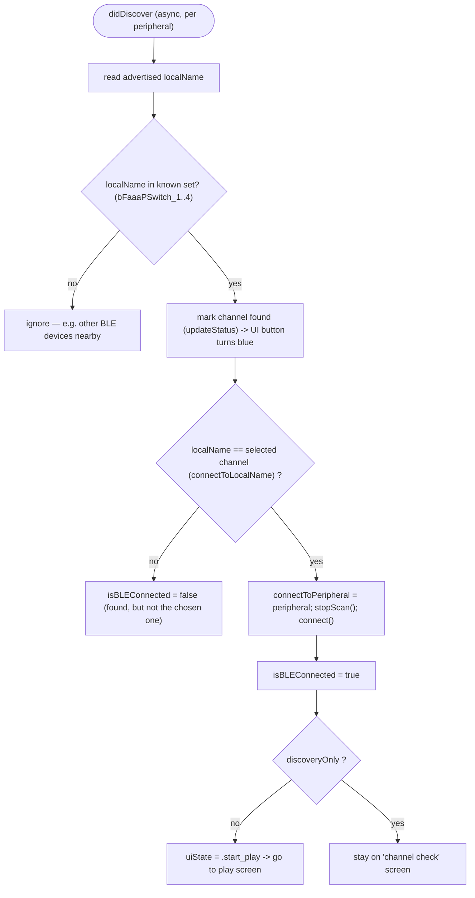
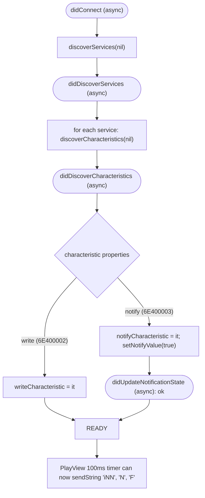
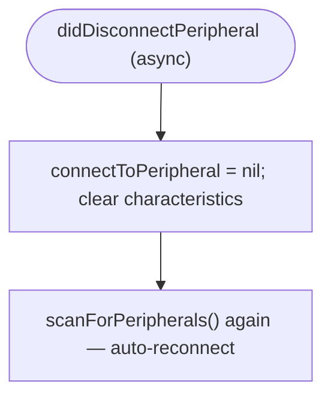

# iOS app — Bluetooth recognition & connection flow

> English first; 日本語・ドイツ語版は後日 `i18n/` 配下に追加予定。

How the iOS app finds the device **by name** (one of four channels
`bFaaaPSwitch_1…4`), connects to it, and then hands off to CoreBluetooth's
**asynchronous (delegate/callback)** processing. Diagrams use Mermaid (rendered
by GitHub). This is the iOS counterpart of the device‑side async model in
[`../device-pro-acoustic/firmware/DESIGN-HIGHLIGHTS.md`](../device-pro-acoustic/firmware/DESIGN-HIGHLIGHTS.md).

All of this lives in `BLEManager.swift` (driven from `PlayView`).

---

## Sync → Async handoff (overview)

The **only** synchronous, app‑initiated step is creating the central manager.
From then on, CoreBluetooth delivers everything as **asynchronous delegate
callbacks** — the app never blocks waiting for BLE, it reacts to events.

`queue: nil` means callbacks arrive on the **main queue**.

---

## 1) Name recognition & connect — `didDiscover`

The scan reports every advertising peripheral via `didDiscover` (async, once per
device). The app recognizes a bFaaaP device purely by its **advertised local
name**, which must be one of the four channel names.

- **Four channels.** `bFaaaPSwitch_1…4` let several devices coexist. On the
  "channel check" screen the app scans in `discoveryOnly` mode and **lights up
  the channels it can see**; the user taps one, the choice is saved to
  `UserDefaults`, and it becomes `connectToLocalName` for the real connection.
- **Filtering.** Anything not in the known set is ignored, so the app never
  mis‑connects to unrelated peripherals.

---

## 2) After connect — async service/characteristic discovery chain

Connecting kicks off a chain of asynchronous callbacks that brings up the Nordic
UART link. **No data can be sent until this chain finishes** and a write
characteristic is found.

---

## 3) Disconnect → automatic re‑scan (async)

A brief BLE drop during a performance recovers without user action.

---

## Where the asynchronous handoff is

| Phase | Sync or async | What |
|-------|---------------|------|
| `setup()` | **sync** (app calls it) | create `CBCentralManager` |
| `centralManagerDidUpdateState` → `didDiscover` → `didConnect` → `didDiscoverServices` → `didDiscoverCharacteristics` → `didUpdateNotificationState` | **async** (CoreBluetooth callbacks) | scan, recognize by name, connect, discover NUS, enable notify |
| sending data | timer‑driven, fire‑and‑forget | `writeValue(.withoutResponse)` once ready |

Both ends of the link are **event‑driven**: the iOS app reacts to CoreBluetooth
callbacks, and the device's nRF52 reacts to SoftDevice events. The continuous
`iNN` stream is then paced by the app's 100 ms timer (see
[`DESIGN-HIGHLIGHTS.md`](DESIGN-HIGHLIGHTS.md) #1).
