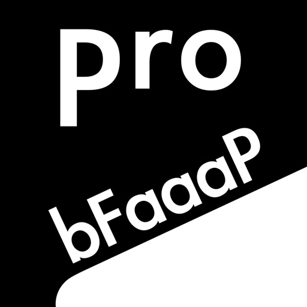

# App Store listing — bFaaaP Pro & Switch

The iOS controller app is published **free** on the App Store:

**<https://apps.apple.com/app/id1545866059>**

| Field | Value |
|-------|-------|
| Name | **bFaaaP Pro & Switch** (the app drives both the Pro and the Switch) |
| Seller | Tomoyuki Shishido |
| Price | **Free** |
| Version | 2.0 (min iOS 14.5) |
| Category | Entertainment |
| Bundle ID | (the developer's own reverse‑DNS ID; this repo ships the placeholder `com.example.bfaaap`) |
| Rating | ★5 (2 ratings) |

## Description (summary)

An app for **electric pianos & keyboards** (and the acoustic **bFaaaP Pro**). The
pedal is controlled by AI‑detecting the player's **head angle** on an iOS phone /
tablet, enabling sustained notes **without using the feet** — so people with limb
disabilities, small children, and the elderly can enjoy pedal piano.

The **bFaaaP Switch system needs both** the Switch device and the app. The device
is **build‑to‑order**: buy it from <https://ui.saaipf.com/app3/> first, then
install the **free** app. **Ships within Japan only.**

- Operation demo: <https://youtu.be/XOVENtBsOp4>
- User manual: [`../../docs/user-manual/`](../../docs/user-manual/)

## Screenshots

App Store screenshots are in [`screenshots/`](screenshots/) (`iphone_01…08`).
They show the head‑angle play screen (white→red), channel selection, on/off‑type,
and the angle‑set / support screens.

> These are the project's own public App Store assets, included here for reference.
